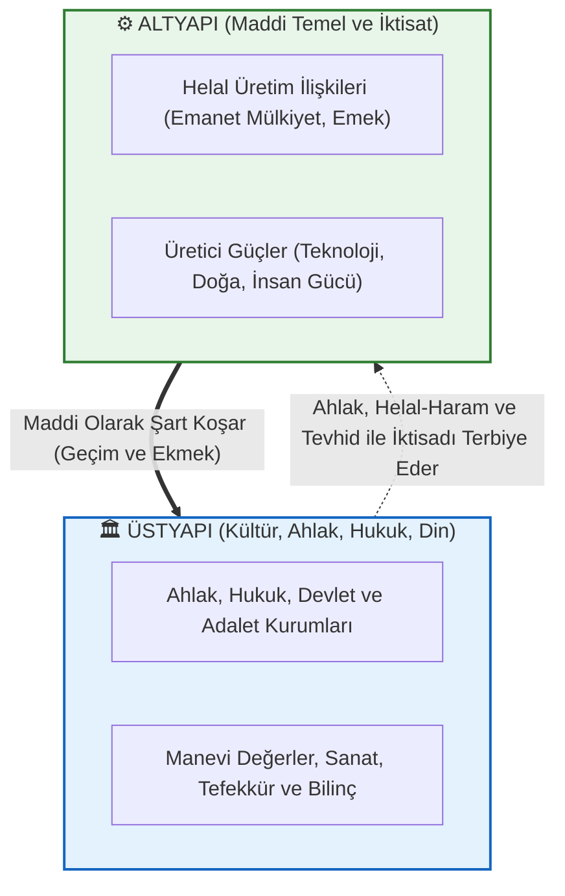
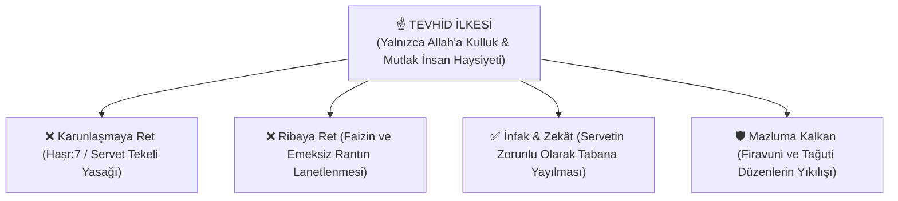

# 🌙 Marksizm Okumaları: Müslüman Bakış Açısıyla Felsefe, Ekonomi Politik ve Sosyal Adalet

[](LICENSE)
[](#)
[](CONTRIBUTING.md)
[](docs/)
[](#)

> *"Hikmet müminin yitiğidir; nerede bulursa onu almaya en layık olan odur."*  
> **— Hz. Muhammed (s.a.v.)**

Bu repo; **Müslüman bir araştırmacı, ilim talebesi ve düşünürün gözüyle** Marksist felsefeyi, ekonomi politik eleştirisini (*Das Kapital*), tarihsel materyalizmi ve sosyalizm deneyimlerini inceleyen kapsamlı, akademik ve eleştirel bir açık kaynak külliyatıdır.

**Temel Amacımız:**
1. **Ne Öğrenebiliriz?** Kapitalizmin vahşi sömürü çarklarına, faiz (riba) talanına, Karunlaşmaya, emeğin gaspına (artı-değer), tüketim putçuluğuna (*meta fetişizmi*) ve emperyalizme dair Marksizm'in **isabetli teşhislerinden** istifade etmek.
2. **Nerede Ayrışıyoruz?** Marksizm'in ruhu, ahireti ve Allah'ı inkar eden **kaba materyalizmini**, tarihi kör yasalara indirgeyen determinizmini, sınıf kinini ve dini "afyon" sayan indirgemeci yanılgılarını **Tevhid, adalet, ahlak ve fıtrat** hakikatiyle tashih etmek.

---

## 📌 İçindekiler Tablosu

1. [🧭 Müslüman Bakış Açısıyla Temel Çerçeve: Ne Öğrenebiliriz, Nerede Ayrışıyoruz?](#1-müslüman-bakış-açısıyla-temel-çerçeve)
2. [🏛️ Marksist Kuramın Temel Sütunları (İslami Mukayeseli)](#2-marksist-kuramın-temel-sütunları-i̇slami-mukayeseli)
3. [📊 Kuramsal Şemalar ve Diyagramlar](#3-kuramsal-şemalar-ve-diyagramlar)
   - [Altyapı - Üstyapı Diyalektiği ve Tevhidî Denge](#altyapı---üstyapı-diyalektiği-ve-tevhidî-denge)
   - [Kapitalist Üretim, Artı-Değer ve Faiz Devresi](#kapitalist-üretim-artı-değer-ve-faiz-devresi)
   - [Tevhid, İnfak ve Sosyal Adalet Modeli](#tevhid-i̇nfak-ve-sosyal-adalet-modeli)
4. [🗺️ Marksist Ekoller, Akımlar ve Müslüman Mütefekkirler](#4-marksist-ekoller-akımlar-ve-müslüman-mütefekkirler)
5. [⏱️ Marksist Tarihte Köşe Taşları ve Dönüm Noktaları (1818 - Günümüz)](#5-marksist-tarihte-köşe-taşları-ve-dönüm-noktaları-1818---günümüz)
6. [🖋️ Kapsamlı Alıntılar Kataloğu (Kurucu Metinler & İslam Âlimleri)](#6-kapsamlı-alıntılar-kataloğu)
   - [A. Karl Marx & Friedrich Engels (Temel Metinler)](#a-karl-marx--friedrich-engels-temel-metinler)
   - [B. Devrim ve Emperyalizm (Lenin, Luxemburg, Troçki, Fanon)](#b-devrim-ve-emperyalizm-lenin-luxemburg-troçki-fanon)
   - [C. İslam Mütefekkirleri ve Sosyal Adalet (Gazali, Şeriati, İkbal, Garaudy, Topçu, Karakoç, Özel)](#c-i̇slam-mütefekkirleri-ve-sosyal-adalet)
   - [D. Dışarıdan Yöneltilen Eleştiriler (Bakunin, Weber, Mises, Hayek, Popper, Arendt)](#d-dışarıdan-yöneltilen-eleştiriler)
7. [⚠️ Marksizmin Eksikleri, Kuramsal Kör Noktaları ve Eleştirel Alıntılar](#7-marksizmin-eksikleri-kuramsal-kör-noktaları-ve-eleştirel-alıntılar)
8. [🌍 Marksizm Uygulandı mı, Uygulanıyor mu? (Reel Sosyalizm Bilançosu)](#8-marksizm-uygulandı-mı-uygulanıyor-mu-reel-sosyalizm-bilançosu)
9. [🌌 Metafizik Felsefesi, Ontoloji ve Bilincin Hakikati](#9-metafizik-felsefesi-ontoloji-ve-bilincin-hakikati)
10. [⚖️ Tevhid, Adalet ve Küresel Sermaye Eleştirisi (Maneviyat ve İktisat)](#10-tevhid-adalet-ve-küresel-sermaye-eleştirisi-maneviyat-ve-i̇ktisat)
11. [📐 Das Kapital ve Ekonomi Politiğin Matematiksel Formülasyonları](#11-das-kapital-ve-ekonomi-politiğin-matematiksel-formülasyonları)
12. [📚 Yapılandırılmış Okuma Kılavuzu (Pedagojik Seviyeler ve Rotalar)](#12-yapılandırılmış-okuma-kılavuzu-pedagojik-seviyeler-ve-rotalar)
13. [📁 Modüler Dokümantasyon ve Kapsamlı Alt Kılavuzlar (12 Özel Dosya)](#13-modüler-dokümantasyon-ve-kapsamlı-alt-kılavuzlar)
14. [🌐 Dijital Kütüphaneler, Akademik Dergiler ve Açık Arşivler](#14-dijital-kütüphaneler-akademik-dergiler-ve-açık-arşivler)
15. [🤝 Katkıda Bulunma Standartları ve Lisans](#15-katkıda-bulunma-standartları-ve-lisans)

---

## 1. Müslüman Bakış Açısıyla Temel Çerçeve

```
                      MÜSLÜMANIN MARKSİZM'E BAKIŞI
  ┌─────────────────────────────────┬─────────────────────────────────┐
  │     KABUL VE İSTİFADE (TEŞHİS)  │       RET VE TASHİH (İTİKAD)    │
  ├─────────────────────────────────┼─────────────────────────────────┤
  │ ✅ Kapitalizmin artı-değer gaspı│ ❌ Ateist ve kaba materyalizm   │
  │ ✅ Faiz (riba) ve sömürü çarkı  │ ❌ "Din afyondur" yanılgısı     │
  │ ✅ Modern meta putçuluğu        │ ❌ Sınıf kini ve intikam ahlakı │
  │ ✅ Mazlum halkların emperyalizmi│ ❌ Ruhsuz determinist tarih     │
  │ ✅ Alın teri ve emeğin hakkı    │ ❌ Mülkiyeti tamamen devlete verme│
  └─────────────────────────────────┴─────────────────────────────────┘
```

> Kapsamlı analitik inceleme için: [`docs/musluman-bakis-acisiyla-marksizm.md`](docs/musluman-bakis-acisiyla-marksizm.md)

---

## 2. Marksist Kuramın Temel Sütunları (İslami Mukayeseli)

* **Diyalektik ve Tarihsel Materyalizm:** Maddenin ve üretim ilişkilerinin tarihi belirlediği tezi.  
  * *İslami Tashih:* Madde gerçektir ama tek gerçeklik değildir; varlık madde ile mananın, beden ile ruhun, dünya ile ahiretin diyalektik birliğidir.
* **Ekonomi Politik Eleştirisi ve Artı-Değer:** Kapitalistin işçinin emeğinden çaldığı karşılıksız pay.  
  * *İslami Karşılık:* Bu doğrudan Peygamber Efendimiz'in *"İşçinin hakkını teri kurumadan veriniz"* emrinin çiğnenmesi ve kul hakkı gaspıdır.
* **Meta Fetişizmi:** İnsanların kendi ürettikleri metaların ve paranın kölesi haline gelmesi.  
  * *İslami Karşılık:* Bu durum modern çağın **"Şirk ve Heva Putçuluğu"**dur. İnsan Allah'a kul olmayı bıraktığında eşyanın kulu olur.
* **Hegemonya ve İdeoloji:** Egemen sınıfların kendi zulümlerini halka "tek sağduyu" gibi kabul ettirmesi.  
  * *İslami Karşılık:* Kur'an'ın **"Firavun ve Mele' (Egemen Zorba Elitler) Düzeni"** tahlilidir.

---

## 3. Kuramsal Şemalar ve Diyagramlar

### Altyapı - Üstyapı Diyalektiği ve Tevhidî Denge



---

### Tevhid, İnfak ve Sosyal Adalet Modeli



---

## 4. Marksist Ekoller, Akımlar ve Müslüman Mütefekkirler

| Düşünce Okulu / Mütefekkir | Temsilciler | Temel Tez ve İslami Değerlendirme |
| :--- | :--- | :--- |
| **Klasik Marksizm** | Karl Marx, Friedrich Engels | Artı-değer, emek sömürüsü ve sınıf savaşı. (Teşhis güçlü, itikad çıkmazda). |
| **Marksizm-Leninizm** | V. I. Lenin | Emperyalizm analizi ve öncü parti. (Mazlum halkların uyanışına etki etti). |
| **Batı Marksizmi & Hegemonya** | Antonio Gramsci, Georg Lukács | Kültürel rıza üretimi, şeyleşme ve mevzi savaşı. |
| **İslam Sosyalizmi / Tevhid Ekolü** | Dr. Ali Şeriati | *Dine Karşı Din*: Karunların Şirk Dinine karşı ezilenlerin Tevhid Dini. |
| **Anadolu Sosyalizmi & Ahlak** | Nurettin Topçu | *İslam ve Sosyalizm*: Maddeci sınıf kinciliğine karşı ruhçu ve ahlaki nizam. |
| **Marksizmden İslama Geçiş** | Roger Garaudy | Fransız Komünist Partisi ideologluğundan İslami hakikate ve adalete geçiş. |
| **Diriliş ve Medeniyet** | Sezai Karakoç | Batı maddeyi putlaştırdı, Doğu maddeyi küçümsedi; İslam maddeyi ruhun emrine verdi. |
| **İslami Şahsiyet ve Duruş** | İsmet Özel | Sosyalizm kapitalizmin gayrimeşru çocuğudur; gerçek direniş Müslümanca şahsiyettedir. |

> Detaylı ekol analizleri için: [`docs/ekoller-ve-akimlar.md`](docs/ekoller-ve-akimlar.md)

---

## 5. Marksist Tarihte Köşe Taşları ve Dönüm Noktaları (1818 - Günümüz)

* **1818:** Karl Marx doğdu.
* **1848:** *Komünist Manifesto* yayımlandı.
* **1867:** *Das Kapital* Cilt 1 basıldı (Artı-değer ve sömürü analizi).
* **1871:** Paris Komünü kuruldu.
* **1917:** Rusya'da Ekim Devrimi (Bolşevikler iktidara geldi).
* **1949:** Çin Devrimi (Mao Zedong).
* **1959:** Küba Devrimi (Fidel Castro & Che Guevara).
* **1979:** İran İslam Devrimi (Doğu ve Batı bloklarına karşı *"Ne Doğu Ne Batı, Yalnızca İslam"* şiarı).
* **1982:** Roger Garaudy Müslüman oldu (*Geleceğimizde İslam Var*).
* **1989-1991:** Berlin Duvarı yıkıldı; Sovyetler Birliği (SSCB) resmen dağıldı.
* **2008:** Küresel Finansal Kriz; Kapitalizm ve faiz sisteminin sorgulanması.
* **2020+:** Dijital Emek, Platform Kapitalizmi, Yapay Zekâ ve İklim Krizi.

> Ayrıntılı tarihsel kronoloji için: [`docs/tarihsel-kronoloji.md`](docs/tarihsel-kronoloji.md)

---

## 6. Kapsamlı Alıntılar Kataloğu

### A. Karl Marx & Friedrich Engels (Temel Metinler)
> *"Filozoflar dünyayı yalnızca çeşitli biçimlerde yorumlamakla yetindiler; oysa asıl sorun onu değiştirmektir."*  
> — **Karl Marx**, *Feuerbach Üzerine Tezler* (1845)

> *"Sermaye ölü emektir; vampir gibi ancak canlı emeği emerek yaşar ve ne kadar çok canlı emek emerse o kadar çok yaşar."*  
> — **Karl Marx**, *Das Kapital*, Cilt 1

> *"İşçi ne kadar çok zenginlik üretirse, kendisi o kadar yoksul bir meta haline gelir. Nesnelerin dünyasının değer kazanması, insanların dünyasının değersizleşmesiyle doğru orantılıdır."*  
> — **Karl Marx**, *1844 Elyazmaları*

---

### B. Devrim ve Emperyalizm (Lenin, Luxemburg, Troçki, Fanon)
> *"Emperyalizm; mali sermayenin ve tekellerin dünyayı paylaştığı, asalak ve son aşamadır."*  
> — **V. I. Lenin**, *Emperyalizm* (1916)

> *"Özgürlük, daima ve sadece farklı düşünenin özgürlüğüdür."*  
> — **Rosa Luxemburg**, *Rus Devrimi Üzerine*

> *"Sömürgecilik ezilen halkın yalnızca bedenini değil, zihnini ve geçmişini de tahrif eder."*  
> — **Frantz Fanon**, *Yeryüzünün Lanetlileri*

---

### C. İslam Mütefekkirleri ve Sosyal Adalet

> *"Allah'ın helal kıldığı mallar, içinizden yalnızca zenginler arasında elden ele dolaşan bir servet olmasın!"*  
> — **Kur'an-ı Kerim**, Haşr Suresi, 7. Ayet

> *"Para, Allah'ın kulları arasında adaleti kursun diye yarattığı bir ölçü aracıdır; onun kendisinde bir amaç yoktur. Parayı faizle çoğaltıp kendi başına gaye kılanlar, yaratılış fıtratını tersyüz eden zalimlerdir."*  
> — **İmam Gazali**, *İhyâu Ulûmi'd-Dîn*

> *"Tarih boyunca iki din savaşmıştır: Biri sarayların, Karunların ve Firavunların 'Şirk Dini'; diğeri ise ezilenlerin ve peygamberlerin 'Tevhid Dini'dir. Ebu Zer el-Gıfari, Muaviye'nin yeşil sarayına karşı 'Altın ve gümüşü yığıp infak etmeyenleri yakıcı bir azapla müjdele!' ayetini haykırırken hakiki İslam'ın ta kendisiydi."*  
> — **Dr. Ali Şeriati**, *Dine Karşı Din*

> *"Marksizm insanın karnını doyurmak istedi ama ruhunu unuttu. Doğu'nun aradığı nizam; ne Batı'nın vahşi para tanrısı ne de Doğu'nun ruhsuz kışlasıdır; adaleti aşk ve Tevhid ile harmanlayan diriliş nizamıdır."*  
> — **Muhammed İkbal**, *Cavidnâme*

> *"Fransız Komünist Partisi'nin baş ideoloğuyken gördüm ki; Marksizm maddi yabancılaşmayı çözerken insanı varoluşsal bir boşluğa fırlatıyor. İslam ise adaleti göklerden koparmayan yegâne hakikattir."*  
> — **Roger Garaudy**, *Geleceğimizde İslam Var* (1981)

> *"Bizim sosyalizmimiz, Batı'nın sınıf kini üzerine kurulu materyalist kavgası değil; İslam'ın merhamet, infak ve alın teri ahlakına dayanan Anadolu ruhçuluğudur."*  
> — **Nurettin Topçu**, *İslam ve Sosyalizm*

> *"Batı maddeyi putlaştırdı, Doğu maddeyi küçümsedi. İslam ise maddeyi ruhun emrine vererek hakiki adaleti kurdu."*  
> — **Sezai Karakoç**, *Diriliş Neslinin Âmentüsü*

> *"Sosyalizm kapitalizmin gayrimeşru çocuğudur; aynı materyalist gövdeden doğmuştur. Gerçek direniş faiz ve sömürü çarkına çomak sokan Müslümanca bir şahsiyetle başlar."*  
> — **İsmet Özel**, *Üç Mesele*

---

### D. Dışarıdan Yöneltilen Eleştiriler
> *"Devlet varsa tahakküm vardır. Marksistlerin 'Halk Devleti' adını verdikleri şey, küçük bir bürokrat azınlığın despotizmidir. Sopanın adına 'Halkın Sopası' denmesi acıyı dindirmez."*  
> — **Mihail Bakunin**, *Devlet ve Anarşi*

> *"Piyasa fiyatları olmadan rasyonel ekonomik hesaplama yapılamaz; merkezi planlama karanlıkta el yordamıyla yürümektir."*  
> — **Ludwig von Mises**, *Ekonomik Hesaplama*

> *"Marksizm gerçekleşmeyen kehanetlerini kurtarmak için yardımcı hipotezlerle dogmatik bir sözde-bilim haline gelmiştir."*  
> — **Karl Popper**, *Açık Toplum ve Düşmanları*

---

## 7. Marksizmin Eksikleri, Kuramsal Kör Noktaları ve Eleştirel Alıntılar

1. **İktisadi Hesaplama ve Kıtlık Problemi:** Fiyat mekanizması olmaksızın tüketici tercihlerinin bürokratik merkezden dağıtılamaması.
2. **Epistemolojik Yanlışlanamazlık:** Bilim iddiasının dogmatik bir inanç kalıbına dönüşmesi.
3. **Yeni Sınıf (Nomenklatura) ve Bürokrasi Tuzağı:** Özel mülkiyet kalkınca sömürünün bitmeyip parti elitlerinin yeni bir imtiyazlı zümreye dönüşmesi.
4. **İnsan Doğası ve Teşvik Sorunu:** Mülkiyet kalktığında sorumluluk ve özen bağının kopması.
5. **Milliyetçilik ve Kimlik Körlüğü:** Sınıf aidiyetinin ulusal/dinsel aidiyetler karşısında 1914'ten beri kırılgan kalması.

> Genişletilmiş eleştiri monografisi için: [`docs/marksizmin-eksikleri-ve-elestirel-alintilar.md`](docs/marksizmin-eksikleri-ve-elestirel-alintilar.md)

---

## 8. Marksizm Uygulandı mı, Uygulanıyor mu? (Reel Sosyalizm Bilançosu)

* **Başarılar:** Okuma-yazma seferberliği, parasız sağlık ve eğitim, sıfır evsizlik güvencesi, kadın hakları ve Batı'da refah devletini doğurması.
* **Başarısızlıklar:** Tek parti diktatörlüğü, Gulag kampları, tüketim mallarında kronik kıtlıklar ve sivil inovasyon tıkanıklığı.
* **Sonuç:** Kapitalizm eleştirisi olarak %100 çalışmakta; ancak 20. yüzyıl katı komuta ekonomisi çökmüştür.

> Tarihsel bilanço raporu için: [`docs/tarihsel-uygulamalar-ve-reel-sosyalizm-bilancosu.md`](docs/tarihsel-uygulamalar-ve-reel-sosyalizm-bilancosu.md)

---

## 9. Metafizik Felsefesi, Ontoloji ve Bilincin Hakikati

Metafizik (*İlk Felsefe*); varlığın kökenini, bilincin gizemini ve aşkın hakikati araştırır.
* **İslam Metafiziği (İbn Arabi & Molla Sadra):** *Vahdet-i Vücud* ve *Cevheri Hareket*.
* **Kuantum Fiziği:** Gözlemci etkisi ve Kuantum Dolanıklık ile maddenin bilince bağlı bir olasılık alanı olduğunun ortaya çıkışı.
* **Ruhsal Çöküş:** Metafiziği dışlayan materyalizmin modern dünyada yarattığı derin anlamsızlık ve nihilizm krizi.

> Metafizik ve ontoloji monografisi için: [`docs/metafizik-felsefesi-ve-varlik-kurami.md`](docs/metafizik-felsefesi-ve-varlik-kurami.md)

---

## 10. Tevhid, Adalet ve Küresel Sermaye Eleştirisi (Maneviyat ve İktisat)

* **Riba (Faiz) Yasağı:** Paranın parayı doğurması küresel sömürünün kalbidir.
* **İnfak ve Zekât:** Servetin tabana zorunlu yayılması (Haşr:7).
* **İstihbarat ve Bilişsel Harp:** Egemen güçlerin dini ve metafiziği kitleleri uyutmak için silahlaştırması (*CIA Stargate, MK-Ultra, KGB Psikotronik*).

> Derinlemesine araştırma dosyaları için: [`docs/tevhid-adalet-ve-kuresel-somuru-elestirisi.md`](docs/tevhid-adalet-ve-kuresel-somuru-elestirisi.md) & [`docs/istihbarat-metafizik-ve-psikolojik-harp.md`](docs/istihbarat-metafizik-ve-psikolojik-harp.md)

---

## 11. Das Kapital ve Ekonomi Politiğin Matematiksel Formülasyonları

### 1. Bir Metanın Değeri ($W$)
$$W = c + v + s$$
* $c$ (*Değişmeyen Sermaye*): Üretim araçları, makineler, hammadde.
* $v$ (*Değişen Sermaye*): Emek gücü ücretleri.
* $s$ (*Artı-Değer*): İşçinin yarattığı ve el konulan karşılıksız pay.

### 2. Sömürü Oranı ($s'$) ve Kâr Oranı Düşüşü ($TRPF$)
$$s' = \frac{s}{v}, \quad p' = \frac{s}{c+v} = \frac{s'}{\frac{c}{v} + 1}$$

> Cilt 1, 2 ve 3 ayrıntılı rehberi için: [`docs/das-kapital-ozeti-ve-rehberi.md`](docs/das-kapital-ozeti-ve-rehberi.md)

---

## 12. Yapılandırılmış Okuma Kılavuzu (Pedagojik Seviyeler ve Rotalar)

1. **🟢 1. Aşama (Temel Giriş):** *Komünist Manifesto*, *Ücretli Emek ve Sermaye*, *Sosyalizmin Ütopyadan Bilime Gelişimi*.
2. **🟡 2. Aşama (Kavramsal Derinlik):** *Alman İdeolojisi*, *1844 Elyazmaları*, *Devlet ve Devrim*, *İslam'da Sosyal Adalet* (Seyyid Kutub).
3. **🔴 3. Aşama (Külliyat & Kapital):** *Das Kapital (Cilt 1-2-3)*, *Hapishane Defterleri* (Gramsci), *Geleceğimizde İslam Var* (Garaudy).
4. **🟣 4. Aşama (Çağdaş & Sentez):** *Dine Karşı Din* (Şeriati), *Caliban ve Cadı* (Federici), *Marx'ın Ekolojisi* (Foster).

> Ayrıntılı müfredat için: [`docs/okuma-rehberi.md`](docs/okuma-rehberi.md)

---

## 13. Modüler Dokümantasyon ve Kapsamlı Alt Kılavuzlar

Projedeki 12 adet kapsamlı araştırma ve ihtisas belgesi:

```
marksizm-okumalari/
├── README.md                                          # Master Külliyat & Ana Kılavuz
├── CONTRIBUTING.md                                    # Katkı İlkeleri ve Akademik Standartlar
├── LICENSE                                            # MIT Açık Kaynak Lisansı
└── docs/
    ├── musluman-bakis-acisiyla-marksizm.md           # 🌙 Müslüman Bakış Açısıyla Marksizm Ana Rehberi
    ├── tevhid-adalet-ve-kuresel-somuru-elestirisi.md # ⚖️ Tevhid, Adalet, Riba Yasağı ve İslami İktisat
    ├── metafizik-felsefesi-ve-varlik-kurami.md       # 🌌 Metafizik, Vahdet-i Vücud, Kuantum ve Bilinç
    ├── istihbarat-metafizik-ve-psikolojik-harp.md    # 👁️ İstihbarat (CIA/KGB), Psişik Savaş ve Bilişsel Harp
    ├── marksizm-din-metafizik-ve-ezoterizm.md        # 🕊️ Din Felsefesi, Yahudi Sorunu ve Meta Büyüsü
    ├── das-kapital-ozeti-ve-rehberi.md               # 📕 Das Kapital Cilt 1-2-3 Bölüm Bölüm Rehberi
    ├── diyalektik-ve-tarihsel-materyalizm-rehberi.md # ⚙️ Diyalektik Materyalizm, Doğa ve Tarih
    ├── tarihsel-uygulamalar-ve-reel-sosyalizm-bilancosu.md # 🌍 Uygulandı mı? SSCB/Çin/Küba Bilançosu
    ├── marksizmin-eksikleri-ve-elestirel-alintilar.md # ⚠️ Marksizmin Eksikleri ve Eleştirel Alıntılar
    ├── turkiye-marksizm-tarihi.md                     # 🇹🇷 Osmanlı'dan Günümüze Türkiye Solu ve Düşüncesi
    ├── ekoller-ve-akimlar.md                          # 🗺️ 14 Farklı Düşünce Ekolünün Analizi
    ├── kavramlar-sozlugu.md                          # 📖 A'dan Z'ye Marksist Terminoloji Sözlüğü
    ├── okuma-rehberi.md                               # 📚 Seviye ve Alan Bazlı Okuma Rotaları
    ├── elestiriler-ve-tartismalar.md                  # ⚖️ Karşı-Tezler ve Savunular Matrisi
    ├── cagdas-marksizm-ve-tartismalar.md              # 🌐 Platform Kapitalizmi, Fisher, Saito, Žižek
    └── calisma-sorulari-ve-tartisma-konulari.md       # 🧠 Atölyeler İçin Tartışma Soruları
```

---

## 14. Dijital Kütüphaneler, Akademik Dergiler ve Açık Arşivler

* 📚 [Marxists Internet Archive (MIA)](https://www.marxists.org/) & [MIA Türkçe](https://www.marxists.org/turkce/index.htm)
* 🎓 [Historical Materialism Journal](https://www.historicalmaterialism.org/)
* 🎓 [Monthly Review](https://monthlyreview.org/)
* 📝 [İslam Düşünce Atlası](https://www.islamdusunceatlasi.org/) — İslam felsefesi ve iktisat tarihi veri tabanı.
* 📝 [İLEM (İlmi Etüdler Derneği)](https://www.ilem.org.tr/) — İslam iktisadı ve sosyal bilimler araştırmaları.

---

## 15. Katkıda Bulunma Standartları ve Lisans

Bu külliyat; hakikatin izini süren araştırmacıların kolektif katkılarıyla büyümektedir.
* Yeni maddeler, tashihler veya kaynaklar eklemek için [CONTRIBUTING.md](CONTRIBUTING.md) dosyasını inceleyin.
* Tüm içerikler [MIT Lisansı](LICENSE) kapsamında kamuya açık ve özgürdür.

---

<div align="center">

```
"Mallar, içinizden yalnızca zenginler arasında elden ele dolaşan bir servet olmasın!"
— Kur'an-ı Kerim, Haşr Suresi: 7
```

</div>