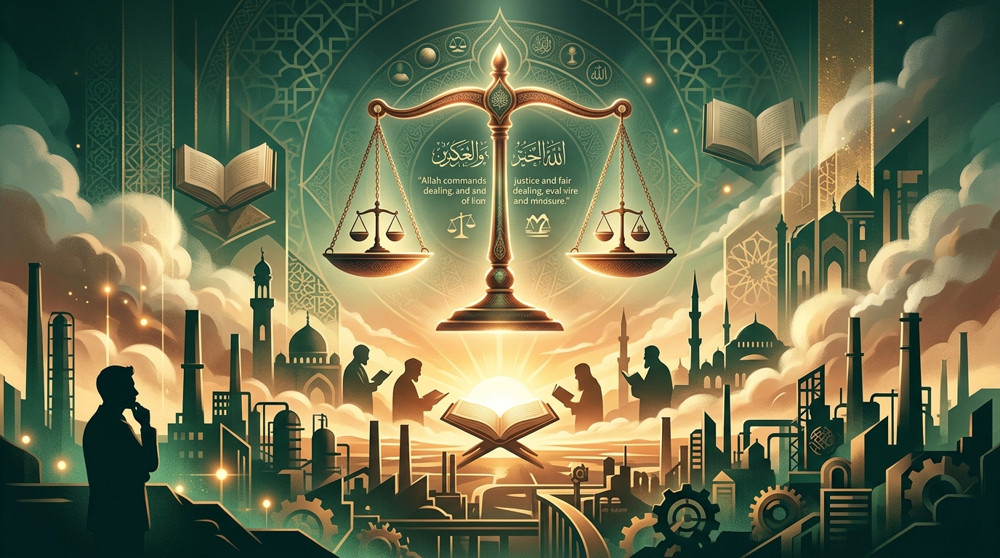
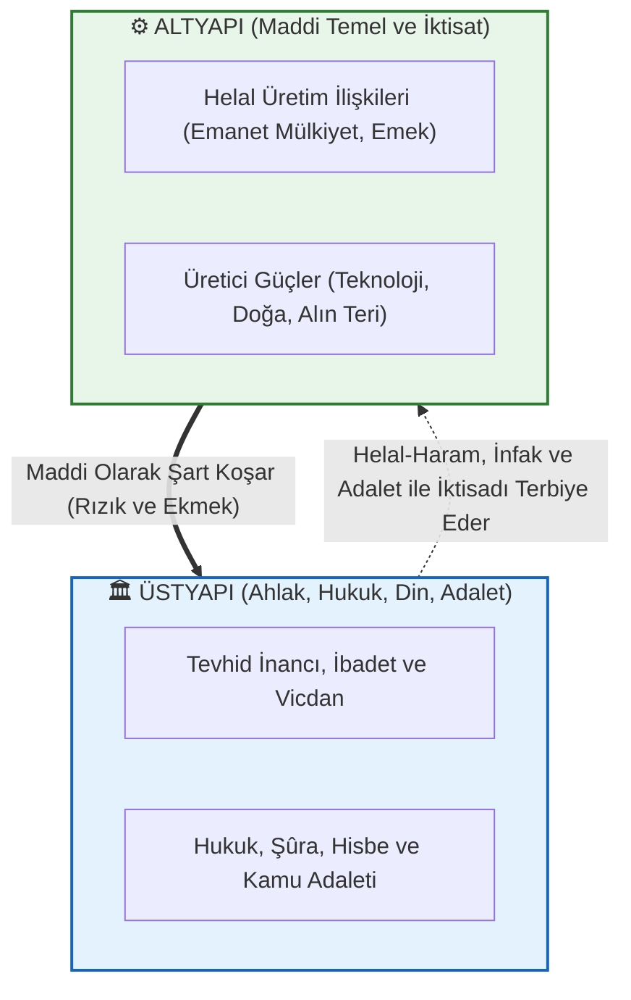
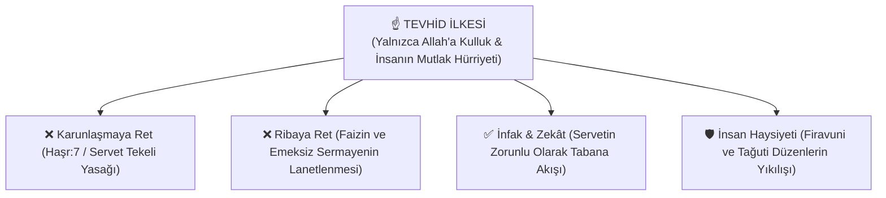
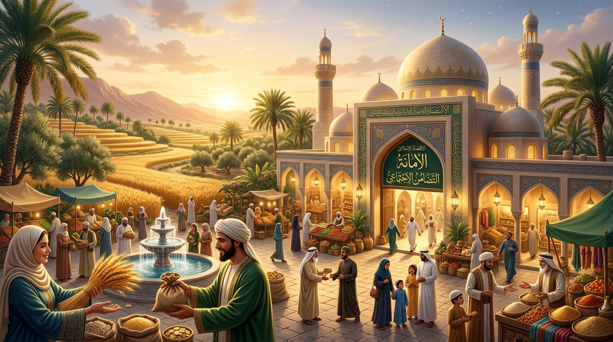
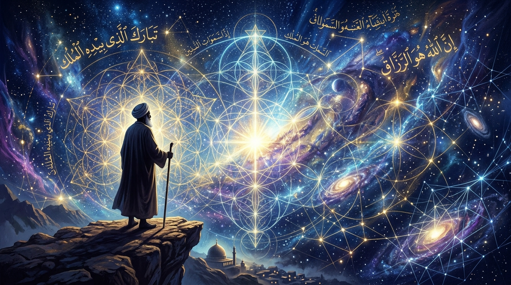
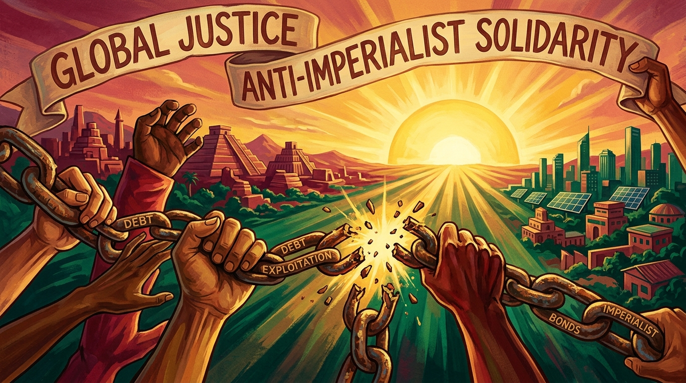

# 🌙 Marksizm Okumaları: Müslüman Bakış Açısıyla Felsefe, Ekonomi Politik ve Sosyal Adalet

[](LICENSE)
[](#)
[](index.html)
[](docs/)
[](docs/interaktif-calisma-plani-ve-mufredat.md)

<div align="center">
  
</div>

> *"Hikmet müminin yitiğidir; nerede bulursa onu almaya en layık olan odur."*  
> **— Hz. Muhammed (s.a.v.)**

Bu açık kaynak kütüphanesi ve **interaktif web portalı**; **Müslüman bir araştırmacı, ilim talebesi ve düşünürün gözüyle** Marksist felsefeyi, ekonomi politik eleştirisini (*Das Kapital*), tarihsel materyalizmi, eleştirel teoriyi, yabancılaşmayı, yapay zeka & platform kapitalizmini ve 20. yüzyıl reel sosyalizm tecrübelerini inceleyen kapsamlı, akademik, mukayeseli ve kaynaklı bir başvuru külliyatıdır.

---

## 🌟 İnteraktif Web Portalı ve Özellikleri

Külliyat, doğrudan tarayıcı üzerinden çalışan modern, sıfır bağımlılıklı tek sayfa web uygulaması (`index.html`) ile donatılmıştır:

* 📖 **Monografi Okuyucu & TTS (Sesli Dinle):** Web Speech API destekli sesli okuma, okuma ilerleme çubuğu ve yazdırma/PDF desteği.
* 🔍 **Canlı Arama Motoru:** `Ctrl+K` kısayoluyla 18 monografi, 60+ kavram ve düşünürler arasında anlık arama.
* ⚖️ **10 Eksenli İnteraktif Mukayese Matrisi:** Marksizm, Kapitalizm ve İslam İktisadı arasında dinamik karşılaştırma.
* 🧠 **Kavramlar Sözlüğü ve Zihin Haritası:** Terimlerin Batı ve İslami anlam haritaları.
* 🎯 **İnteraktif Kavrayış Testi (Quiz):** 3 kademeli soru havuzu, anında dönüt ve puanlama.
* ⏱️ **Zaman Tüneli:** 1818'den günümüze düşünce tarihi ve İslam dünyası kronolojisi.
* 🎓 **12 Haftalık Müfredat Takipçisi:** Tarayıcıda yerel olarak (`localStorage`) saklanan interaktif ilerleme kutucukları.
* 🌓 **Çoklu Tema Desteği:** Karanlık (Dark), Aydınlık (Light) ve Kitap/Sepya modu.

> **Hızlı Başlangıç:** Web uygulamasını çalıştırmak için depodaki `index.html` dosyasını tarayıcınızda açmanız yeterlidir.

---

## 🧭 Temel Vizyon ve Yaklaşımımız

```
                      MÜSLÜMANIN MARKSİZM'E BAKIŞI
  ┌─────────────────────────────────┬─────────────────────────────────┐
  │     KABUL VE İSTİFADE (TEŞHİS)  │       RET VE TASHİH (İTİKAD)    │
  ├─────────────────────────────────┼─────────────────────────────────┤
  │ ✅ Kapitalizmin artı-değer gaspı│ ❌ Ateist ve kaba materyalizm   │
  │ ✅ Faiz (riba) ve sermaye talanı│ ❌ "Din afyondur" indirgemesi   │
  │ ✅ Modern meta putçuluğu        │ ❌ Sınıf kini ve intikam ahlakı │
  │ ✅ Emperyalist sömürgecilik     │ ❌ Ruhsuz determinist tarih     │
  │ ✅ Emeğin kutsallığı ve hak     │ ❌ Mülkiyeti tamamen devlete verme│
  └─────────────────────────────────┴─────────────────────────────────┘
```

1. **Ne Öğrenebiliriz? (Doğru Teşhisler):**
   * Kapitalizmin vahşi sömürü dinamikleri, emeğin karşılıksız gaspı (**artı-değer**), servetin bir avuç tekelde toplanması (**Karunlaşma**), paranın ve tüketim mallarının modern bir puta dönüşmesi (**meta fetişizmi**) ve İslam coğrafyasını hedef alan **emperyalist talan mekanizmaları**.
2. **Nerede Ayrışıyoruz? (İtikadi ve Felsefi Tashih):**
   * Varlığı yalnızca kaba maddeye indirgeyen materyalizm yerine **Tevhid ve Metafizik Hakikati**; sınıf kini ve kanlı çatışma yerine **İslam Kardeşliği (Uhuvvet), Merhamet ve İnfak Ahlakını**; mutlak devletçi mülkiyet yerine **Mülk Allah'ındır (Emanet Mülkiyet)** nizamını savunmak.

---

## 📌 İçindekiler Tablosu

1. [🧭 Müslüman Bakış Açısıyla Temel Çerçeve](#1-müslüman-bakış-açısıyla-temel-çerçeve)
2. [🏛️ Marksist Kuramın Temel Sütunları ve İslami Mukayese](#2-marksist-kuramın-temel-sütunları-ve-i̇slami-mukayese)
3. [📊 Kuramsal Şemalar ve Diyagramlar](#3-kuramsal-şemalar-ve-diyagramlar)
   - [Altyapı - Üstyapı Diyalektiği ve Tevhidî Denge](#altyapı---üstyapı-diyalektiği-ve-tevhidî-denge)
   - [Kapitalist Üretim, Artı-Değer ve Faiz Devresi](#kapitalist-üretim-artı-değer-ve-faiz-devresi)
   - [Tevhid, İnfak ve Sosyal Adalet Modeli](#tevhid-i̇nfak-ve-sosyal-adalet-modeli)
4. [🗺️ Düşünce Ekolleri, Akımlar ve Müslüman Mütefekkirler Matrisi](#4-düşünce-ekolleri-akımlar-ve-müslüman-mütefekkirler-matrisi)
5. [⏱️ Tarihsel Dönüm Noktaları ve Kronoloji (1818 - Günümüz)](#5-tarihsel-dönüm-noktaları-ve-kronoloji-1818---günümüz)
6. [💎 Kapsamlı Alıntılar Kataloğu ve İsabetli Teşhisler Antolojisi](#6-kapsamlı-alıntılar-kataloğu-ve-i̇sabetli-teşhisler-antolojisi)
   - [A. Karl Marx & Friedrich Engels (Temel Metinler ve İsabetli Teşhisler)](#a-karl-marx--friedrich-engels-temel-metinler-ve-i̇sabetli-teşhisler)
   - [B. Devrim ve Emperyalizm (Lenin, Luxemburg, Troçki, Fanon)](#b-devrim-ve-emperyalizm-lenin-luxemburg-troçki-fanon)
   - [C. İslam Mütefekkirleri ve Sosyal Adalet (Gazali, Şeriati, İkbal, Garaudy, Topçu, Karakoç, Özel, Malcolm X)](#c-i̇slam-mütefekkirleri-ve-sosyal-adalet)
   - [D. Dışarıdan Yöneltilen Eleştiriler (Bakunin, Weber, Mises, Hayek, Popper, Arendt)](#d-dışarıdan-yöneltilen-eleştiriler)
7. [⚠️ Marksizmin Eksikleri, Kuramsal Kör Noktaları ve Eleştirel Alıntılar](#7-marksizmin-eksikleri-kuramsal-kör-noktaları-ve-eleştirel-alıntılar)
8. [🌍 Marksizm Uygulandı mı, Uygulanıyor mu? (Reel Sosyalizm Bilançosu)](#8-marksizm-uygulandı-mı-uygulanıyor-mu-reel-sosyalizm-bilançosu)
9. [🌌 Metafizik Felsefesi, Ontoloji ve Bilincin Hakikati](#9-metafizik-felsefesi-ontoloji-ve-bilincin-hakikati)
10. [👁️ İstihbarat Teşkilatları, Bilişsel Harp ve Metafizik Manipülasyon](#10-i̇stihbarat-teşkilatları-bilişsel-harp-ve-metafizik-manipülasyon)
11. [⚖️ Tevhid, Adalet ve Küresel Sermaye Eleştirisi (Maneviyat ve İktisat)](#11-tevhid-adalet-ve-küresel-sermaye-eleştirisi-maneviyat-ve-i̇ktisat)
12. [📐 Das Kapital ve Ekonomi Politiğin Matematiksel Formülasyonları](#12-das-kapital-ve-ekonomi-politiğin-matematiksel-formülasyonları)
13. [📚 Yapılandırılmış Okuma Kılavuzu (Pedagojik Seviyeler ve Rotalar)](#13-yapılandırılmış-okuma-kılavuzu-pedagojik-seviyeler-ve-rotalar)
14. [📁 Modüler Dokümantasyon Dizini (15 Özel Monografi Dosyası)](#14-modüler-dokümantasyon-dizini)
15. [❓ Sıkça Sorulan Sorular ve Felsefi Tahliller (FAQ)](#15-sıkça-sorulan-sorular-ve-felsefi-tahliller-faq)
16. [📖 Temel Kavramlar ve Hızlı Başvuru Sözlüğü](#16-temel-kavramlar-ve-hızlı-başvuru-sözlüğü)
17. [🌐 Dijital Kütüphaneler, Akademik Dergiler ve Açık Arşivler](#17-dijital-kütüphaneler-akademik-dergiler-ve-açık-arşivler)
18. [🤝 Katkıda Bulunma Standartları ve Lisans](#18-katkıda-bulunma-standartları-ve-lisans)

---

## 1. Müslüman Bakış Açısıyla Temel Çerçeve

İslam düşüncesi; yeryüzündeki hiçbir hakikate gözünü kapatmaz. Karl Marx'ın 19. yüzyıl sanayi kapitalizminin vahşi sömürüsüne dair yaptığı gözlemler, Kur'an'ın **"Karunlaşma"** ve **"Riba (Faiz) Yasağı"** uyarılarıyla büyük ölçüde örtüşür.

* **Emeğin Kutsallığı:** Hz. Peygamber (s.a.v.), *"İşçinin ücretini teri kurumadan veriniz"* buyurarak artı-değer gaspına 1400 yıl önceden set çekmiştir.
* **Modern Putçuluk:** Marx'ın *Meta Fetişizmi* dediği olgu, insanın kendi eliyle ürettiği paraya ve eşyaya tapınmasıdır (Şirk ve heva putçuluğu).
* **Felsefi Ayrışma:** Marksizm insanı sadece midesi olan bir üretim aracına indirgerken; İslam insanı ruh, kalp, akıl ve ebediyet arayışıyla donatılmış şerefli bir emanetçi (*ahsen-i takvim*) kabul eder.

<div align="center">
  
  <p><em>Görsel 1: Sanayi çarkları arasında yabancılaşan insan emeği ve alın terinin bereketi.</em></p>
</div>

> Kapsamlı analitik rehber için: [`docs/musluman-bakis-acisiyla-marksizm.md`](docs/musluman-bakis-acisiyla-marksizm.md)

---

## 2. Marksist Kuramın Temel Sütunları ve İslami Mukayese

* **Diyalektik ve Tarihsel Materyalizm:**  
  * *Marksist Teori:* Tarihin tek itici gücü üretim araçları ve sınıf çatışmasıdır.  
  * *İslami Tashih:* Madde gerçektir ama tek belirleyici değildir; ahlak, vahiy, niyet ve maneviyat tarihi dönüştüren otonom güçlerdir.
* **Artı-Değer ve Sömürü:**  
  * *Marksist Teori:* İşçinin ürettiği değer ile aldığı ücret arasındaki farka kapitalist el koyar.  
  * *İslami Tashih:* Bu açık bir kul hakkı gaspıdır; İslam emeksiz kazancı ve faizi haram kılmıştır.
* **Devlet ve Bürokrasi:**  
  * *Marksist Teori:* Proletarya diktatörlüğü geçicidir, devlet sönümlenecektir.  
  * *İslami Tashih:* Devleti tek partiye teslim etmek yeni bir tağuti bürokrasi (*Nomenklatura*) doğurur; adalet ancak bağımsız hukuk ve şûra ile korunur.

---

## 3. Kuramsal Şemalar ve Diyagramlar

### Altyapı - Üstyapı Diyalektiği ve Tevhidî Denge



---

### Tevhid, İnfak ve Sosyal Adalet Modeli



---

## 4. Düşünce Ekolleri, Akımlar ve Müslüman Mütefekkirler Matrisi

| Düşünce Okulu / Mütefekkir | Öne Çıkan İsimler | Temel Tez ve İslami Değerlendirme |
| :--- | :--- | :--- |
| **Klasik Marksizm** | Karl Marx, Friedrich Engels | Artı-değer, emek sömürüsü ve sınıf savaşı. (Teşhis güçlü, itikad çıkmazda). |
| **Marksizm-Leninizm** | V. I. Lenin | Emperyalizm analizi ve öncü parti. (Mazlum halkların uyanışına etki etti). |
| **Batı Marksizmi & Hegemonya** | Antonio Gramsci, Georg Lukács | Kültürel rıza üretimi, şeyleşme ve mevzi savaşı. |
| **Frankfurt Okulu & Eleştirel Teori** | Theodor Adorno, Max Horkheimer | Kültür endüstrisi, tek boyutlu insan ve tüketim uyuşturucusu. |
| **Bağımlılık Okulu & Üçüncü Dünyacılık** | Samir Amin, Andre Gunder Frank | Merkez-Çevre sömürüsü, eşitsiz mübadele ve küresel emperyalizm. |
| **İslam Sosyalizmi / Tevhid Ekolü** | Dr. Ali Şeriati | *Dine Karşı Din*: Karunların Şirk Dinine karşı ezilenlerin Tevhid Dini. |
| **Anadolu Sosyalizmi & Ahlak** | Nurettin Topçu | *İslam ve Sosyalizm*: Maddeci sınıf kinciliğine karşı ruhçu ve ahlaki nizam. |
| **İslam İktisadı & Medeniyet** | Aliya İzzetbegoviç | *Doğu ve Batı Arasında İslam*: Madde-ruh dengesi ve üçüncü yol. |
| **Marksizmden İslama Geçiş** | Roger Garaudy | Fransız Komünist Partisi ideologluğundan İslami hakikate ve adalete geçiş. |
| **Diriliş ve Medeniyet** | Sezai Karakoç | Batı maddeyi putlaştırdı, Doğu maddeyi küçümsedi; İslam maddeyi ruhun emrine verdi. |
| **İslami Şahsiyet ve Duruş** | İsmet Özel | Sosyalizm kapitalizmin gayrimeşru çocuğudur; gerçek direniş Müslümanca şahsiyettedir. |

---

### 📊 10 Temel Eksende Büyük Karşılaştırma Matrisi

| Kriter | 🟢 İslam İktisat Nizamı | 🔴 Marksist-Sosyalist Sistem | 🔵 Kapitalist-Serbest Piyasa |
| :--- | :--- | :--- | :--- |
| **1. Mülkiyet Anlayışı** | **Emanet Mülkiyet:** Asıl mülk Allah'ındır; fert meşru kazanır, sınırsız yığamaz (Kenz haram). | **Kolektif/Devlet Mülkiyeti:** Üretim araçlarında özel mülkiyet lağvedilir. | **Mutlak Özel Mülkiyet:** Sermayedar istediği gibi mülk biriktirir ve tekel kurar. |
| **2. Kazancın Meşruiyet Kaynağı** | **Alın Teri, Emek ve Helal Ticaret:** Riba, kumar, ihtikar ve spekülasyon yasaktır. | **Yalnızca Canlı Emek:** Sermaye kârı sömürüdür; artı-değer gasp kabul edilir. | **Sermaye ve Piyasa:** Paradan para kazanmak (faiz, borsa) meşru kâr sayılır. |
| **3. Servet Dağıtım Mekanizması** | **Zorunlu İnfak & Zekât:** Servetin tabana akması esastır (Haşr:7). | **Merkezi Planlama ve Dağıtım:** Devlet fiyatları ve tayınları belirler. | **Görünmez El & Fiyat Mekanizması:** Piyasa dengeler, zengin-fakir uçurumu derinleşir. |
| **4. Faiz (Riba) & Finans** | **Mutlak Yasak:** Faiz Allah ve Resulüne harp açmaktır; reel üretim esastır. | **Reddedilir:** Faiz getiren sermaye en parazit sömürü biçimidir. | **Sistemin Motoru:** Faizli kredi, borçlandırma ve türev piyasalar temeldir. |
| **5. İnsan Tanımı & Gaye** | **Ahsen-i Takvim & Kul:** Ruh, akıl, kalp ve ahlak sahibi sorumlu varlık. | **Homo Faber (Üreten İnsan):** Üretim ilişkilerinin şekillendirdiği maddi varlık. | **Homo Economicus:** Kendi kârını ve tüketim hazlarını maksimize eden birey. |
| **6. Sosyal Adalet Yolu** | **Uhuvvet, Hakkaniyet ve Karşılıklı Yardımlaşma:** Sınıf kini değil, adalet. | **Sınıf Savaşı ve Proletarya Diktatörlüğü:** Burjuvazinin zorla tasfiyesi. | **Bırakınız Yapsınlar (*Laissez-Faire*):** Güçlü olanın kazandığı rekabet. |
| **7. Ekoloji ve Tabiat** | **İlahi Emanet:** Tabiat Allah'ın ayetidir; israf ve fesat haramdır (Rûm:41). | **Metabolik Onarım:** Doğanın sermaye tarafından yağmalanmasına karşı çıkar. | **Sınırsız Kaynak:** Maksimum kâr için doğanın metalaştırılması ve tüketimi. |
| **8. Devletin Rolü** | **Adalet, Hisbe ve Denetim:** Tekelleşmeyi, faizi önler; helal piyasayı korur. | **Tekelci Yönetici:** Üretimi, dağıtımı ve toplumu tepeden tırnağa yönetir. | **Jandarma Devlet:** Özel mülkiyeti ve sermaye düzenini koruyan asgari bekçi. |
| **9. Nihai Hedef** | **Rıza-i İlahi ve Darusselam:** Dünyada adalet, ahirette ebedi saadet. | **Sınıfsız, Devletsiz Komünist Toplum:** Yeryüzü cenneti vaadi. | **Sonsuz Sermaye Büyümesi:** Tüketim, büyüme ve hissedar kârı. |
| **10. Maneviyat & Din** | **Tevhid ve Varlık Sebebi:** İmanın, vicdanın ve ahlakın kurucu temeli. | **Tarihsel İllüzyon:** Sınıflı toplumun çaresizlik ürünü (Afyon). | **Pazarlanabilir Meta:** İnançların bile tüketim sektörüne dönüştürülmesi. |

<div align="center">
  
  <p><em>Görsel: İslam İktisadı, Emanet Mülkiyet (İstihlaf) ve İnfak Nizamı — Faizin olmadığı, servetin tabana yayıldığı adil medeniyet pazarı.</em></p>
</div>

> Detaylı karşılaştırma için: [`docs/islam-iktisadi-ve-kapitalizm-marksizm-karsilastirmasi.md`](docs/islam-iktisadi-ve-kapitalizm-marksizm-karsilastirmasi.md)

---

## 5. Tarihsel Dönüm Noktaları ve Kronoloji (1818 - Günümüz)

* **1818:** Karl Marx doğdu.
* **1848:** *Komünist Manifesto* yayımlandı.
* **1867:** *Das Kapital* Cilt 1 basıldı (Artı-değer ve sömürü analizi).
* **1871:** Paris Komünü kuruldu.
* **1917:** Rusya'da Ekim Devrimi (Bolşevikler iktidara geldi).
* **1949:** Çin Devrimi (Mao Zedong).
* **1959:** Küba Devrimi (Fidel Castro & Che Guevara).
* **1979:** İran İslam Devrimi (Doğu ve Batı bloklarına karşı *"Ne Doğu Ne Batı, Yalnızca İslam"* şiarı).
* **1982:** Roger Garaudy Müslüman oldu (*Geleceğimizde İslam Var*).
* **1989-1991:** Berlin Duvarı yıkıldı; Sovyetler Birliği (SSCB) resmen dağıldı.
* **2008:** Küresel Finansal Kriz; Kapitalizm ve faiz sisteminin sorgulanması.
* **2020+:** Dijital Emek, Platform Kapitalizmi, Yapay Zekâ ve İklim Krizi.

> Ayrıntılı tarihsel kronoloji için: [`docs/tarihsel-kronoloji.md`](docs/tarihsel-kronoloji.md)

---

## 6. Kapsamlı Alıntılar Kataloğu ve İsabetli Teşhisler Antolojisi

> 💎 **Özel İhtisas Dosyası:** Marksizmin kapitalizm teşhisindeki en çarpıcı hakikatleri, mantıksal doğrulukları ve kapsamlı alıntı antolojisi için: [`docs/marksizmdeki-hakikatler-ve-isabetli-teshisler.md`](docs/marksizmdeki-hakikatler-ve-isabetli-teshisler.md)

---

### A. Karl Marx & Friedrich Engels (Temel Metinler ve Ekonomi Politik Teşhisleri)

> *"Filozoflar dünyayı yalnızca çeşitli biçimlerde yorumlamakla yetindiler; oysa asıl sorun onu değiştirmektir."*  
> — **Karl Marx**, *Feuerbach Üzerine Tezler* (1845)

> *"Sermaye ölü emektir; vampir gibi ancak canlı emeği emerek yaşar ve ne kadar çok canlı emek emerse o kadar çok yaşar."*  
> — **Karl Marx**, *Das Kapital*, Cilt 1, Bölüm 10 (Çalışma Günü)

> *"İşçi ne kadar çok zenginlik üretirse, üretiminin gücü ve hacmi ne kadar artarsa, kendisi o kadar yoksul bir meta haline gelir. Nesnelerin dünyasının değer kazanması, insanların dünyasının değersizleşmesiyle doğru orantılıdır."*  
> — **Karl Marx**, *1844 İktisadi ve Felsefi Elyazmaları*

> *"Metanın fetiş karakteri: İnsan elinin ürünleri, kendi başlarına yaşayan, insanlarla ve birbirleriyle ilişki kuran bağımsız ilahlara dönüşür. İnsanlar elleriyle yaptıkları nesnelerin (markaların, paranın, borsanın, fiyat grafiklerinin) kölesi ve müridi olurlar."*  
> — **Karl Marx**, *Das Kapital*, Cilt 1, Bölüm 1 (Meta Fetişizmi ve Sırrı)

<div align="center">
  
  <p><em>Görsel 2: Meta Fetişizmi — Paranın ve sermayenin tapınağında insanın kendi ürettiği nesnelere kul olması.</em></p>
</div>

> *"Sermaye yüzde 10 kâr karşısında her yere sızar; yüzde 20 kâr heves uyandırır; yüzde 50 kâr cüreti artırır; yüzde 100 kârda bütün insani kanunları ayaklar altına alır; yüzde 300 kâr karşısında ise işleyemeyeceği hiçbir cinayet, göze alamayacağı hiçbir cürüm yoktur; darağacı tehdidi altında olsa bile."*  
> — **T.J. Dunning'den aktaran Karl Marx**, *Das Kapital*, Cilt 1, 31. Bölüm

> *"Kapitalist üretim, insan ile toprak arasındaki metabolik etkileşimi bozar; yani insanın topraktan besin olarak aldığı unsurların toprağa geri dönmesini engeller; böylece toprağın ebedi verimlilik şartlarını tahrip eder. Kapitalist tarımdaki her ilerleme yalnızca emekçiyi soyma sanatında değil, toprağı soyma sanatında da bir ilerlemedir."*  
> — **Karl Marx**, *Das Kapital*, Cilt 1 (Metabolik Yarılma ve Ekolojik Yıkım)

> *"Faiz getiren sermaye ($M - M'$, Paradank Para Doğması), sermaye ilişkisinin en fetişleşmiş, en yabancılaşmış ve en asalak biçimidir. Burada para, hiçbir üretim sürecinden geçmeksizin doğrudan doğruya daha fazla para yaratıyormuş gibi görünür; bu ise tefeciliğin ve finansal sömürünün en saf ve çıplak illüzyonudur."*  
> — **Karl Marx**, *Das Kapital*, Cilt 3, 24. Bölüm

> *"Egemen sınıfın fikirleri, her çağda egemen fikirlerdir. Toplumun maddi üretim araçlarını elinde bulunduran sınıf, aynı zamanda zihinsel üretim araçlarını da kontrol eder; böylece kendi çıkarlarını bütün toplumun evrensel çıkarıymış gibi sunar."*  
> — **Karl Marx & Friedrich Engels**, *Alman İdeolojisi* (1846)

> *"Burjuvazi, şimdiye kadar saygı duyulan ve huşu ile bakılan her mesleğin etrafındaki kutsal haleyi söküp attı. Doktoru, avukatı, rahibi, şairi ve bilim insanını kendi ücretli emekçisine dönüştürdü. İnsan ile insan arasında çıplak menfaatten, katı 'nakit ödeme'den başka hiçbir bağ bırakmadı."*  
> — **Karl Marx & Friedrich Engels**, *Komünist Manifesto* (1848)

> *"Makineler insanı işinden etmekle kalmaz; çalışan insanı makinenin canlı bir vidasına, ritmine ve hızına mahkum bir aparatına dönüştürür. İnsan aklı ve yaratıcılığı makinenin yazılımına aktarılırken, emekçi aptallaştırılır."*  
> — **Karl Marx**, *Grundrisse* (Makineler Üzerine Fragman)

---

### B. Devrim, Emperyalizm ve Küresel Sömürü (Lenin, Luxemburg, Fanon, Samir Amin, Sankara)

> *"Emperyalizm; kapitalizmin tekellerin ve mali sermayenin egemenliğinin kurulduğu, sermaye ihracının birinci derecede önem kazandığı, dünyanın uluslararası tröstler arasında paylaşıldığı ve bütün toprakların en büyük kapitalist güçler arasında bölüşülmesinin tamamlandığı aşamadır."*  
> — **V. I. Lenin**, *Emperyalizm: Kapitalizmin En Yüksek Aşaması* (1916)

> *"Kapitalizm tek başına kapalı bir sistem olarak yaşayamaz; varlığını sürdürebilmek ve kâr oranlarındaki düşüşü telafi edebilmek için kapitalist olmayan coğrafyaları (İslam alemini, Afrika'yı, Asya köylüsünü) zorla, borçla ve savaşla kendi talan sahasına katmak mecburiyetindedir."*  
> — **Rosa Luxemburg**, *Sermaye Birikimi* (1913)

> *"Özgürlük, daima ve sadece farklı düşünenin özgürlüğüdür. Bu bir adalet fanatizmi değil; eleştirel aklın ve hakikatin yegâne nefes alma borusudur."*  
> — **Rosa Luxemburg**, *Rus Devrimi Üzerine* (1918)

> *"Sömürgecilik ezilen halkın yalnızca bugünkü bedenini ve toprağını gasp etmekle kalmaz; geçmişini tahrif eder, kültürünü aşağılar, dilini unutturur ve onu kendi efendisine hayran bir 'zihinsel köle' haline getirir."*  
> — **Frantz Fanon**, *Yeryüzünün Lanetlileri* (1961)

> *"Beyaz efendinin diliyle düşünen, onun standartlarıyla kendi derisini tartan sömürgeleştirilmiş zihin, özgürleştiğini sandığı anda dahi sömürgecinin aynasındaki bir gölgeden ibarettir."*  
> — **Frantz Fanon**, *Siyah Deri, Beyaz Maskeler* (1952)

> *"Küresel kapitalist sistem, doğası gereği 'Eşitsiz Değişim' üretir. Merkez ülkeler çevre ülkelere teknoloji satıp onların hammaddesini ve ucuz emeğini emerek onları kalıcı bir 'Azgelişmişlik' tuzağına mahkûm eder. Çözüm, küresel sermaye zincirinden radikal bir kopuştur (Delinking)."*  
> — **Samir Amin**, *Eşitsiz Gelişme ve Emperyalizm*

> *"Bizi borçlandıranlar, bizi sömürenlerdir. Dış borç, Afrika'yı ve ezilen halkları yeniden sömürgeleştirmenin modern, kravatlı ve kan dökmeden uygulanan en vahşi mekanizmasıdır. Eğer bu borcu ödemezsek emperyalistler ölmez; ama ödersek halkımız açlıktan ölür!"*  
> — **Thomas Sankara**, *Afrika Birliği Konuşması* (1987)

> *"Kapitalizmin mantığı insani ihtiyaçları karşılamak değil, sermayeyi genişletmektir. Bu yüzden bir yanda tonlarca gıda denize dökülürken diğer yanda çocuklar açlıktan ölür; çünkü aç insanın cebinde satın alma gücü yoktur."*  
> — **Che Guevara**, *Sosyalizm ve İnsan* (1965)

<div align="center">
  
  <p><em>Görsel: Küresel Adalet ve Mazlumların Dayanışması — Borç zincirlerini kıran ilahi adalet terazisi ve evrensel kardeşlik.</em></p>
</div>

---

### C. İslam Mütefekkirleri, Âlimleri ve Sosyal Adalet Mirası

#### 📖 İlahi Vahiy ve Nebevi Sünnetten İktisadi & Ahlaki İlkeler

> *"Mallar, içinizden yalnızca zenginler arasında elden ele dolaşan bir servet gücü (tahakküm tekeli) olmasın!"*  
> — **Kur'an-ı Kerim**, Haşr Suresi, 7. Ayet

> *"Ey iman edenler! Hahamlardan ve rahiplerden birçoğu insanların mallarını haksız yollarla yerler ve Allah'ın yolundan alıkoyarlar. Altın ve gümüşü yığıp da (kenz edip/tekelleştirip) onları Allah yolunda infak etmeyenleri yakıcı bir azapla müjdele!"*  
> — **Kur'an-ı Kerim**, Tevbe Suresi, 34. Ayet

> *"Karun, 'Bu servet bana ancak bendeki bilgi ve beceri sayesinde verilmiştir' dedi. Bilmez miydi ki Allah, ondan önceki nesillerden kendisinden çok daha güçlü ve servetçe daha üstün nicelerini helak etmiştir? Nihayet Biz onu da sarayını da yerin dibine geçirdik!"*  
> — **Kur'an-ı Kerim**, Kasas Suresi, 78-81. Ayetler

> *"Faiz (riba) yiyenler, ancak şeytan çarpmış kimsenin kalktığı gibi kalkarlar. Bu, onların 'Alışveriş de faiz gibidir' demelerindendir. Oysa Allah alışverişi helal, faizi ise haram kılmıştır... Eğer faizi terk etmezseniz, Allah'a ve Resulü'ne karşı savaş açtığınızı bilin!"*  
> — **Kur'an-ı Kerim**, Bakara Suresi, 275-279. Ayetler

> *"Çoklukla övünmek (servet, güç ve tüketim yarışı) sizi kabirlere varıncaya kadar oyalayıp aldattı!"*  
> — **Kur'an-ı Kerim**, Tekâsür Suresi, 1-2. Ayetler

> *"Gördün mü o dini/hesap gününü yalanlayanı? İşte o, yetimi itip kakar; yoksulu doyurmaya önayak olmaz. Vay haline o namaz kılanların ki, onlar namazlarından gafildirler; gösteriş yaparlar ve en ufak bir yardıma (mâûna) dahi engel olurlar!"*  
> — **Kur'an-ı Kerim**, Mâûn Suresi, 1-7. Ayetler

> *"İşçinin hakkını ve ücretini, alın teri kurumadan önce veriniz."*  
> — **Hz. Muhammed (s.a.v.)**, (İbn Mâce, Rühûn, 4)

> *"Hiç kimse elinin emeğinden ve alın terinden daha hayırlı bir rızık asla yememiştir. Allah'ın Peygamberi Dâvûd (a.s.) da kendi elinin emeğini yerdi."*  
> — **Hz. Muhammed (s.a.v.)**, (Buhârî, Büyû', 15)

> *"Piyasaya helal mal getiren rızıklandırılır; fiyatları yükseltip halkı mağdur etmek için mal saklayan (ihtikar/tekelcilik yapan) ise lanetlenmiştir."*  
> — **Hz. Muhammed (s.a.v.)**, (İbn Mâce, Ticârât, 6)

> *"Müslümanlar üç şeyde ortaktır: Suda, merada ve enerjide (ateşte). Bunların tekelleştirilmesi ve halktan esirgenmesi haramdır."*  
> — **Hz. Muhammed (s.a.v.)**, (Ebû Dâvûd, Büyû', 60)

---

#### 🧠 Müslüman Düşünürlerin, Filozofların ve Mücahitlerin Tahlilleri

> *"Sosyalizm ve Marksizm insanın karnını doyurmak için ruhunu ve hürriyetini feda etti; Kapitalizm ise hürriyet adı altında insanı doymak bilmez sermayenin ve tüketim çarkının kölesi kıldı. İslam; madde ile ruhu, ferdî mesuliyet ile toplumsal adaleti tek bir Tevhidî potada birleştiren yegâne hakiki nizamdır."*  
> — **Aliya İzzetbegoviç**, *Doğu ve Batı Arasında İslam*

> *"Bir ülkede adalet olmadan kalkınma olmaz. Yönetici halkın zenginleşmesini vergilendirmekten önce, halkın refahını ve emniyetini artırmayı hedeflemelidir. Çünkü vergi toplamak, imar ve adaletin meyvesidir; imar olmadan vergi koyanlar, süt almak için ineği kesen akılsızlara benzerler."*  
> — **Hz. Ali (r.a.)**, *Nehcü'l-Belâğa* (Mısır Valisi Mâlik b. el-Eşter'e Tarihi Emirname)

> *"Her kazanç ve zenginliğin yegâne hakiki kaynağı insan emeğidir. Emek olmaksızın yeryüzündeki hiçbir maden, toprak veya hammadde kendiliğinden servete dönüşmez. Devlet haksız vergilerle ve tekelleşmeyle halkın emeğine el koyduğunda üretim durur, umran çöker ve medeniyet yok olur."*  
> — **İbn Haldun**, *Mukaddime* (1377)

> *"Para, Allah'ın kulları arasında adaleti ve mübadeleyi sağlasın diye yarattığı bir ölçü aracı ve aynadır; onun kendi zatında bir faydası ve amacı yoktur. Parayı faizle çoğaltıp kendi başına bir meta ve gaye kılanlar, yaratılış fıtratını tersyüz eden ve parayı kısır bir kadından çocuk bekler gibi işleten zalimlerdir."*  
> — **İmam Gazali**, *İhyâu Ulûmi'd-Dîn* (Kitâbu'l-Helâl ve'l-Harâm)

> *"Tarih boyunca iki din savaşmıştır: Biri sarayların, Karunların, Bel'amların ve Firavunların 'Şirk Dini'; diğeri ise ezilenlerin, mustazafların ve peygamberlerin 'Tevhid Dini'dir. Ebu Zer el-Gıfari, Muaviye'nin yeşil sarayına karşı 'Altın ve gümüşü yığıp infak etmeyenleri yakıcı bir azapla müjdele!' ayetini haykırırken, sınıfsız ve sömürüsüz Tevhid nizamının bayraktarıydı."*  
> — **Dr. Ali Şeriati**, *Dine Karşı Din* & *Ebu Zer*

> *"Tevhid sadece göklerde bir Tanrı'nın varlığına inanmak değildir; Tevhid, yeryüzünde kula kulluğun, sınıfsal tahakkümün, ırkçılığın ve Karunlaşmanın kökünü kazıyan bir dünya görüşüdür. La ilahe illallah demek; bütün tağutlara, istikbar odaklarına ve sermaye putlarına 'Hayır!' demektir."*  
> — **Dr. Ali Şeriati**, *İslam Sosyolojisi Üzerine*

> *"Lenin Allah'ın Huzurunda der ki: 'Ey Kâinatın Sahibi! Yeryüzünde kiliseler tefecilerin kasası, bankalar ise yeni tapınaklar olmuştu; ben o putları kırdım ama kalplerdeki manevi boşluğu dolduramadım.' Doğu'nun aradığı diriliş, Batı'nın çürümüş parası ve kaba maddeciliği değil; İslam'ın aşk, adalet ve hikmet nizamıdır."*  
> — **Muhammed İkbal**, *Cavidnâme / Peyam-ı Maşrık*

> *"İslam'da mülkiyet mutlak değil, emanettir. Mülkün mutlak sahibi Allah'tır. Toplumdaki yoksulun, yetimin ve mazlumun zenginin malı üzerindeki hakkı (zekat ve infak), bir lütuf veya sadaka değil; hakkın sahibine iadesidir."*  
> — **Seyyid Kutub**, *İslam'da Sosyal Adalet* (1949)

> *"Fransız Komünist Partisi'nin baş ideoloğuyken gördüm ki; Marksizm kapitalizmin maddi çelişkilerini teşhis ederken insanı metafizik bir çölün ortasında yapayalnız bıraktı. İnsanı sadece üreten bir hayvana indirgedi. İslam ise adaleti semadan koparmayan, insanı kâinatın şerefli emanetçisi kılan tek hakikattir."*  
> — **Roger Garaudy**, *Geleceğimizde İslam Var* & *İslam'ın Vadettikleri*

> *"Bir toplum sömürülmeye elverişli hale gelmedikçe (kabiliyet-i istimar), emperyalistler orayı işgal edemez. Batı'nın sömürgeciliği dışsal bir mikroptur; ama o mikrop ancak içerideki fikri ve ahlaki çürüme zemin bulduğunda bünyeyi hasta eder. Kurtuluş, nefsi ve aklı Tevhid ekseninde yeniden inşa etmektir."*  
> — **Malik bin Nebi**, *Sömürgecilik ve Sömürülmeye Yatkınlık*

> *"Bizim kavgamız, Batı'nın sınıf kini üzerine kurulu materyalist kavgası değildir. Bizim kavgamız; İslam'ın merhamet, infak ve alın teri ahlakına dayanan Anadolu ruhçuluğudur. Sermayenin tekelleşmesine karşı duruşumuz imandandır."*  
> — **Nurettin Topçu**, *İslam ve Sosyalizm* & *İsyan Ahlakı*

> *"Marksizm, Batı'nın kendi içinde ürettiği en radikal özkritiktir. Fakat bir Hristiyan sapmasıdır; kiliseye isyan ederken Tanrı'yı da inkâr etmiş, materyalizmin batağına saplanmıştır. Doğu insanı, Batı'nın bu iç kavgasında taraf olmak zorunda değildir; bizim meşalemiz Tevhid'dir."*  
> — **Cemil Meriç**, *Umrandan Uygarlığa* & *Bu Ülke*

> *"Batı maddeyi putlaştırdı, Doğu ise maddeyi küçümseyip tembelliğe düştü. İslam ise maddeyi ruhun emrine vererek hakiki medeniyeti kurdu. Diriliş nesli; ne kapitalizmin faizli saraylarına ne de komünizmin ruhsuz kışlalarına boyun eğecektir."*  
> — **Sezai Karakoç**, *Diriliş Neslinin Âmentüsü* & *İslam Toplumunun Ekonomik Strüktürü*

> *"Müslümanlar kapitalizmin şartlarına intibak ettikçe Müslümanlıklarından ödün verirler. Sosyalizm kapitalizmin gayrimeşru çocuğudur; aynı pozitivist gövdeden çıkmıştır. Gerçek direniş faiz, borsa ve sömürü çarkına çomak sokan tavizsiz bir Müslümanca şahsiyetle başlar."*  
> — **İsmet Özel**, *Üç Mesele* & *Waldo Sen Neden Burada Değilsin?*

> *"Kapitalizm akbaba gibidir; sömürü kapitalizmin fıtratında vardır, kan emmeden yaşayamaz. İslam ise bütün ırkları, renkleri ve sınıfları tek bir ilahi potada kardeş kılan, adaleti yeryüzüne hâkim kılan yegâne hakikattir."*  
> — **Malcolm X (El-Hac Mâlik el-Şahbaz)**, *Son Konuşmalar* (1964)

> *"Kapitalizmin en büyük tahribatı, insanın 'ihtiyaç' kavramını tahrif etmesidir. İnsana gerçekte ihtiyacı olmayan binlerce metaı ihtiyaçmış gibi dayatarak onu bitmek bilmez bir tüketim yarışının ve borç köleliğinin içine hapseder."*  
> — **Rasim Özdenören**, *Müslümanca Düşünme Üzerine Denemeler*

---

### D. Eleştirel Teori, Çağdaş Felsefe ve Dijital Kapitalizm Tahlilleri

> *"Tarihsel materyalizm, satranç oynayan bir otomat gibidir. Her hamleyi kazanabilir; ancak arkasında gizlenen ve ipleri elinde tutan çirkin teolojik cüceden (metafizik hakikat ve ilahi adalet arayışından) yardım aldığı sürece."*  
> — **Walter Benjamin**, *Tarih Felsefesi Üzerine Tezler* (1940)

> *"Kültür endüstrisi, kitleleri sürekli olarak vaat edilen şeylerle eğlendirirken, onları düşünmekten, sorgulamaktan ve isyan etmekten alıkoyar. Reklamlar, eğlence sektörü ve popüler kültür; modern insanın bilincini felç eden yeni ve kusursuz bir kitle afyonudur."*  
> — **Theodor W. Adorno & Max Horkheimer**, *Aydınlanmanın Diyalektiği* (1947)

> *"Çağdaş endüstri toplumu insanı tek boyutlu hale getirmiştir. İhtiyaçlarımız bile sermaye tarafından imal edilir. İnsanlar sahip oldukları eşyalarla kendilerini tanımlar; ruhunu otomobilinde, televizyonunda ve ev aletlerinde bulur."*  
> — **Herbert Marcuse**, *Tek Boyutlu İnsan* (1964)

> *"Egemen sınıf sadece polisi ve ordusuyla hükmetmez; okullar, medya, sanat ve kültürel kurumlar aracılığıyla ezilenlerin rızasını (Kültürel Hegemonya) üreterek onların kendi köleliklerini 'sağduyu' ve kaçınılmaz kader olarak görmelerini sağlar."*  
> — **Antonio Gramsci**, *Hapishane Defterleri*

> *"Devlet sadece kaba zor aygıtlarıyla değil; İdeolojik Devlet Aygıtları (okul, aile, medya, hukuk) yoluyla bireyleri ideolojinin içine 'özne' olarak çağırır (interpellation) ve onları kurulu düzenin itaatkâr çarkları yapar."*  
> — **Louis Althusser**, *İdeoloji ve Devletin İdeolojik Aygıtları* (1970)

> *"Gerçek dünyanın basit imgelere dönüştüğü gösteri toplumunda, imgeler gerçek güçler ve hipnotik davranış modelleri haline gelir. Sahip olmanın yerini 'görünmek' almıştır; gösteri, metanın toplumsal hayatı bütünüyle işgal etmesidir."*  
> — **Guy Debord**, *Gösteri Toplumu* (1967)

> *"Bugün dünyanın sonunu hayal etmek, kapitalizmin sonunu hayal etmekten daha kolay hale gelmiştir. Kapitalist gerçekçilik, başka hiçbir alternatifin mümkün olmadığını fısıldayan sinsi ve görünmez bir zihinsel hapishanedir."*  
> — **Mark Fisher**, *Kapitalist Gerçekçilik* (2009)

> *"Kapitalizm sadece fabrikada artı-değer üreterek büyümez; kamu mallarını özelleştirerek, doğal kaynakları yağmalayarak, barınma hakkını finansallaştırarak ve halkları borçlandırarak 'Mülksüzleştirme Yoluyla Birikim' yapar."*  
> — **David Harvey**, *Yeni Emperyalizm* & *Sermayenin On Yedi Çelişkisi*

> *"Gözetim Kapitalizmi; insan deneyimini davranışsal veri biçiminde bedava hammadde olarak tekellerin mülkiyetine geçirir. Artık müşteri değil, bizzat satılan hammadde ve manipüle edilen ürün biziz."*  
> — **Shoshana Zuboff**, *Gözetim Kapitalizmi Çağı* (2019)

> *"21. yüzyılın disiplin toplumu yerini 'Başarı Toplumu'na bırakmıştır. Artık insan bir efendi tarafından zorla sömürülmez; kendi kendisinin patronu ve kölesi olarak 'kendini gönüllüce sömürür' ve tükenmişlik krizine sürüklenir."*  
> — **Byung-Chul Han**, *Yorgunluk Toplumu* & *Psikopolitika*

> *"Kapitalizmin en büyük ideolojik zaferi, kendisini 'doğal insan doğasının kaçınılmaz sonucu' olarak yutturmasıdır. Oysa krizler birer kaza değil, sistemin bizzat motorudur."*  
> — **Slavoj Žižek**, *Gıdıklanan Özne* & *İdeolojinin Yüce Nesnesi*

<div align="center">
  
  <p><em>Görsel: Yapay Zeka, Bilişsel Emek ve Hikmet — Teknolojinin insan onuruna ve adalet nizamına hizmet ettiği dengeli gelecek tasavvuru.</em></p>
</div>

---

### E. Dışarıdan Yöneltilen Eleştiriler (Liberalizm, Anarşizm ve Bilim Felsefesi)

> *"Devlet varsa kaçınılmaz olarak tahakküm ve kölelik vardır. Marksistlerin 'Proletarya Diktatörlüğü' veya 'Halk Devleti' adını verdikleri şey, küçük bir imtiyazlı bürokrat azınlığın halk üzerindeki despotizmidir. Sopanın adına 'Halkın Sopası' denmesi, sırtına vurulan halkın acısını dindirmez."*  
> — **Mihail Bakunin**, *Devlet ve Anarşi* (1873)

> *"Mülkiyet hırsızlıktır! Fakat mülkiyeti tek bir devlete devretmek de bütün toplumu o devletin kölesi yapmaktır."*  
> — **Pierre-Joseph Proudhon**, *Mülkiyet Nedir?* (1840)

> *"Serbest piyasa fiyatları olmaksızın rasyonel ekonomik hesaplama yapmak imkânsızdır. Üretim araçlarının mülkiyeti tek elde toplandığında hiçbir bürokrasi milyonlarca insanın anlık ihtiyaç ve tercihlerini doğru planlayamaz; merkezi planlama karanlıkta el yordamıyla yürümektir."*  
> — **Ludwig von Mises**, *Sosyalizm: İktisadi ve Sosyolojik Bir Analiz* (1922)

> *"Ekonomik faaliyetlerin tek bir merkezden planlanması, adım adım siyasi ve kişisel hürriyetlerin yok edilmesine ve tiranlığa yol açar. Cenneti yeryüzünde kurma iddiası, daima yeryüzünü cehenneme çeviren 'Kölelik Yolu'dur."*  
> — **Friedrich August von Hayek**, *Kölelik Yolu* (1944)

> *"Marksizm başlangıçta hakiki bir bilimsel hipotez gibi yola çıktı; ancak öngörüleri (işçilerin mutlak yoksullaşması, gelişmiş sanayi ülkelerinde devrim vb.) yanlışlandıkça, teorisyenleri teoriyi revize edip yanlışlanamaz dogmatik bir inanç/kehanet sistemine dönüştürdüler."*  
> — **Karl Popper**, *Açık Toplum ve Düşmanları* & *Tarihselciliğin Sefaleti*

> *"Totalitarizm, insanın sadece eylemlerini değil; düşüncesini, vicdanını ve mahremiyetini de tek bir resmi ideolojiye kurban eder. İster sınıf ister ırk adına olsun, mutlak hakikat iddiasındaki ideolojiler insan haysiyetini yok eder."*  
> — **Hannah Arendt**, *Totalitarizmin Kaynakları* (1951)

> *"Marksizm, 19. yüzyıl sanayileşmesinin yarattığı ıstıraplara verilmiş romantik ve öfkeli bir cevaptır. Ancak aydınların komünizme duyduğu kör inanç, seküler bir din arayışından farksızdır; bu inanç 'Aydınların Afyonu'dur."*  
> — **Raymond Aron**, *Aydınların Afyonu* (1955)

---

## 7. Marksizmin Eksikleri, Kuramsal Kör Noktaları ve Eleştirel Alıntılar

1. **İktisadi Hesaplama ve Kıtlık Problemi:** Fiyat mekanizması olmaksızın tüketici tercihlerinin bürokratik merkezden dağıtılamaması.
2. **Epistemolojik Yanlışlanamazlık:** Bilim iddiasının dogmatik bir inanç kalıbına dönüşmesi.
3. **Yeni Sınıf (Nomenklatura) ve Bürokrasi Tuzağı:** Özel mülkiyet kalkınca sömürünün bitmeyip parti elitlerinin yeni bir imtiyazlı zümreye dönüşmesi.
4. **İnsan Doğası ve Teşvik Sorunu:** Mülkiyet kalktığında sorumluluk ve özen bağının kopması.
5. **Milliyetçilik ve Kimlik Körlüğü:** Sınıf aidiyetinin ulusal/dinsel aidiyetler karşısında 1914'ten beri kırılgan kalması.

> Genişletilmiş eleştiri monografisi için: [`docs/marksizmin-eksikleri-ve-elestirel-alintilar.md`](docs/marksizmin-eksikleri-ve-elestirel-alintilar.md)

---

## 8. Marksizm Uygulandı mı, Uygulanıyor mu? (Reel Sosyalizm Bilançosu)

* **Başarılar:** Okuma-yazma seferberliği, parasız sağlık ve eğitim, sıfır evsizlik güvencesi, kadın hakları ve Batı'da refah devletini doğurması.
* **Başarısızlıklar:** Tek parti diktatörlüğü, Gulag kampları, tüketim mallarında kronik kıtlıklar ve sivil inovasyon tıkanıklığı.
* **Sonuç:** Kapitalizm eleştirisi olarak %100 çalışmakta; ancak 20. yüzyıl katı komuta ekonomisi çökmüştür.

> Tarihsel bilanço raporu için: [`docs/tarihsel-uygulamalar-ve-reel-sosyalizm-bilancosu.md`](docs/tarihsel-uygulamalar-ve-reel-sosyalizm-bilancosu.md)

---

## 9. Metafizik Felsefesi, Ontoloji ve Bilincin Hakikati

Metafizik (*İlk Felsefe*); varlığın kökenini, bilincin gizemini ve aşkın hakikati araştırır.
* **İslam Metafiziği (İbn Arabi & Molla Sadra):** *Vahdet-i Vücud* ve *Cevheri Hareket*.
* **Kuantum Fiziği:** Gözlemci etkisi ve Kuantum Dolanıklık ile maddenin bilince bağlı bir olasılık alanı olduğunun ortaya çıkışı.
* **Ruhsal Çöküş:** Metafiziği dışlayan materyalizmin modern dünyada yarattığı derin anlamsızlık ve nihilizm krizi.

<div align="center">
  
  <p><em>Görsel 3: İslam Metafiziği — Kozmik ahenk, ilahi nizam ve maddenin ötesindeki aşkın şuur.</em></p>
</div>

> Metafizik ve ontoloji monografisi için: [`docs/metafizik-felsefesi-ve-varlik-kurami.md`](docs/metafizik-felsefesi-ve-varlik-kurami.md)

---

## 10. İstihbarat Teşkilatları, Bilişsel Harp ve Metafizik Manipülasyon

Egemen emperyalist devletler ve istihbarat teşkilatları (CIA, KGB, MOSSAD); kitleleri kontrol etmek ve jeopolitik hedeflere ulaşmak için inançları, mitolojileri ve ezoterizmi silahlaştırmıştır:
* **CIA Project Stargate & MK-Ultra:** Uzaktan görü (*Remote Viewing*), zihin kontrolü ve parapsikolojik harp.
* **Sovyet KGB Psikotronik Araştırmaları:** Biyo-frekanslar ve elektromanyetik zihin yönlendirme.
* **Kehanetlerin Silahlaştırılması:** Dini mitolojilerin ve kıyamet senaryolarının jeopolitik işgaller için operasyonelleştirilmesi.

> Ayrıntılı araştırma dosyası için: [`docs/istihbarat-metafizik-ve-psikolojik-harp.md`](docs/istihbarat-metafizik-ve-psikolojik-harp.md)

---

## 11. Tevhid, Adalet ve Küresel Sermaye Eleştirisi (Maneviyat ve İktisat)

* **Riba (Faiz) Yasağı:** Paranın parayı doğurması küresel sömürünün kalbidir.
* **İnfak ve Zekât:** Servetin tabana zorunlu yayılması (Haşr:7).
* **Emanet Mülkiyet:** Mülkün gerçek sahibinin Allah olduğu bilinciyle kapitalist azgınlığın dizginlenmesi.

<div align="center">
  
  <p><em>Görsel 4: Küresel Adalet ve Tevhid — Mazlum halkların faiz ve emperyalizm zincirlerini kırması.</em></p>
</div>

> Derinlemesine araştırma dosyası için: [`docs/tevhid-adalet-ve-kuresel-somuru-elestirisi.md`](docs/tevhid-adalet-ve-kuresel-somuru-elestirisi.md)

---

## 12. Das Kapital ve Ekonomi Politiğin Matematiksel Formülasyonları

### 1. Bir Metanın Değeri ($W$)
$$W = c + v + s$$
* $c$ (*Değişmeyen Sermaye*): Üretim araçları, makineler, hammadde.
* $v$ (*Değişen Sermaye*): Emek gücü ücretleri.
* $s$ (*Artı-Değer*): İşçinin yarattığı ve el konulan karşılıksız pay.

### 2. Sömürü Oranı ($s'$) ve Kâr Oranı Düşüşü ($TRPF$)
$$s' = \frac{s}{v}, \quad p' = \frac{s}{c+v} = \frac{s'}{\frac{c}{v} + 1}$$

> Cilt 1, 2 ve 3 ayrıntılı rehberi için: [`docs/das-kapital-ozeti-ve-rehberi.md`](docs/das-kapital-ozeti-ve-rehberi.md)

---

## 13. Yapılandırılmış Okuma Kılavuzu (Pedagojik Seviyeler ve Rotalar)

1. **🟢 1. Aşama (Temel Giriş):** *Komünist Manifesto*, *Ücretli Emek ve Sermaye*, *İslam'da Sosyal Adalet* (Seyyid Kutub).
2. **🟡 2. Aşama (Kavramsal Derinlik):** *Alman İdeolojisi*, *1844 Elyazmaları*, *Dine Karşı Din* (Şeriati), *İslam ve Sosyalizm* (Topçu).
3. **🔴 3. Aşama (Külliyat & Kapital):** *Das Kapital (Cilt 1-2-3)*, *İhyâu Ulûmi'd-Dîn* (Gazali), *Geleceğimizde İslam Var* (Garaudy).
4. **🟣 4. Aşama (Çağdaş & Sentez):** *Diriliş Neslinin Âmentüsü* (Karakoç), *Caliban ve Cadı* (Federici), *Üç Mesele* (İsmet Özel).

> Müslüman araştırmacılar için özel okuma müfredatı: [`docs/musluman-arastirmacilar-icin-marksizm-okuma-rehberi.md`](docs/musluman-arastirmacilar-icin-marksizm-okuma-rehberi.md)

---

## 14. Modüler Dokümantasyon Dizini

Projedeki 18 adet kapsamlı araştırma ve ihtisas belgesi ile veri tabanı dosyaları:

```
marksizm-okumalari/
├── index.html                                                # 🌟 İnteraktif Web Portalı (SPA)
├── app.js                                                    # ⚡ Portal Mantığı, Arama, TTS ve Quiz Motoru
├── style.css                                                 # 🎨 Modern Tema & Tipografi Stilleri
├── README.md                                                 # Master Külliyat & Ana Kılavuz
├── CONTRIBUTING.md                                           # Katkı İlkeleri ve Akademik Standartlar
├── LICENSE                                                   # MIT Açık Kaynak Lisansı
├── .github/workflows/deploy-pages.yml                        # 🚀 GitHub Pages Otomatik Dağıtım
├── data/
│   ├── dokumanlar.json                                       # Monografi Kataloğu ve İndeksi
│   ├── kavramlar.json                                        # 60+ Kavram ve Tashih Veri Tabanı
│   ├── mukayese-matrisi.json                                 # 10 Eksenli Mukayese Verisi
│   ├── sozler-antolojisi.json                                # Hikmet ve Sözler Kataloğu
│   ├── kronoloji.json                                        # Tarihsel Dönüm Noktaları
│   └── quiz-sorulari.json                                    # İnteraktif Quiz Soru Havuzu
└── docs/
    ├── marksizmdeki-hakikatler-ve-isabetli-teshisler.md     # 💎 Marksizmdeki Mantıklı Hakikatler ve Alıntılar Külliyatı
    ├── musluman-bakis-acisiyla-marksizm.md                  # 🌙 Müslüman Bakış Açısıyla Marksizm Ana Rehberi
    ├── islam-iktisadi-ve-kapitalizm-marksizm-karsilastirmasi.md # ⚖️ 10 Temel Eksende Mukayeseli İktisat Felsefesi
    ├── musluman-arastirmacilar-icin-marksizm-okuma-rehberi.md # 📚 Müslüman Talebeler İçin 4 Aşamalı Okuma Müfredatı
    ├── tevhid-adalet-ve-kuresel-somuru-elestirisi.md        # ☝️ Tevhid, Adalet, Riba Yasağı ve İslami İktisat
    ├── metafizik-felsefesi-ve-varlik-kurami.md              # 🌌 Metafizik, Vahdet-i Vücud, Kuantum ve Bilinç
    ├── istihbarat-metafizik-ve-psikolojik-harp.md           # 👁️ İstihbarat (CIA/KGB), Psişik Savaş ve Bilişsel Harp
    ├── marksizm-din-metafizik-ve-ezoterizm.md               # 🕊️ Din Felsefesi, Yahudi Sorunu ve Meta Büyüsü
    ├── das-kapital-ozeti-ve-rehberi.md                      # 📕 Das Kapital Cilt 1-2-3 Bölüm Bölüm Rehberi
    ├── diyalektik-ve-tarihsel-materyalizm-rehberi.md        # ⚙️ Diyalektik Materyalizm, Doğa ve Tarih
    ├── yabancilasma-kurami-ve-insan-dogasi.md               # 🧬 Yabancılaşma, Erich Fromm ve Fıtrat Ontolojisi
    ├── kuresellesme-emperyalizm-ve-post-kolonyalizm.md      # 🌐 Lenin, Luxemburg, Malik bin Nebi ve Samir Amin
    ├── yapay-zeka-otomasyon-ve-emegin-gelecegi.md           # 🤖 Yapay Zeka, Platform Kapitalizmi ve Keramet-i İnsan
    ├── interaktif-calisma-plani-ve-mufredat.md              # 🎓 12 Haftalık Yapılandırılmış İlim Müfredatı
    ├── tarihsel-uygulamalar-ve-reel-sosyalizm-bilancosu.md  # 🌍 Uygulandı mı? SSCB/Çin/Küba Bilançosu
    ├── marksizmin-eksikleri-ve-elestirel-alintilar.md        # ⚠️ Marksizmin Eksikleri ve Eleştirel Alıntılar
    ├── turkiye-marksizm-tarihi.md                            # 🇹🇷 Osmanlı'dan Günümüze Türkiye Solu ve Düşüncesi
    ├── ekoller-ve-akimlar.md                                 # 🗺️ 14 Farklı Düşünce Ekolünün Analizi
    ├── kavramlar-sozlugu.md                                 # 📖 A'dan Z'ye Marksist Terminoloji Sözlüğü
    ├── okuma-rehberi.md                                      # 📚 Seviye ve Alan Bazlı Genel Okuma Rotaları
    ├── elestiriler-ve-tartismalar.md                         # ⚖️ Karşı-Tezler ve Savunular Matrisi
    ├── cagdas-marksizm-ve-tartismalar.md                     # 🌐 Platform Kapitalizmi, Fisher, Saito, Žižek
    └── calisma-sorulari-ve-tartisma-konulari.md              # 🧠 Atölyeler İçin Tartışma Soruları
```

---

## 15. Sıkça Sorulan Sorular ve Felsefi Tahliller (FAQ)

### ❓ 1. Bir Müslüman Marksizm ve Kapital okumalı mıdır?
**Cevap:** Evet. Hz. Ali'nin *"Kişi bilmediği şeyin düşmanıdır"* ve Hz. Peygamber'in *"Hikmet müminin yitiğidir"* buyrukları uyarınca, modern dünyayı şekillendiren küresel kapitalist sömürü çarklarını anlamak için Marksizmin ekonomi politik eleştirilerini okumak entelektüel ve ahlaki bir vazifedir. Teşhis yöntemlerinden istifade edilir, ateist ontolojisi tashih edilir.

### ❓ 2. İslam ve Sosyalizm aynı şey midir?
**Cevap:** Hayır. Nurettin Topçu ve Aliya İzzetbegoviç'in belirttiği gibi, İslam ve Sosyalizm farklı ontolojik temellere dayanır. Sosyalizm materyalisttir ve insanı iktisadi üretime indirger. İslam ise Tevhidîdir; mülkü Allah'ın emaneti sayar, helal mülkiyeti ve ticareti teşvik ederken faiz, kenz ve tekelleşmeyi haram kılar. Hedef sınıf savaşı değil, adalet ve kardeşliktir.

### ❓ 3. Marx'ın "Din halkın afyonudur" sözünün asıl bağlamı nedir?
**Cevap:** Marx'ın 1844 *Hegel'in Hukuk Felsefesinin Eleştirisi* metnindeki tam ifadesi şöyledir: *"Dinsel ıstırap, hem gerçek ıstırabın bir ifadesi hem de gerçek ıstıraba karşı bir protestodur. Din, ezilen yaratığın iç çekişi, kalpsiz bir dünyanın kalbi, ruhsuz koşulların ruhudur. O, halkın afyonudur."*  
Marx burada dini halkı uyuşturan bir yalan olarak görürken, aynı zamanda zalim çarlık ve kilise ittifakının baskısı altındaki yoksulların tek teselli sığınağı olduğunu teslim etmiştir. Ali Şeriati'nin tespitiyle Marx, sarayların **"Şirk Dini"**ni görmüş, peygamberlerin **"Tevhid Dini"**ni tanıyamamıştır.

### ❓ 4. Faizsiz İktisat ile Sosyalizm arasındaki fark nedir?
**Cevap:** Sosyalizm piyasayı ve kârı tamamen yok ederek mülkiyeti devlete devreder (bu da yeni bir bürokratik sınıf yaratır). İslam iktisadı ise piyasayı yok etmez; piyasayı faizden, spekülasyondan, tekellerden ve ihtikardan arındırır. Zekat, infak ve hisbe teşkilatıyla servetin tabana yayılmasını garanti eder.

---

## 16. Temel Kavramlar ve Hızlı Başvuru Sözlüğü

| Terim / Kavram | Orijinal / Literatür | İzahı ve İslami Mukayesesi |
| :--- | :--- | :--- |
| **Artı-Değer ($s$)** | *Mehrwert* (Marx) | İşçinin yarattığı toplam değer ile ona ödenen asgari ücret arasındaki çalınmış pay. İslam'da açık bir kul hakkı gaspıdır. |
| **Yabancılaşma** | *Entfremdung* (Marx) | İnsanın kendi emeğine, ürettiği nesneye ve fıtratına yabancılaşarak eşyalaşması. |
| **Meta Fetişizmi** | *Commodity Fetishism* | İnsan yapımı nesnelerin ve paranın ilahlaştırılması; modern putperestlik ve heva şirkidir. |
| **Kenz (Yığmacılık)** | *Kenz* (Kur'an / Tevbe:34) | Serveti atıl bırakıp toplumun istifadesine ve dolaşımına sunmama suçu; sermaye tekelleşmesi. |
| **Riba (Faiz)** | *Riba* (Kur'an / Bakara:275) | Paradan risksiz ve emeksiz para kazanma zulmü; küresel finansal asalaklık. |
| **Hegemonya** | *Egemonia* (Gramsci) | Egemen sınıfın ideolojisini kitlelere medya ve kültürle "doğal ve alternatifsiz" kabul ettirme sanatı. |
| **Metabolik Yarılma** | *Metabolic Rift* (Marx) | Kapitalizmin toprağı, suyu ve doğayı doymak bilmez kâr hırsıyla tüketip ekolojik dengeyi bozması (Rûm:41). |
| **Emanet Mülkiyet** | *İstihlaf* (İslam Hukuku) | Mülkün yegâne sahibinin Allah olduğu, insanın yalnızca sorumlu bir vekil olduğu ilkesi. |

---

## 17. Dijital Kütüphaneler, Akademik Dergiler ve Açık Arşivler

* 📚 [Marxists Internet Archive (MIA)](https://www.marxists.org/) & [MIA Türkçe](https://www.marxists.org/turkce/index.htm)
* 🎓 [Historical Materialism Journal](https://www.historicalmaterialism.org/)
* 🎓 [Monthly Review](https://monthlyreview.org/)
* 📝 [İslam Düşünce Atlası](https://www.islamdusunceatlasi.org/) — İslam felsefesi ve iktisat tarihi veri tabanı.
* 📝 [İLEM (İlmi Etüdler Derneği)](https://www.ilem.org.tr/) — İslam iktisadı ve sosyal bilimler araştırmaları.

---

## 18. Katkıda Bulunma Standartları ve Lisans

Bu külliyat; hakikatin izini süren araştırmacıların kolektif katkılarıyla büyümektedir.
* Yeni maddeler, tashihler veya kaynaklar eklemek için [CONTRIBUTING.md](CONTRIBUTING.md) dosyasını inceleyin.
* Tüm içerikler [MIT Lisansı](LICENSE) kapsamında kamuya açık ve özgürdür.

---

<div align="center">

```
"Mallar, içinizden yalnızca zenginler arasında elden ele dolaşan bir servet olmasın!"
— Kur'an-ı Kerim, Haşr Suresi: 7
```

</div>