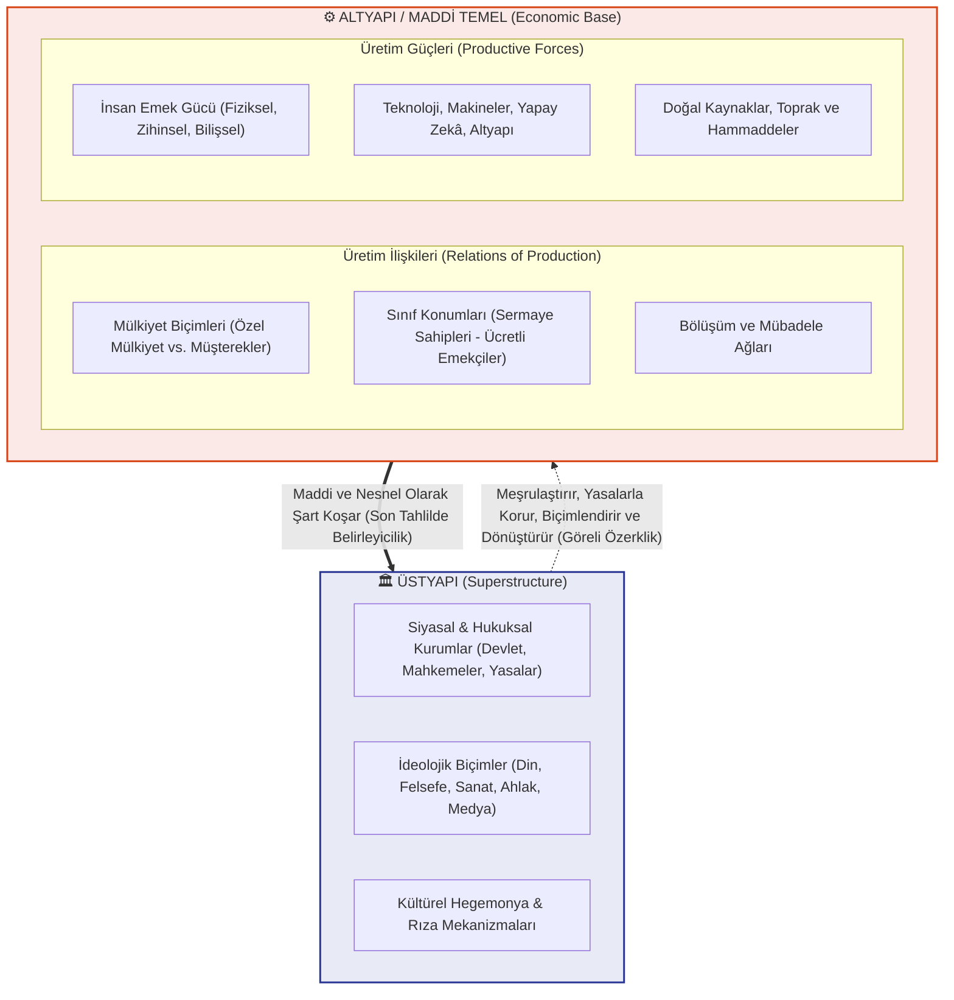
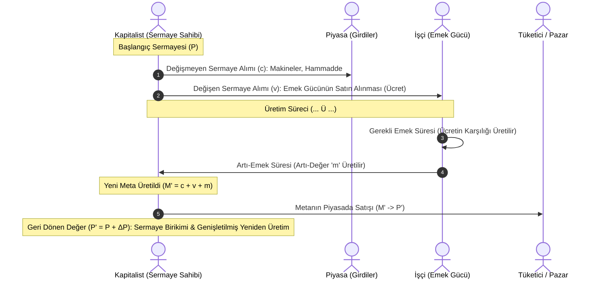
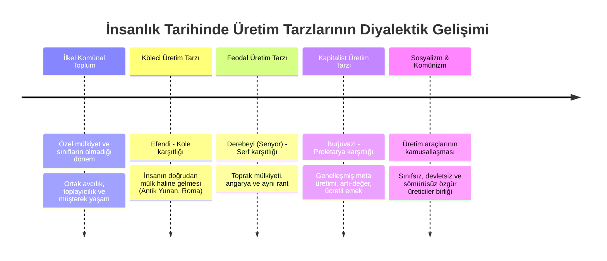
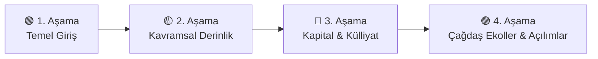

# 🚩 Marksizm Okumaları: Felsefe, Ekonomi Politik ve Tarihsel Materyalizm Külliyatı

[](LICENSE)
[](CONTRIBUTING.md)
[](docs/)
[](#)
[](#)

Bu repo; 19. yüzyılda **Karl Marx** ve **Friedrich Engels** tarafından kuramsallaştırılan, ardından 20. ve 21. yüzyıllarda farklı coğrafyalarda, kriz dönemlerinde ve disiplinlerde derinleşerek çeşitlenen **Marksist felsefe**, **ekonomi politik eleştirisi**, **tarihsel materyalizm**, **eleştirel teori**, **Marksist feminizm** ve **eko-Marksizm** literatürünü kapsamlı, akademik, alıntılarla zenginleştirilmiş ve modüler bir formatta sunmaktadır.

> [!NOTE]
> Bu kütüphane statik bir dogma özeti değildir; kavramların tarihsel gelişimini, iç tartışmalarını (öncü parti, konsey komünizmi, revizyonizm, hegemonya, sosyal yeniden üretim, metabolik yarılma) ve kurama yöneltilen başlıca felsefi, iktisadi ve sosyolojik eleştirileri nesnel, kaynaklı ve bütüncül bir yaklaşımla ele alır.

---

## 📌 İçindekiler Tablosu

1. [🏛️ Marksist Kuramın Temel Sütunları ve Metodolojisi](#️-marksist-kuramın-temel-sütunları-ve-metodolojisi)
2. [📊 Kuramsal Şemalar ve Diyagramlar](#-kuramsal-şemalar-ve-diyagramlar)
   - [Altyapı - Üstyapı Diyalektiği](#altyapı---üstyapı-diyalektiği)
   - [Kapitalist Üretim ve Artı-Değer Devresi](#kapitalist-üretim-ve-artı-değer-devresi)
   - [Tarihsel Formasyonlar ve Üretim Tarzları](#tarihsel-formasyonlar-ve-üretim-tarzları)
3. [🗺️ Marksist Düşünce Ekolleri ve Akımlar Matrisi](#️-marksist-düşünce-ekolleri-ve-akımlar-matrisi)
4. [⏱️ Marksist Tarihte Köşe Taşları ve Dönüm Noktaları (1818 - Günümüz)](#️-marksist-tarihte-köşe-taşları-ve-dönüm-noktaları-1818---günümüz)
5. [🖋️ Kapsamlı Alıntılar ve Metinler Kataloğu](#️-kapsamlı-alıntılar-ve-metinler-kataloğu)
   - [1. Kurucu Metinler ve Felsefi Temeller (Karl Marx)](#1-kurucu-metinler-ve-felsefi-temeller-karl-marx)
   - [2. Doğanın Diyalektiği, Bilim ve Tarih (Friedrich Engels)](#2-doğanın-diyalektiği-bilim-ve-tarih-friedrich-engels)
   - [3. Öncü Parti, Emperyalizm ve Devlet (V. I. Lenin)](#3-öncü-parti-emperyalizm-ve-devlet-v-i-lenin)
   - [4. Kitle Grevi, Enternasyonalizm ve Özgürlük (Rosa Luxemburg)](#4-kitle-grevi-enternasyonalizm-ve-özgürlük-rosa-luxemburg)
   - [5. Sürekli Devrim ve Bürokrasi Analizi (Leon Troçki)](#5-sürekli-devrim-ve-bürokrasi-analizi-leon-troçki)
   - [6. Hegemonya, Sivil Toplum ve İdeoloji (Antonio Gramsci & Louis Althusser)](#6-hegemonya-sivil-toplum-ve-ideoloji-antonio-gramsci--louis-althusser)
   - [7. Şeyleşme ve Bilinç Felsefesi (Georg Lukács & Karl Korsch)](#7-şeyleşme-ve-bilinç-felsefesi-georg-lukács--karl-korsch)
   - [8. Eleştirel Teori, Kültür Endüstrisi ve Sanat (Frankfurt Okulu & Walter Benjamin)](#8-eleştirel-teori-kültür-endüstrisi-ve-sanat-frankfurt-okulu--walter-benjamin)
   - [9. Sömürge Karşıtı Marksizm ve Küresel Güney (Fanon, Guevara, Castro, Sankara, Cabral)](#9-sömürge-karşıtı-marksizm-ve-küresel-güney-fanon-guevara-castro-sankara-cabral)
   - [10. Marksist Feminizm ve Sosyal Yeniden Üretim (Federici, Davis, Kollontay, Vogel)](#10-marksist-feminizm-ve-sosyal-yeniden-üretim-federici-davis-kollontay-vogel)
   - [11. Eko-Marksizm, Metabolik Yarılma ve İklim (Foster, Saito, Moore, Malm)](#11-eko-marksizm-metabolik-yarılma-ve-iklim-foster-saito-moore-malm)
   - [12. Mekân, Finansallaşma ve Kriz Kuramı (David Harvey & Post-Marksizm)](#12-mekân-finansallaşma-ve-kriz-kuramı-david-harvey--post-marksizm)
   - [13. Türkiye'de Marksist Düşünce ve Sosyalist Miras](#13-türkiyede-marksist-düşünce-ve-sosyalist-miras)
   - [14. Dışarıdan Yöneltilen Eleştiriler ve Karşı-Tezler (Bakunin, Weber, Mises, Hayek, Popper, Arendt)](#14-dışarıdan-yöneltilen-eleştiriler-ve-karşı-tezler-bakunin-weber-mises-hayek-popper-arendt)
6. [📐 Ekonomi Politiğin Matematiksel ve Kavramsal Formülasyonları](#-ekonomi-politiğin-matematiksel-ve-kavramsal-formülasyonları)
7. [📚 Yapılandırılmış Okuma Kılavuzu (Pedagojik Seviyeler ve Tematik Rotalar)](#-yapılandırılmış-okuma-kılavuzu-pedagojik-seviyeler-ve-tematik-rotalar)
8. [⚖️ Eleştiriler, Açmazlar ve Karşı-Tezler Matrisi](#️-eleştiriler-açmazlar-ve-karşı-tezler-matrisi)
9. [📁 Modüler Dokümantasyon ve Alt Kılavuzlar](#-modüler-dokümantasyon-ve-alt-kılavuzlar)
10. [🌐 Dijital Kütüphaneler, Akademik Dergiler ve Açık Arşivler](#-dijital-kütüphaneler-akademik-dergiler-ve-açık-arşivler)
11. [🤝 Katkıda Bulunma Standartları ve Lisans](#-katkıda-bulunma-standartları-ve-lisans)

---

## 🏛️ Marksist Kuramın Temel Sütunları ve Metodolojisi

Marksizm; toplumsal gerçekliği, tarihi ve doğayı anlamlandırmak için birbirine diyalektik bağlarla bağlı temel kuramsal temeller üzerine kuruludur:

```
                                  ┌───────────────────────────────┐
                                  │      PRAKSİS (EYLEM/KURAM)    │
                                  └───────────────┬───────────────┘
                                                  │
                 ┌────────────────────────────────┴────────────────────────────────┐
                 ▼                                                                 ▼
   ┌───────────────────────────┐                                     ┌───────────────────────────┐
   │   DİYALEKTİK MATERYALİZM  │                                     │   TARİHSEL MATERYALİZM    │
   │  (Doğa ve Düşünce Yasaları)│                                     │ (Toplumsal Formasyon Analizi)│
   └─────────────┬─────────────┘                                     └─────────────┬─────────────┘
                 │                                                                 │
                 └────────────────────────────────┬────────────────────────────────┘
                                                  ▼
                                  ┌───────────────────────────────┐
                                  │   EKONOMİ POLİTİK ELEŞTİRİSİ  │
                                  │ (Artı-Değer, Sermaye, Krizler)│
                                  └───────────────┬───────────────┘
                                                  ▼
                                  ┌───────────────────────────────┐
                                  │   SINIF MÜCADELESİ VE SİYASET │
                                  │  (Hegemonya, Devlet, Kurtuluş)│
                                  └───────────────────────────────┘
```

1. **Diyalektik Materyalizm:** Evrenin ve insan bilincinin idealist fikirlerin bir yansıması olmadığını; maddenin ve hareketin önceliğini savunan felsefi yöntemdir. Değişimi zıtların birliği, niceliksel birikimlerin niteliksel sıçramalara dönüşmesi ve inkârın inkârı yasalarıyla açıklar.
2. **Tarihsel Materyalizm:** İnsanlık tarihinin belirleyici motorunun, insanların yaşamlarını sürdürmek için kurdukları maddi üretim tarzları, üretim güçleri ve üretim ilişkileri olduğu kuramıdır.
3. **Ekonomi Politik Eleştirisi:** Kapitalizmin görünürdeki "özgür piyasa" mekanizmasının ardında yatan sömürü ilişkilerini (emek gücünün satın alınması, artı-değere el konulması, sermayenin organik bileşiminin artışı ve kriz eğilimleri) çözümler.
4. **Yabancılaşma (*Entfremdung*) ve Şeyleşme (*Verdinglichung*):** İnsanın ürettiği nesneye, üretim faaliyetine, kendi türsel potansiyeline ve topluma yabancılaşarak metanın ve piyasanın tahakkümü altına girmesi sürecidir.
5. **Kültürel Hegemonya ve İdeoloji:** Sınıf tahakkümünün yalnızca ordu/polis gibi kaba kuvvet aygıtlarıyla değil; eğitim, din, medya, sanat ve gündelik pratikler yoluyla inşa edilen rıza düzeniyle sürdürülmesi mekanizmasıdır.
6. **Sosyal Yeniden Üretim ve Doğa Bağı:** Sermaye birikiminin yalnızca fabrikadaki artık emekle değil; ev içi ücretsiz bakım emeği ve doğanın sömürülmesi (metabolik yarılma) üzerine inşa edildiği gerçeğidir.

---

## 📊 Kuramsal Şemalar ve Diyagramlar

### Altyapı - Üstyapı Diyalektiği



---

### Kapitalist Üretim ve Artı-Değer Devresi

Marx'ın *Kapital* Cilt 2'de açıkladığı genel sermaye devresi ($Para \rightarrow Meta \rightarrow Daha\ Fazla\ Para$):



---

### Tarihsel Formasyonlar ve Üretim Tarzları



---

## 🗺️ Marksist Düşünce Ekolleri ve Akımlar Matrisi

| Düşünce Okulu / Akım | Başlıca Temsilciler | Temel Tezleri ve Kuramsal Katkıları | Karşı Çıktığı / Eleştirdiği Odak |
| :--- | :--- | :--- | :--- |
| **Klasik Marksizm** | Karl Marx, Friedrich Engels | Emek-değer kuramı, tarihsel materyalizm, artı-değer, yabancılaşma, sınıf mücadelesi. | İdealist felsefe (Hegelcilik), ütopik sosyalizm, klasik burjuva ekonomi politiği. |
| **Ortodoks Marksizm & II. Enternasyonal** | Karl Kautsky, Georgi Plehanov | Determinist tarih okuması, pozitivist bilim algısı, kapitalizmin kaçınılmaz çöküş tezi. | İdealizm, iradecilik (*voluntarism*), anarşizm. |
| **Marksizm-Leninizm & Bolşevizm** | V. I. Lenin, J. Stalin | Öncü parti, emperyalizm (tekelci aşama), proletarya diktatörlüğü, anti-sömürgecilik. | Ekonomizm, II. Enternasyonal şovenizmi, Menşevizm, parlamentarizm. |
| **Sol & Konsey Komünizmi** | Rosa Luxemburg, Anton Pannekoek, Paul Mattick | Kendiliğinden kitle eylemi, fabrika konseyleri ve sovyet demokrasisi, parti ikamesine ret. | Bürokratik parti egemenliği, reformizm, parlamenter uzlaşmacılık. |
| **Troçkizm & Sürekli Devrim** | Leon Troçki, Ernest Mandel, Tony Cliff | Sürekli devrim kuramı, bürokratik işçi devleti tahlili, enternasyonalist dünya devrimi. | "Tek Ülkede Sosyalizm" tezi, aşamalı devrim teorisi, Stalinizm. |
| **Batı Marksizmi & Kültürel Kuram** | Georg Lukács, Karl Korsch, Antonio Gramsci | Şeyleşme (*Verdinglichung*), kültürel hegemonya, mevzi savaşı, özne-nesne bütünlüğü. | Kaba ekonomik determinizm, mekanik pozitivizm. |
| **Frankfurt Okulu (Eleştirel Teori)** | T. Adorno, M. Horkheimer, W. Benjamin, H. Marcuse | Kültür endüstrisi, araçsal akıl eleştirisi, otoriter kişilik, teknolojik tahakküm. | Pozitivizm, kitle kültürü, tüketim toplumu yanılsaması. |
| **Yapısalcı Marksizm** | Louis Althusser, Nicos Poulantzas, Étienne Balibar | Epistemolojik kopuş, İdeolojik Devlet Aygıtları, öznelerin çağrılması, göreli özerklik. | Hümanizm, tarihselcilik, özcü ekonomi-merkeziyetçilik. |
| **Otonomizm & Operaizm** | Mario Tronti, Antonio Negri, Franco Berardi (Bifo) | "Önce işçi, sonra sermaye", maddi olmayan emek, genel zekâ (*general intellect*), çokluk. | Sendikal bürokrasi, geleneksel parti hiyerarşisi, devletçilik. |
| **Dünya Sistemleri & Bağımlılık** | Immanuel Wallerstein, Samir Amin, A. G. Frank | Merkez-Çevre-Yarı Çevre hiyerarşisi, eşitsiz mübadele, küresel sermaye birikimi. | Doğrusal modernleşme teorileri, ulus-devlet temelli dar analizler. |
| **Marksist Feminizm** | Silvia Federici, Lise Vogel, Angela Davis, C. Arruzza | Sosyal yeniden üretim, ev içi ücretsiz emek, cadı avları ve bedenin ilkel birikimi. | Yalnızca fabrika emeğine odaklanan indirgemeci yaklaşım, liberal feminizm. |
| **Eko-Marksizm & Eko-Sosyalizm** | John Bellamy Foster, Kohei Saito, Jason W. Moore | Metabolik yarılma (*metabolic rift*), büyüme saplantısının krizi, küçülmeci komünizm. | Kapitalist yeşil aklama, ekolojik yıkımı görmezden gelen üretimcilik (*prometheanism*). |
| **Analitik Marksizm** | G. A. Cohen, Jon Elster, John Roemer | Anglosakson analitik felsefe, metodolojik bireycilik, rasyonel tercih modelleriyle Marx. | Hegelci diyalektiğin muğlaklığı, metafizik kavramlar. |
| **Post-Marksizm** | Ernesto Laclau, Chantal Mouffe, Slavoj Žižek | Sınıf özcülüğünün reddi, radikal demokrasi, söylem kuramı, Lacancı psikanaliz. | Katı ekonomik sınıf indirgemeciliği, tekil devrimci özne algısı. |

> Her bir ekolün ayrıntılı tarihsel arka planı için: [`docs/ekoller-ve-akimlar.md`](docs/ekoller-ve-akimlar.md)

---

## ⏱️ Marksist Tarihte Köşe Taşları ve Dönüm Noktaları (1818 - Günümüz)

```
1818 ── Marx doğdu (Trier)
1844 ── 1844 Elyazmaları (Yabancılaşma)
1848 ── Komünist Manifesto & 1848 Devrimleri
1864 ── I. Enternasyonal kuruldu
1867 ── Kapital Cilt 1 yayımlandı
1871 ── Paris Komünü (72 Günlük İşçi Hükümeti)
1883 ── Karl Marx vefat etti
1889 ── II. Enternasyonal kuruldu (1 Mayıs)
1905 ── 1905 Rus Devrimi ve Sovyetlerin doğuşu
1914 ── II. Enternasyonal'in çöküşü (Savaş kredileri)
1917 ── Büyük Ekim Sosyalist Devrimi (Bolşevikler)
1919 ── III. Enternasyonal (Komintern) kuruldu; Rosa Luxemburg katledildi
1923 ── Frankfurt Okulu kuruldu; Lukács 'Tarih ve Sınıf Bilinci'ni yazdı
1929 ── Gramsci Hapishane Defterleri'ne başladı
1938 ── IV. Enternasyonal kuruldu (Troçki)
1949 ── Çin Halk Cumhuriyeti kuruldu (Mao)
1959 ── Küba Devrimi zafere ulaştı (Castro & Che)
1968 ── Küresel Mayıs 68 İsyanları
1973 ── Şili'de Allende devrildi; Pinochet diktatörlüğü & Neoliberal deney
1989 ── Berlin Duvarı yıkıldı
1991 ── SSCB dağıldı; 'Tarihin Sonu' tezi ilan edildi
1994 ── Meksika Chiapas'ta Zapatista (EZLN) ayaklanması
2008 ── Küresel Finansal Kriz; Kapital'e küresel dönüş
2020+ ── Platform Kapitalizmi, Yapay Zekâ Çağında Emek, İklim Krizi ve Eko-Marksizm
```

> Yıl bazında derinlemesine kronolojik kayıtlar için: [`docs/tarihsel-kronoloji.md`](docs/tarihsel-kronoloji.md)

---

## 🖋️ Kapsamlı Alıntılar ve Metinler Kataloğu

### 1. Kurucu Metinler ve Felsefi Temeller (Karl Marx)

#### Felsefe, Yabancılaşma ve Praksis
> *"Filozoflar dünyayı yalnızca çeşitli biçimlerde yorumlamakla yetindiler; oysa asıl sorun onu değiştirmektir."*  
> — **Karl Marx**, *Feuerbach Üzerine Tezler* (11. Tez, 1845)

> *"Din, ezilen yaratığın iç çekişi, kalpsiz bir dünyanın duygusu ve ruhsuz koşulların ruhudur. O, halkın afyonudur. Halkın aldatıcı mutluluğu olarak dinin ortadan kaldırılması, onların gerçek mutluluğunun talebidir."*  
> — **Karl Marx**, *Hegel’in Hukuk Felsefesinin Eleştirisine Katkı* (1844)

> *"İşçi ne kadar çok zenginlik üretirse, üretimi güç ve hacim bakımından ne kadar artarsa, kendisi o kadar yoksul bir meta haline gelir. Nesnelerin dünyasının değer kazanması, insanların dünyasının değersizleşmesiyle doğru orantılı olarak gerçekleşir."*  
> — **Karl Marx**, *1844 İktisadi ve Felsefi El Yazmaları*

> *"Yabancılaşmış emek; insanı doğadan yabancılaştırır, insanı kendi kendisinden, kendi etkin işlevinden yabancılaştırır; böylece insanı kendi türsel özünden (*Gattungswesen*) koparır."*  
> — **Karl Marx**, *1844 İktisadi ve Felsefi El Yazmaları*

#### Tarihsel Materyalizm ve Sınıf Savaşı
> *"Bugüne kadarki bütün toplumların tarihi, sınıf savaşımları tarihidir. Özgür yurttaş ile köle, patrisyen ile pleb, senyör ile serf, lonca ustası ile kalfa; tek kelimeyle ezenler ile ezilenler, birbirleriyle sürekli bir karşıtlık içinde yaşamışlar, bazen gizli bazen açık kesintisiz bir kavga sürdürmüşlerdir."*  
> — **Karl Marx & Friedrich Engels**, *Komünist Parti Manifestosu* (1848)

> *"İnsanlar kendi tarihlerini kendileri yaparlar, ama kendi keyflerine göre, kendi seçtikleri koşullar içinde yapmazlar; doğrudan karşı karşıya kaldıkları, belirlenmiş olan ve geçmişten gelen koşullar içinde yaparlar. Bütün ölmüş kuşakların geleneği, büyük bir ağırlıkla, yaşayanların beyinleri üzerine bir kâbus gibi çöker."*  
> — **Karl Marx**, *Louis Bonaparte'ın 18 Brumaire'i* (1852)

> *"İnsanların varlığını belirleyen şey bilinçleri değildir; tam tersine, onların bilincini belirleyen toplumsal varlıklarıdır. Toplumun maddi üretici güçleri, gelişimlerinin belirli bir aşamasında, o zamana kadar içinde hareket ettikleri mevcut üretim ilişkileriyle çatışma içine girerler... İşte o zaman toplumsal devrimler çağı başlar."*  
> — **Karl Marx**, *Ekonomi Politiğin Eleştirisine Katkı (Önsöz)* (1859)

> *"Egemen sınıfın fikirleri, her çağda egemen fikirlerdir; yani toplumun maddi egemen gücü olan sınıf, aynı zamanda toplumun egemen zihinsel gücüdür."*  
> — **Karl Marx & Friedrich Engels**, *Alman İdeolojisi* (1845-1846)

#### Sermaye, Artı-Değer ve Meta Fetişizmi
> *"Sermaye ölü emektir; vampir gibi ancak canlı emeği emerek yaşar ve ne kadar çok canlı emek emerse o kadar çok yaşar."*  
> — **Karl Marx**, *Das Kapital*, Cilt 1 (1867)

> *"Bir metanın fetişist niteliği, insanların kendi emeklerinin toplumsal niteliğini, emek ürünlerinin nesnel nitelikleriymiş gibi, bu şeylere içkin toplumsal doğal özelliklermiş gibi görmelerinden kaynaklanır."*  
> — **Karl Marx**, *Das Kapital*, Cilt 1

> *"Kapitalist üretim, ancak ve ancak üreticinin üretim araçlarından koparıldığı yerde başlar. Sözde ilkel birikim (*ursprüngliche Akkumulation*), üretici ile üretim araçları arasındaki tarihsel boşanma sürecinden başka bir şey değildir."*  
> — **Karl Marx**, *Das Kapital*, Cilt 1, Bölüm 26

> *"Sermaye kâr oranının düşüklüğünden korkar. Yüzde 10 kâr güvencesi sermayeyi her yere çeker; yüzde 50 kâr onu gözü pek yapar; yüzde 100 kâr tüm insan yasalarını ayaklar altına aldırır; yüzde 300 kâr karşısında ise sermayenin işlemeyeceği cinayet, göze alamayacağı cürüm yoktur."*  
> — **Karl Marx**, *Das Kapital*, Cilt 1 (T. J. Dunning'den aktarımla)

> *"Komünist toplumun daha yüksek bir evresinde... emek sadece bir yaşam aracı değil, yaşamın birincil ihtiyacı haline geldiğinde... toplum bayraklarının üzerine şunu yazabilecektir: 'Herkesten yeteneğine göre, herkese ihtiyacına göre!'"*  
> — **Karl Marx**, *Gotha Programı'nın Eleştirisi* (1875)

---

### 2. Doğanın Diyalektiği, Bilim ve Tarih (Friedrich Engels)

> *"Doğa üzerinde kazandığımız zaferlerle kendimizi fazlaca övmeyelim. Çünkü böylesi her zafer için doğa bizden intikamını alır. Her zafer ilk planda beklediğimiz sonuçları doğurur, ama ikinci ve üçüncü planda çoğu kez ilk sonuçları ortadan kaldıran apayrı, öngörülmemiş etkiler yaratır."*  
> — **Friedrich Engels**, *Doğanın Diyalektiği* (1883)

> *"Devlet, toplumun belirli bir gelişme aşamasının ürünüdür; toplumun kendi içinde çözülmez bir çelişkiye düştüğünün, uzlaşmaz karşıtlıklara bölündüğünün ve bunları yatıştırmaktan aciz olduğunun itirafıdır. Sınıflar kaçınılmaz olarak nasıl ortaya çıktıysa, aynı kaçınılmazlıkla yok olacaklardır. Onlarla birlikte devlet de kaçınılmaz olarak çökecektir. Üreticilerin özgür ve eşit birliğini kuran toplum, bütün devlet mekanizmasını ait olacağı yere koyacaktır: Eski eserler müzesine, çıkrık ve tunç baltanın yanına."*  
> — **Friedrich Engels**, *Ailenin, Özel Mülkiyetin ve Devletin Kökeni* (1884)

> *"Tarihsel materyalist yaklaşıma göre tarihteki nihai belirleyici unsur, gerçek yaşamın üretimi ve yeniden üretimidir. Bunun ötesinde ne Marx ne de ben tek belirleyicinin ekonomi olduğunu asla iddia etmedik. Biri bunu ekonominin tek belirleyici olduğu şekline büküyorsa, önermeyi anlamsız, soyut ve saçma bir söze dönüştürüyor demektir."*  
> — **Friedrich Engels**, *Joseph Bloch'a Mektup* (21 Eylül 1890)

---

### 3. Öncü Parti, Emperyalizm ve Devlet (V. I. Lenin)

> *"Devrimci bir teori olmaksızın, devrimci bir hareket olamaz. Bu fikir, oportünizmin moda vaazlarının pratik hareketin en dar biçimlerine duyulan hayranlıkla el ele gittiği bir dönemde ne kadar ısrarla vurgulansa azdır."*  
> — **V. I. Lenin**, *Ne Yapmalı?* (1902)

> *"İşçi sınıfı kendi güçleriyle yalnızca sendikal bir bilinç geliştirebilir... Sosyalist bilinç ise işçi sınıfına ancak dışarıdan, sınıf mücadelesinin ve burjuvazi ile devlet ilişkilerinin bütününden taşınabilir."*  
> — **V. I. Lenin**, *Ne Yapmalı?* (1902)

> *"Emperyalizm; tekellerin ve mali sermayenin egemenliğinin kurulduğu, sermaye ihracının birinci planda önem kazandığı, dünyanın uluslararası tröstler arasında paylaşılmasının başladığı ve yeryüzünün en büyük kapitalist güçler arasında bölüşülmesinin tamamlandığı kapitalist aşamadır."*  
> — **V. I. Lenin**, *Emperyalizm: Kapitalizmin En Yüksek Aşaması* (1916)

> *"Devlet varken özgürlük yoktur. Özgürlük olduğunda ise devlet olmayacaktır."*  
> — **V. I. Lenin**, *Devlet ve Devrim* (1917)

> *"Burjuva parlamentosuna ve seçim oyunlarına katılmayı ilkesel olarak reddetmek, çocukça bir sol gevezeliktir. Komünistler, kitlelerin hâlâ bu kurumlara inandığı her yerde çalışmak, parlamenter kürsüyü burjuvazinin maskesini düşürmek için kullanmak zorundadır."*  
> — **V. I. Lenin**, *"Sol" Komünizm: Bir Çocukluk Hastalığı* (1920)

---

### 4. Kitle Grevi, Enternasyonalizm ve Özgürlük (Rosa Luxemburg)

> *"Yalnızca hükümet yandaşları için, yalnızca tek bir partinin üyeleri için olan bir özgürlük —sayıları ne kadar çok olursa olsun— özgürlük değildir. Özgürlük, daima ve istisnasız, farklı düşünenin özgürlüğüdür."*  
> — **Rosa Luxemburg**, *Rus Devrimi Üzerine* (1918)

> *"Burjuva toplumu bir ikilemle karşı karşıyadır: Ya sosyalizme ilerleyiş ya da barbarlığa geri düşüş!"*  
> — **Rosa Luxemburg**, *Junius Broşürü: Sosyal Demokrasinin Krizi* (1916)

> *"Hareket etmeyenler zincirlerini fark edemezler."*  
> — **Rosa Luxemburg**

> *"Kitle grevi, devrimin kendiliğinden patlak veren nabzıdır; sınıf mücadelesinin en canlı, en dinamik motorudur. Kitle grevleri bir merkezden bürokratik emirle başlatılıp durdurulamaz."*  
> — **Rosa Luxemburg**, *Kitle Grevi, Parti ve Sendikalar* (1906)

---

### 5. Sürekli Devrim ve Bürokrasi Analizi (Leon Troçki)

> *"Demokratik devrim görevlerini gecikmiş olarak üstlenen geri kalmış ülkelerde, tam ve gerçek bir çözüme ancak proletaryanın önderliğinde ve sosyalist önlemlerle ulaşılabilir. Devrim ulusal sınırlar içinde duramaz; sürekli devrim, dünya devrimiyle birleşmek zorundadır."*  
> — **Leon Troçki**, *Sürekli Devrim* (1930)

> *"Bürokrasi, tüketim maddelerinin dağıtımını denetleyen bir bekçidir. Kıtlık olduğunda kuyruklar oluşur; kuyrukların olduğu yerde bir polis memuruna, bir dağıtıcıya ihtiyaç doğar. Dağıtıcı ise asla pay almayı unutmaz."*  
> — **Leon Troçki**, *İhanete Uğrayan Devrim* (1936)

> *"Tarihin akışı masa başında çizilen şemalara uymaz. Tarih sıçramalarla, gerilemelerle, çelişkilerin düğümlenip patlamasıyla ilerler."*  
> — **Leon Troçki**, *Rus Devriminin Tarihi* (1930)

---

### 6. Hegemonya, Sivil Toplum ve İdeoloji (Antonio Gramsci & Louis Althusser)

> *"Eski dünya ölüyor, yeni dünya ise doğmak için mücadele ediyor: Bu alacakaranlık kuşağında envaiçeşit canavarlar ortaya çıkar."*  
> — **Antonio Gramsci**, *Hapishane Defterleri* (1930)

> *"Aklın kötümserliği, iradenin iyimserliği." (*Pessimismo dell'intelligenza, ottimismo della volontà.*)*  
> — **Antonio Gramsci**, *L'Ordine Nuovo* (1920)

> *"Batı'da devlet sadece bir dış siperdir; onun arkasında sivil toplumun son derece güçlü ve karmaşık bir kale ve siperler sistemi yer alır. Bu nedenle Batı'da devrim basit bir hücum (hareket savaşı) değil, sabırlı ve kurumsal bir mevzi savaşı gerektirir."*  
> — **Antonio Gramsci**, *Hapishane Defterleri*

> *"İdeoloji, bireylerin kendi gerçek varoluş koşullarıyla olan hayali ilişkilerini temsil eder. İdeolojinin hiçbir tarihi yoktur; ideoloji ebedidir ve bireyleri doğrudan 'özne' olarak çağırır (*interpellation*)."*  
> — **Louis Althusser**, *İdeoloji ve Devletin İdeolojik Aygıtları* (1970)

---

### 7. Şeyleşme ve Bilinç Felsefesi (Georg Lukács & Karl Korsch)

> *"Şeyleşme (Reification), insanın kendi öz etkinliğinin, kendi emeğinin insana yabancılaşarak bağımsız, nesnel ve insana hükmeden kör bir yasa kılığına bürünmesidir. Kapitalizmde insanın kaderi, ürettiği eşyaların kaderine tabi olur."*  
> — **Georg Lukács**, *Tarih ve Sınıf Bilinci* (1923)

> *"Ortodoks Marksizm, Marx'ın vardığı sonuçların dogmatik bir kabulü anlamına gelmez. Ortodoksluk yalnızca ve sadece yönteme —diyalektik materyalizme— sadık kalmaktır."*  
> — **Georg Lukács**, *Tarih ve Sınıf Bilinci* (1923)

---

### 8. Eleştirel Teori, Kültür Endüstrisi ve Sanat (Frankfurt Okulu & Walter Benjamin)

> *"Yanlış yaşam doğru yaşanamaz." (*Es gibt kein richtiges Leben im falschen.*)*  
> — **Theodor W. Adorno**, *Minima Moralia* (1951)

> *"Kültür endüstrisi bireyleri uyuşturur; onlara sürekli olarak sunduğu eğlence ile var olan düzenin katlanılmazlığını unutturur. Eğlenmek, kurulu düzenle mutabık olmak demektir."*  
> — **Max Horkheimer & Theodor W. Adorno**, *Aydınlanmanın Diyalektiği* (1944)

> *"Tarih Meleği'nin (*Angelus Novus*) yüzü geçmişe dönüktür. Bizim bir olaylar zinciri gördüğümüz yerde, o tek bir felaket görür... Cennetten kopup gelen bir fırtına kanatlarına takılmıştır; bu fırtına onu karşı koyamayacağı biçimde geleceğe fırlatır. İşte bizim ilerleme adını verdiğimiz şey bu fırtınadır."*  
> — **Walter Benjamin**, *Tarih Kavramı Üzerine Tezler* (1940)

> *"Tek boyutlu düşünce ve davranış biçimi; kurulu düzenin sunduğu yapay ihtiyaçları içselleştiren, var olanın ötesini hayal etme yetisini yitirmiş modern insanın trajedisidir."*  
> — **Herbert Marcuse**, *Tek Boyutlu İnsan* (1964)

---

### 9. Sömürge Karşıtı Marksizm ve Küresel Güney (Fanon, Guevara, Castro, Sankara, Cabral)

> *"Sömürgecilik sadece halkı pençesine almakla ve yerlinin beynini her türlü biçimden yoksun bırakmakla kalmaz. Bir tür sapkın mantıkla, ezilen halkın geçmişine döner, onu tahrif eder, bozar ve yok eder."*  
> — **Frantz Fanon**, *Yeryüzünün Lanetlileri* (1961)

> *"Sömürgecinin getirdiği şiddete karşı, sömürgeleştirilen insanın tek kurtuluş yolu örgütlü karşı-şiddettir; çünkü şiddet yerli insanı aşağılık kompleksinden, çaresizlikten ve edilgenlikten arındıran temizleyici bir güçtür."*  
> — **Frantz Fanon**, *Yeryüzünün Lanetlileri* (1961)

> *"Eğer her haksızlık karşısında öfkeyle titriyorsanız, o halde benim bir yoldaşımsınız demektir."*  
> — **Ernesto "Che" Guevara**

> *"Devrim sadece bir kök sökme eylemi değildir; devrim insan ruhunun, yeni insanın (*el hombre nuevo*) inşasıdır. Sosyalizm yalnızca fabrikalar inşa etmekle kurulamaz; o yeni bir ahlak ve vicdan gerektirir."*  
> — **Ernesto "Che" Guevara**, *Küba'da Sosyalizm ve İnsan* (1965)

> *"Emperyalizm bu dünyanın başına gelmiş en büyük lanettir. Bize borçlarını ödemeyen bir Afrika'dan bahsediyorlar; asıl emperyalistler yüzyıllardır kanımızı ve madenlerimizi çaldıkları için bize borçludur!"*  
> — **Thomas Sankara** (Burkina Faso Devlet Başkanı, 1987)

> *"Ulusal kurtuluş mücadelesi, yalnızca yabancı bayrağı indirip yerli bayrağı çekmek değildir; üretim güçlerinin yabancı tekelinden kurtarılması ve halkın kendi tarihini yeniden üretmesidir."*  
> — **Amílcar Cabral**, *Tarihin Silahı* (1966)

---

### 10. Marksist Feminizm ve Sosyal Yeniden Üretim (Federici, Davis, Kollontay, Vogel)

> *"Kadınların ev içindeki görünmeyen, ücretsiz emeği; kapitalizmin fabrikalarda sömürdüğü canlı emek gücünün her gün fiziki ve psikolojik olarak yeniden üretilmesini sağlayan görünmez temelidir. Bu emek olmadan sermaye birikimi bir gün bile varlığını sürdüremez."*  
> — **Silvia Federici**, *Caliban ve Cadı: Kadınlar, Beden ve İlkel Birikim* (2004)

> *"Ortaçağ sonundaki 'Cadı Avları', kadınların bedenlerini, üreme kapasitelerini ve cinselliklerini devletin ve sermayenin denetimine sokmak için yürütülen bir ilkel birikim terörüdür."*  
> — **Silvia Federici**, *Caliban ve Cadı*

> *"Siyah kadınların ezilmişliğini anlamak için ırk, sınıf ve toplumsal cinsiyet tahakkümünün birbirinden ayrılamaz bir üçlü sarmal olduğunu kavramak zorundayız. Beyaz burjuva feminizmi, fabrikadaki ve tarladaki işçi kadının gerçekliğini temsil edemez."*  
> — **Angela Davis**, *Kadınlar, Irk ve Sınıf* (1981)

> *"Aşk ve cinsellik, özel mülkiyet dünyasının bencilliğinden ve piyasa meta ilişkilerinden kurtarıldığında; iki özgür insanın yoldaşça ve eşitlikçi birliği haline gelecektir."*  
> — **Aleksandra Kollontay**, *Sosyalizm ve Aile* (1918)

---

### 11. Eko-Marksizm, Metabolik Yarılma ve İklim (Foster, Saito, Moore, Malm)

> *"Kapitalist tarım ve kentleşme; insan ile toprak arasındaki ebedi doğal metabolik çevrimi parçalamıştır. Toprağın verimliliğini çalarak uzak şehirlere taşımış, geri dönüşümü imkânsız kılarak çevre kirliliğini ve ekolojik krizi doğurmuştur."*  
> — **John Bellamy Foster**, *Marx'ın Ekolojisi: Materyalizm ve Doğa* (2000)

> *"Gezegenin fiziksel ve biyolojik sınırları ile sermayenin sonsuz değer birikimi ve büyüme zorunluluğu arasında uzlaşmaz bir çelişki vardır. Gerçek bir çıkış; yeşil kapitalizmin teknolojik masallarında değil, küçülmeci bir komünist planlamadadır."*  
> — **Kohei Saito**, *Marx in the Anthropocene* (2022)

> *"Doğa, kapitalizm için dışsal bir dekor değil; bedava kaynak ve bedava atık çöpü olarak sömürülen bir 'ucuz doğa' şebekesidir. Kapitalizm doğada değil, doğanın içinde bir matristir."*  
> — **Jason W. Moore**, *Hayat Ağındaki Kapitalizm* (2015)

> *"Tarihsel olarak fosil yakıtların tercih edilmesi su gücünden daha ucuz olduğu için değil; fabrikaları işçi havzalarının kalbine taşıyıp grevleri kırmak ve emeği disipline sokmak için yapılmış sınıfsal bir tercihti. Fosil sermaye yok edilmeden iklim kurtulamaz."*  
> — **Andreas Malm**, *Fosil Sermaye* (2016)

---

### 12. Mekân, Finansallaşma ve Kriz Kuramı (David Harvey & Post-Marksizm)

> *"Sermaye krizlerini çözmez; onları yalnızca coğrafi olarak yer değiştirerek, kenti yeniden inşa ederek veya finansal borçlandırma mekanizmalarıyla geleceğe erteleyerek mekânsal bir sabitleme (*spatial fix*) kurar."*  
> — **David Harvey**, *Sermayenin Sınırları* & *Yeni Emperyalizm*

> *"Bugün kapitalizmin sonunu hayal etmek, dünyanın sonunu hayal etmekten daha zor hale gelmiştir. İşte bu duruma 'Kapitalist Realizm' diyoruz."*  
> — **Mark Fisher**, *Kapitalist Realizm: Başka Alternatif Yok mu?* (2009)

> *"Siyaset, verili sınıfsal çıkarların mekanik bir çarpışması değildir; hegemonik zincirlerin, kimliklerin ve radikal taleplerin söylemsel olarak eklemlenmesi mücadelesidir."*  
> — **Ernesto Laclau & Chantal Mouffe**, *Hegemonya ve Sosyalist Strateji* (1985)

---

### 13. Türkiye'de Marksist Düşünce ve Sosyalist Miras

> *"Düşünmek ve anlamak: İnsanlığın en yüce eylemi budur. Ve dövüşmek: Bu anladığın hakikat uğruna dövüşmek."*  
> — **Nazım Hikmet**

> *"Tarih tezi; Doğu ve Batı toplumlarının farklı mülkiyet ve devlet kökenlerine dayandığını gösterir. Türkiye'de sosyalizm mücadelesi, bu toprakların tarihsel 'Antika Tarih' dinamiklerini ve kamu mülkiyeti hafızasını kavramadan başarıya ulaşamaz."*  
> — **Dr. Hikmet Kıvılcımlı**, *Tarih Tezi* (1965)

> *"Sosyalizm bir dogma veya hazır reçeteler bütünü değil; Türkiye işçi sınıfının ve emekçilerinin somut maddi koşullarından üretilen bilimsel bir kurtuluş kılavuzudur."*  
> — **Behice Boran**, *Türkiye ve Sosyalizm Sorunları* (1968)

---

### 14. Dışarıdan Yöneltilen Eleştiriler ve Karşı-Tezler (Bakunin, Weber, Mises, Hayek, Popper, Arendt)

> **Mihail Bakunin (Devlet ve Otorite Eleştirisi):**  
> *"Marksistler halk devletinden bahsettiklerinde kendilerini kandırıyorlar. Devlet varsa tahakküm vardır, kölelik vardır. Halk bir sopayla dövüldüğünde, o sopanın adına 'Halkın Sopası' denmesi işçilerin acısını dindirmez."*  
> — *Devlet ve Anarşi* (1873)

> **Max Weber (Kültürel ve Sosyolojik İtiraz):**  
> *"Ekonomik temel her şeyin kaynağı değildir. Modern kapitalizmin rasyonel doğuşunu sağlayan etkenlerin başında, Kalvinist Protestan dünyadaki 'çileci meslek ahlakı' gelmektedir. Fikirler ve inançlar tarihi bağımsızca şekillendirebilir."*  
> — *Protestan Ahlakı ve Kapitalizmin Ruhu* (1905)

> **Ludwig von Mises (Ekonomik Hesaplama Problemi):**  
> *"Üretim araçlarının özel mülkiyette olmadığı ve serbest piyasa fiyat mekanizmasının bulunmadığı bir sosyalist düzende, hangi malın ne kadar üretileceğini rasyonel biçimde hesaplamak imkânsızdır. Sosyalizm karanlıkta el yordamıyla yürümektir."*  
> — *Sosyalizm: İktisadi ve Sosyolojik Bir Tahlil* (1922)

> **Friedrich A. Hayek (Özgürlük ve Planlama Eleştirisi):**  
> *"Bütün ekonomik kararları merkezi bir planlama komitesinin eline teslim etmek, er ya da geç bireysel tercihleri, ifade özgürlüğünü ve demokrasiyi yok ederek toplumu totaliter bir kölelik yoluna sürükler."*  
> — *Kölelik Yolu* (*The Road to Serfdom*, 1944)

> **Karl Popper (Epistemoloji ve Yanlışlanabilirlik):**  
> *"Bilimsel bir kuram yanlışlanabilir riskler almalıdır. Marksizm, gerçekleşmeyen öngörülerini (örneğin Batı'da devrim beklentisi) kurtarmak için yardımcı hipotezlerle teoriyi her şeye uyduran dogmatik bir sözde-bilim (*pseudo-science*) haline gelmiştir."*  
> — *Açık Toplum ve Düşmanları* (1945)

> **Hannah Arendt (Totalitarizm ve Kamusal Alan):**  
> *"Sınıfsız bir toplum ütopyası adına hareket eden totaliter hareketler; hukuku, çoğulculuğu ve bireysel vicdanı sınıf savaşı mantığına kurban ederek insanı değersizleştirir."*  
> — *Totalitarizmin Kökenleri* (1951)

---

## 📐 Ekonomi Politiğin Matematiksel ve Kavramsal Formülasyonları

Marx'ın *Kapital*'de formüle ettiği temel ekonomik bağıntılar:

### 1. Bir Metanın Değeri ($W$)
$$W = c + v + s$$
* $c$ (*Constant Capital* / Değişmeyen Sermaye): Üretim araçları, makineler, hammadde (değeri doğrudan aktarır).
* $v$ (*Variable Capital* / Değişen Sermaye): Emek gücünün satın alma bedeli (ücretler).
* $s$ (*Surplus Value* / Artı-Değer): İşçinin yarattığı ve kapitalistin el koyduğu karşılıksız yeni değer.

### 2. Sömürü Oranı / Artı-Değer Oranı ($s'$)
$$s' = \frac{s}{v} = \frac{\text{Artı Emek Zamanı}}{\text{Gerekli Emek Zamanı}}$$

### 3. Sermayenin Organik Bileşimi ($OCC$)
$$OCC = \frac{c}{v}$$
*(Teknoloji ve makineleşme geliştikçe $c/v$ oranı artar; bu durum canlı emeğin toplam sermaye içindeki payını göreli olarak azaltır).*

### 4. Kâr Oranı ($p'$) ve Düşüş Eğilimi ($TRPF$)
$$p' = \frac{s}{c + v} = \frac{s/v}{\frac{c}{v} + 1} = \frac{s'}{OCC + 1}$$
* Teknoloji geliştikçe Organik Bileşim ($c/v$) yükselir. Eğer sömürü oranındaki ($s'$) artış bu yükselişi telafi edemezse, genel kâr oranı ($p'$) zamanla aşağı doğru eğilim gösterir (*Kâr Oranlarının Eğilimsel Düşüş Yasası*).

---

## 📚 Yapılandırılmış Okuma Kılavuzu (Pedagojik Seviyeler ve Tematik Rotalar)



| Düzey | Önerilen Başyapıtlar | Pedagojik Hedef |
| :--- | :--- | :--- |
| **🟢 1. Aşama: Giriş** | • Karl Marx & Friedrich Engels – *Komünist Manifesto* (1848)<br>• Karl Marx – *Ücretli Emek ve Sermaye* & *Ücret, Fiyat ve Kâr*<br>• Friedrich Engels – *Sosyalizmin Ütopyadan Bilime Gelişimi*<br>• V. I. Lenin – *Marksizmin Üç Kaynağı ve Üç Öğesi* | Temel kavramları (sınıf, artı-değer, sömürü, diyalektik) kafa karışıklığı olmadan öğrenmek. |
| **🟡 2. Aşama: Kavramsal Derinleşme** | • Karl Marx & Friedrich Engels – *Alman İdeolojisi* (Feuerbach)<br>• Karl Marx – *1844 İktisadi ve Felsefi El Yazmaları*<br>• Karl Marx – *Louis Bonaparte'ın 18 Brumaire'i*<br>• Friedrich Engels – *Ailenin, Özel Mülkiyetin ve Devletin Kökeni*<br>• V. I. Lenin – *Devlet ve Devrim* & *Emperyalizm*<br>• Rosa Luxemburg – *Sosyal Reform mu Devrim mi?* | Tarihsel materyalizmin metodolojisini, yabancılaşmayı, devlet aygıtını ve emperyalist krizleri kavramak. |
| **🔴 3. Aşama: Külliyat & Kapital** | • Karl Marx – *Kapital (Cilt 1, 2, 3)*<br>• Karl Marx – *Grundrisse (Ekonomi Politiğin Eleştirisinin Temelleri)*<br>• Georg Lukács – *Tarih ve Sınıf Bilinci*<br>• Antonio Gramsci – *Hapishane Defterleri*<br>• Rosa Luxemburg – *Sermaye Birikimi* | Değer biçimi analizini, sermaye devrelerini, kriz yasalarını, şeyleşmeyi ve kültürel hegemonyayı çözmek. |
| **🟣 4. Aşama: Çağdaş & Tematik** | • Silvia Federici – *Caliban ve Cadı* (Feminizm & İlkel Birikim)<br>• David Harvey – *Sermayenin Sınırları* (Mekânsal Krizler)<br>• John Bellamy Foster & Kohei Saito – *Marx'ın Ekolojisi* (Eko-Marksizm)<br>• Theodor Adorno & Max Horkheimer – *Aydınlanmanın Diyalektiği*<br>• Frantz Fanon – *Yeryüzünün Lanetlileri* (Post-Sömürgecilik) | 21. yüzyıl krizlerini, dijital emeği, iklim çöküşünü ve ırk-cinsiyet-sınıf kesişimlerini analiz etmek. |

> Ayrıntılı kitap listeleri, çeviri önerileri ve tematik okuma rehberleri için: [`docs/okuma-rehberi.md`](docs/okuma-rehberi.md)

---

## ⚖️ Eleştiriler, Açmazlar ve Karşı-Tezler Matrisi

| Eleştiri Alanı | Eleştiren Ekol | İddia Edilen Teori | Marksist Yanıt ve Çağdaş Savunma |
| :--- | :--- | :--- | :--- |
| **Ekonomik Hesaplama Problemi** | Mises, Hayek *(Avusturya Okulu)* | Serbest piyasa fiyatları olmadan kaynak dağıtımı yapılamaz; planlama kıtlık yaratır. | Piyasa sinyalleri kriz, eşitsizlik ve yıkıcı israf üretir. Günümüzde büyük veri, algoritmik planlama ve şeffaf dijital koordinasyonla demokratik ihtiyaç tahsisi mümkündür. |
| **Dönüşüm Sorunu (*Transformation Problem*)** | Böhm-Bawerk, Bortkiewicz | Emek-değerleri ile somut piyasa üretim fiyatları arasında matematiksel tutarlılık kurulamaz. | Marx'ın kuramı mikro-fiyat tahmini değil, makro-toplumsal artı-değer bölüşümüdür; TSSI (*Temporal Single-System Interpretation*) modelleri kuramın matematiksel bütünlüğünü kanıtlamıştır. |
| **Epistemolojik Yanlışlanabilirlik** | Karl Popper | Marksizm yanlışlanamaz kehanetler üretir, bu yüzden bilim değil dogmadır. | Marksizm doğa bilimleri gibi statik laboratuvar modelleriyle değil, toplumsal eğilim yasaları ve dinamik sınıf çelişkileriyle çalışır. |
| **Bürokrasi ve Devlet Tiranlığı** | Bakunin, Kropotkin *(Anarşizm)* | Geçici işçi devleti kaçınılmaz olarak totaliter yeni bir bürokratik sınıf yaratır. | Devlet sömürücü sınıfların direnişini ve emperyalist saldırıları bertaraf etmek için zorunlu bir geçiş kalkanıdır; hedefi devletin sönümlenmesidir. |
| **Kültürel Özerklik / İndirgemecilik** | Max Weber | Fikirler, din ve değerler ekonomiden bağımsız olarak tarihi şekillendirir. | Marksizm kaba determinizmi reddeder; altyapı ile üstyapı arasında diyalektik bir karşılıklılık ve üstyapının göreli özerkliği esastır. |

> Karşılaştırmalı argüman analizleri için: [`docs/elestiriler-ve-tartismalar.md`](docs/elestiriler-ve-tartismalar.md)

---

## 📁 Modüler Dokümantasyon ve Kapsamlı Alt Kılavuzlar

Projedeki ayrıntılı araştırma ve ihtisas belgeleri:

```
marksizm-okumalari/
├── README.md                                          # Master Külliyat & Ana Kılavuz
├── CONTRIBUTING.md                                    # Katkı İlkeleri ve Akademik Standartlar
├── LICENSE                                            # MIT Açık Kaynak Lisansı
└── docs/
    ├── kavramlar-sozlugu.md                          # A'dan Z'ye Kapsamlı Marksist Terminoloji Sözlüğü
    ├── tarihsel-kronoloji.md                          # 1818'den Günümüze Detaylı Tarihsel Zaman Çizelgesi
    ├── ekoller-ve-akimlar.md                          # 14 Farklı Düşünce Ekolünün Karşılaştırmalı Analizi
    ├── okuma-rehberi.md                               # Pedagojik Seviyeler ve Tematik Okuma Programları
    ├── das-kapital-ozeti-ve-rehberi.md               # Das Kapital (Cilt 1-2-3) Bölüm Bölüm Kapsamlı Rehberi
    ├── diyalektik-ve-tarihsel-materyalizm-rehberi.md # Felsefi Metodoloji, Doğa ve Toplum Diyalektiği
    ├── turkiye-marksizm-tarihi.md                     # Osmanlı'dan Günümüze Türkiye Solu ve Düşünce Tarihi
    ├── cagdas-marksizm-ve-tartismalar.md              # Dijital Emek, Platformlar, Ekoloji ve 21. Yüzyıl
    ├── elestiriler-ve-tartismalar.md                  # Karşı Görüşler, Eleştiriler ve Savunular
    └── calisma-sorulari-ve-tartisma-konulari.md       # Atölyeler ve Gruplar İçin Tartışma Soruları
```

### 📚 Modüler Doküman Bağlantıları:
- 📖 [**Marksist Kavramlar Sözlüğü**](docs/kavramlar-sozlugu.md) — Temel kuramsal terimler ve orijinal kavram kökleri.
- ⏱️ [**Tarihsel Kronoloji**](docs/tarihsel-kronoloji.md) — 1818'den bugüne tüm devrimler, kongreler ve kırılmalar.
- 🗺️ [**Ekoller ve Akımlar**](docs/ekoller-ve-akimlar.md) — Leninizmden Eleştirel Teoriye, Otonomizmden Eko-Marksizme tüm okullar.
- 📕 [**Das Kapital Okuma Rehberi**](docs/das-kapital-ozeti-ve-rehberi.md) — 3 Cildin bölüm bölüm şemaları ve matematiksel formülleri.
- ⚙️ [**Diyalektik & Tarihsel Materyalizm**](docs/diyalektik-ve-tarihsel-materyalizm-rehberi.md) — Hegel'den Marx'a diyalektiğin 3 yasası ve üretim tarzları.
- 🇹🇷 [**Türkiye'de Marksizm Tarihi**](docs/turkiye-marksizm-tarihi.md) — Osmanlı'dan TİP, 68 Kuşağı, Kıvılcımlı ve günümüze.
- 🌐 [**Çağdaş Marksizm ve Tartışmalar**](docs/cagdas-marksizm-ve-tartismalar.md) — Platform kapitalizmi, Fisher, Saito, Žižek, Yapay Zekâ.
- ⚖️ [**Eleştiriler ve Tartışmalar**](docs/elestiriler-ve-tartismalar.md) — Popper, Hayek, Weber, Bakunin ve Marksist yanıtlar.
- 📚 [**Yapılandırılmış Okuma Rehberi**](docs/okuma-rehberi.md) — Seviye bazlı (Başlangıç, Orta, İleri) kitap listeleri.
- 🧠 [**Çalışma ve Tartışma Soruları**](docs/calisma-sorulari-ve-tartisma-konulari.md) — Seminer ve okuma grupları için müfredat soruları.

---

## 🌐 Dijital Kütüphaneler, Akademik Dergiler ve Açık Arşivler

Marksist metinlere, orijinal el yazmalarına ve güncel akademik araştırmalara açık erişim sağlayan platformlar:

* 📚 [Marxists Internet Archive (MIA)](https://www.marxists.org/) — 80'den fazla dilde devasa orijinal metin ve mektup arşivi.
* 📚 [MIA Türkçe Bölümü](https://www.marxists.org/turkce/index.htm) — Türkçe klasik çeviriler ve külliyat.
* 🎓 [Historical Materialism Journal](https://www.historicalmaterialism.org/) — Uluslararası hakemli Marksist araştırma dergisi ve kitap dizisi.
* 🎓 [Monthly Review](https://monthlyreview.org/) — 1949'dan beri yayımlanan köklü bağımsız sosyalist dergi (Paul Sweezy, Leo Huberman, John Bellamy Foster).
* 📝 [Verso Books Blog](https://www.versobooks.com/blogs) — Çağdaş felsefe, eleştirel teori ve siyaset tartışmaları.
* 📝 [Jacobin](https://jacobin.com/) — Güncel emek hareketi, ekonomi politik ve sosyalizm analizleri.
* 📚 [Rosa-Luxemburg-Stiftung](https://www.rosalux.de/en/) — Sosyalizm, demokrasi ve enternasyonalist araştırmalar vakfı arşivi.

---

## 🤝 Katkıda Bulunma Standartları ve Lisans

Bu külliyat; araştırmacıların, öğrencilerin ve felsefe meraklılarının kolektif katkılarıyla büyüyen açık kaynaklı bir platformdur.
* Yeni alıntılar, kavramlar, tarihsel maddeler veya okuma önerileri eklemek için lütfen [CONTRIBUTING.md](CONTRIBUTING.md) dosyasındaki ilkeleri inceleyin.
* Tüm içerikler [MIT Lisansı](LICENSE) kapsamında özgürce paylaşılabilir, çoğaltılabilir ve geliştirilebilir.

---

<div align="center">

```
"İnsanın özgür gelişimi, herkesin özgür gelişiminin koşuludur."
— Karl Marx & Friedrich Engels, 1848
```

</div>