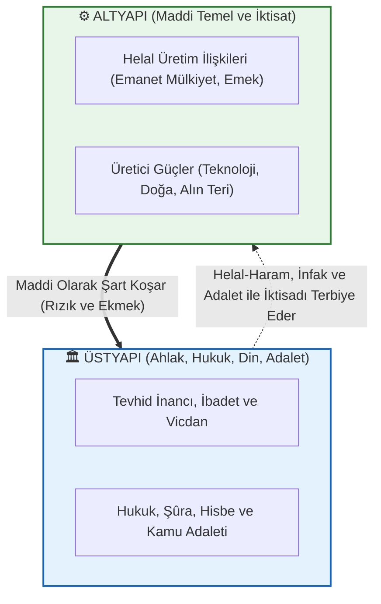
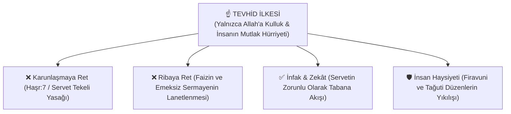

# 🌙 Marksizm Okumaları: Müslüman Bakış Açısıyla Felsefe, Ekonomi Politik ve Sosyal Adalet

[](LICENSE)
[](#)
[](CONTRIBUTING.md)
[](docs/)
[](#)

> *"Hikmet müminin yitiğidir; nerede bulursa onu almaya en layık olan odur."*  
> **— Hz. Muhammed (s.a.v.)**

Bu açık kaynak kütüphanesi; **Müslüman bir araştırmacı, ilim talebesi ve düşünürün gözüyle** Marksist felsefeyi, ekonomi politik eleştirisini (*Das Kapital*), tarihsel materyalizmi, eleştirel teoriyi ve 20. yüzyıl reel sosyalizm tecrübelerini inceleyen kapsamlı, akademik, mukayeseli ve kaynaklı bir başvuru külliyatıdır.

---

## 🧭 Temel Vizyon ve Yaklaşımımız

```
                      MÜSLÜMANIN MARKSİZM'E BAKIŞI
  ┌─────────────────────────────────┬─────────────────────────────────┐
  │     KABUL VE İSTİFADE (TEŞHİS)  │       RET VE TASHİH (İTİKAD)    │
  ├─────────────────────────────────┼─────────────────────────────────┤
  │ ✅ Kapitalizmin artı-değer gaspı│ ❌ Ateist ve kaba materyalizm   │
  │ ✅ Faiz (riba) ve sermaye talanı│ ❌ "Din afyondur" indirgemesi   │
  │ ✅ Modern meta putçuluğu        │ ❌ Sınıf kini ve intikam ahlakı │
  │ ✅ Emperyalist sömürgecilik     │ ❌ Ruhsuz determinist tarih     │
  │ ✅ Emeğin kutsallığı ve hak     │ ❌ Mülkiyeti tamamen devlete verme│
  └─────────────────────────────────┴─────────────────────────────────┘
```

1. **Ne Öğrenebiliriz? (Doğru Teşhisler):**
   * Kapitalizmin vahşi sömürü dinamikleri, emeğin karşılıksız gaspı (**artı-değer**), servetin bir avuç tekelde toplanması (**Karunlaşma**), paranın ve tüketim mallarının modern bir puta dönüşmesi (**meta fetişizmi**) ve İslam coğrafyasını hedef alan **emperyalist talan mekanizmaları**.
2. **Nerede Ayrışıyoruz? (İtikadi ve Felsefi Tashih):**
   * Varlığı yalnızca kaba maddeye indirgeyen materyalizm yerine **Tevhid ve Metafizik Hakikati**; sınıf kini ve kanlı çatışma yerine **İslam Kardeşliği (Uhuvvet), Merhamet ve İnfak Ahlakını**; mutlak devletçi mülkiyet yerine **Mülk Allah'ındır (Emanet Mülkiyet)** nizamını savunmak.

---

## 📌 İçindekiler Tablosu

1. [🧭 Müslüman Bakış Açısıyla Temel Çerçeve](#1-müslüman-bakış-açısıyla-temel-çerçeve)
2. [🏛️ Marksist Kuramın Temel Sütunları ve İslami Mukayese](#2-marksist-kuramın-temel-sütunları-ve-i̇slami-mukayese)
3. [📊 Kuramsal Şemalar ve Diyagramlar](#3-kuramsal-şemalar-ve-diyagramlar)
   - [Altyapı - Üstyapı Diyalektiği ve Tevhidî Denge](#altyapı---üstyapı-diyalektiği-ve-tevhidî-denge)
   - [Kapitalist Üretim, Artı-Değer ve Faiz Devresi](#kapitalist-üretim-artı-değer-ve-faiz-devresi)
   - [Tevhid, İnfak ve Sosyal Adalet Modeli](#tevhid-i̇nfak-ve-sosyal-adalet-modeli)
4. [🗺️ Düşünce Ekolleri, Akımlar ve Müslüman Mütefekkirler Matrisi](#4-düşünce-ekolleri-akımlar-ve-müslüman-mütefekkirler-matrisi)
5. [⏱️ Tarihsel Dönüm Noktaları ve Kronoloji (1818 - Günümüz)](#5-tarihsel-dönüm-noktaları-ve-kronoloji-1818---günümüz)
6. [💎 Kapsamlı Alıntılar Kataloğu ve İsabetli Teşhisler Antolojisi](#6-kapsamlı-alıntılar-kataloğu-ve-i̇sabetli-teşhisler-antolojisi)
   - [A. Karl Marx & Friedrich Engels (Temel Metinler ve İsabetli Teşhisler)](#a-karl-marx--friedrich-engels-temel-metinler-ve-i̇sabetli-teşhisler)
   - [B. Devrim ve Emperyalizm (Lenin, Luxemburg, Troçki, Fanon)](#b-devrim-ve-emperyalizm-lenin-luxemburg-troçki-fanon)
   - [C. İslam Mütefekkirleri ve Sosyal Adalet (Gazali, Şeriati, İkbal, Garaudy, Topçu, Karakoç, Özel, Malcolm X)](#c-i̇slam-mütefekkirleri-ve-sosyal-adalet)
   - [D. Dışarıdan Yöneltilen Eleştiriler (Bakunin, Weber, Mises, Hayek, Popper, Arendt)](#d-dışarıdan-yöneltilen-eleştiriler)
7. [⚠️ Marksizmin Eksikleri, Kuramsal Kör Noktaları ve Eleştirel Alıntılar](#7-marksizmin-eksikleri-kuramsal-kör-noktaları-ve-eleştirel-alıntılar)
8. [🌍 Marksizm Uygulandı mı, Uygulanıyor mu? (Reel Sosyalizm Bilançosu)](#8-marksizm-uygulandı-mı-uygulanıyor-mu-reel-sosyalizm-bilançosu)
9. [🌌 Metafizik Felsefesi, Ontoloji ve Bilincin Hakikati](#9-metafizik-felsefesi-ontoloji-ve-bilincin-hakikati)
10. [👁️ İstihbarat Teşkilatları, Bilişsel Harp ve Metafizik Manipülasyon](#10-i̇stihbarat-teşkilatları-bilişsel-harp-ve-metafizik-manipülasyon)
11. [⚖️ Tevhid, Adalet ve Küresel Sermaye Eleştirisi (Maneviyat ve İktisat)](#11-tevhid-adalet-ve-küresel-sermaye-eleştirisi-maneviyat-ve-i̇ktisat)
12. [📐 Das Kapital ve Ekonomi Politiğin Matematiksel Formülasyonları](#12-das-kapital-ve-ekonomi-politiğin-matematiksel-formülasyonları)
13. [📚 Yapılandırılmış Okuma Kılavuzu (Pedagojik Seviyeler ve Rotalar)](#13-yapılandırılmış-okuma-kılavuzu-pedagojik-seviyeler-ve-rotalar)
14. [📁 Modüler Dokümantasyon Dizini (15 Özel Monografi Dosyası)](#14-modüler-dokümantasyon-dizini)
15. [🌐 Dijital Kütüphaneler, Akademik Dergiler ve Açık Arşivler](#15-dijital-kütüphaneler-akademik-dergiler-ve-açık-arşivler)
16. [🤝 Katkıda Bulunma Standartları ve Lisans](#16-katkıda-bulunma-standartları-ve-lisans)

---

## 1. Müslüman Bakış Açısıyla Temel Çerçeve

İslam düşüncesi; yeryüzündeki hiçbir hakikate gözünü kapatmaz. Karl Marx'ın 19. yüzyıl sanayi kapitalizminin vahşi sömürüsüne dair yaptığı gözlemler, Kur'an'ın **"Karunlaşma"** ve **"Riba (Faiz) Yasağı"** uyarılarıyla büyük ölçüde örtüşür.

* **Emeğin Kutsallığı:** Hz. Peygamber (s.a.v.), *"İşçinin ücretini teri kurumadan veriniz"* buyurarak artı-değer gaspına 1400 yıl önceden set çekmiştir.
* **Modern Putçuluk:** Marx'ın *Meta Fetişizmi* dediği olgu, insanın kendi eliyle ürettiği paraya ve eşyaya tapınmasıdır (Şirk ve heva putçuluğu).
* **Felsefi Ayrışma:** Marksizm insanı sadece midesi olan bir üretim aracına indirgerken; İslam insanı ruh, kalp, akıl ve ebediyet arayışıyla donatılmış şerefli bir emanetçi (*ahsen-i takvim*) kabul eder.

> Kapsamlı analitik rehber için: [`docs/musluman-bakis-acisiyla-marksizm.md`](docs/musluman-bakis-acisiyla-marksizm.md)

---

## 2. Marksist Kuramın Temel Sütunları ve İslami Mukayese

* **Diyalektik ve Tarihsel Materyalizm:**  
  * *Marksist Teori:* Tarihin tek itici gücü üretim araçları ve sınıf çatışmasıdır.  
  * *İslami Tashih:* Madde gerçektir ama tek belirleyici değildir; ahlak, vahiy, niyet ve maneviyat tarihi dönüştüren otonom güçlerdir.
* **Artı-Değer ve Sömürü:**  
  * *Marksist Teori:* İşçinin ürettiği değer ile aldığı ücret arasındaki farka kapitalist el koyar.  
  * *İslami Tashih:* Bu açık bir kul hakkı gaspıdır; İslam emeksiz kazancı ve faizi haram kılmıştır.
* **Devlet ve Bürokrasi:**  
  * *Marksist Teori:* Proletarya diktatörlüğü geçicidir, devlet sönümlenecektir.  
  * *İslami Tashih:* Devleti tek partiye teslim etmek yeni bir tağuti bürokrasi (*Nomenklatura*) doğurur; adalet ancak bağımsız hukuk ve şûra ile korunur.

---

## 3. Kuramsal Şemalar ve Diyagramlar

### Altyapı - Üstyapı Diyalektiği ve Tevhidî Denge



---

### Tevhid, İnfak ve Sosyal Adalet Modeli



---

## 4. Düşünce Ekolleri, Akımlar ve Müslüman Mütefekkirler Matrisi

| Düşünce Okulu / Mütefekkir | Öne Çıkan İsimler | Temel Tez ve İslami Değerlendirme |
| :--- | :--- | :--- |
| **Klasik Marksizm** | Karl Marx, Friedrich Engels | Artı-değer, emek sömürüsü ve sınıf savaşı. (Teşhis güçlü, itikad çıkmazda). |
| **Marksizm-Leninizm** | V. I. Lenin | Emperyalizm analizi ve öncü parti. (Mazlum halkların uyanışına etki etti). |
| **Batı Marksizmi & Hegemonya** | Antonio Gramsci, Georg Lukács | Kültürel rıza üretimi, şeyleşme ve mevzi savaşı. |
| **İslam Sosyalizmi / Tevhid Ekolü** | Dr. Ali Şeriati | *Dine Karşı Din*: Karunların Şirk Dinine karşı ezilenlerin Tevhid Dini. |
| **Anadolu Sosyalizmi & Ahlak** | Nurettin Topçu | *İslam ve Sosyalizm*: Maddeci sınıf kinciliğine karşı ruhçu ve ahlaki nizam. |
| **Marksizmden İslama Geçiş** | Roger Garaudy | Fransız Komünist Partisi ideologluğundan İslami hakikate ve adalete geçiş. |
| **Diriliş ve Medeniyet** | Sezai Karakoç | Batı maddeyi putlaştırdı, Doğu maddeyi küçümsedi; İslam maddeyi ruhun emrine verdi. |
| **İslami Şahsiyet ve Duruş** | İsmet Özel | Sosyalizm kapitalizmin gayrimeşru çocuğudur; gerçek direniş Müslümanca şahsiyettedir. |

> Detaylı karşılaştırma için: [`docs/islam-iktisadi-ve-kapitalizm-marksizm-karsilastirmasi.md`](docs/islam-iktisadi-ve-kapitalizm-marksizm-karsilastirmasi.md)

---

## 5. Tarihsel Dönüm Noktaları ve Kronoloji (1818 - Günümüz)

* **1818:** Karl Marx doğdu.
* **1848:** *Komünist Manifesto* yayımlandı.
* **1867:** *Das Kapital* Cilt 1 basıldı (Artı-değer ve sömürü analizi).
* **1871:** Paris Komünü kuruldu.
* **1917:** Rusya'da Ekim Devrimi (Bolşevikler iktidara geldi).
* **1949:** Çin Devrimi (Mao Zedong).
* **1959:** Küba Devrimi (Fidel Castro & Che Guevara).
* **1979:** İran İslam Devrimi (Doğu ve Batı bloklarına karşı *"Ne Doğu Ne Batı, Yalnızca İslam"* şiarı).
* **1982:** Roger Garaudy Müslüman oldu (*Geleceğimizde İslam Var*).
* **1989-1991:** Berlin Duvarı yıkıldı; Sovyetler Birliği (SSCB) resmen dağıldı.
* **2008:** Küresel Finansal Kriz; Kapitalizm ve faiz sisteminin sorgulanması.
* **2020+:** Dijital Emek, Platform Kapitalizmi, Yapay Zekâ ve İklim Krizi.

> Ayrıntılı tarihsel kronoloji için: [`docs/tarihsel-kronoloji.md`](docs/tarihsel-kronoloji.md)

---

## 6. Kapsamlı Alıntılar Kataloğu ve İsabetli Teşhisler Antolojisi

> 💎 **Özel İhtisas Dosyası:** Marksizmin kapitalizm teşhisindeki en çarpıcı hakikatleri, mantıksal doğrulukları ve kapsamlı alıntı antolojisi için: [`docs/marksizmdeki-hakikatler-ve-isabetli-teshisler.md`](docs/marksizmdeki-hakikatler-ve-isabetli-teshisler.md)

### A. Karl Marx & Friedrich Engels (Temel Metinler ve İsabetli Teşhisler)
> *"Filozoflar dünyayı yalnızca çeşitli biçimlerde yorumlamakla yetindiler; oysa asıl sorun onu değiştirmektir."*  
> — **Karl Marx**, *Feuerbach Üzerine Tezler* (1845)

> *"Sermaye ölü emektir; vampir gibi ancak canlı emeği emerek yaşar ve ne kadar çok canlı emek emerse o kadar çok yaşar."*  
> — **Karl Marx**, *Das Kapital*, Cilt 1, Bölüm 10

> *"İşçi ne kadar çok zenginlik üretirse, kendisi o kadar yoksul bir meta haline gelir. Nesnelerin dünyasının değer kazanması, insanların dünyasının değersizleşmesiyle doğru orantılıdır."*  
> — **Karl Marx**, *1844 İktisadi ve Felsefi Elyazmaları*

> *"Metanın fetiş karakteri: İnsan elinin ürünleri, kendi başlarına yaşayan, insanlarla ilişki kuran bağımsız ilahlara dönüşür. İnsanlar elleriyle yaptıkları nesnelerin (markaların, paranın, borsanın) kölesi olurlar."*  
> — **Karl Marx**, *Das Kapital*, Cilt 1, Bölüm 1 (Meta Fetişizmi)

> *"Sermaye yüzde 100 kârda bütün insani kanunları ayaklar altına alır; yüzde 300 kâr karşısında ise işleyemeyeceği hiçbir cinayet, göze alamayacağı hiçbir cürüm yoktur; darağacı tehdidi altında olsa bile."*  
> — **T.J. Dunning'den aktaran Karl Marx**, *Das Kapital*, Cilt 1

> *"Kapitalist üretim, insan ile toprak arasındaki metabolik etkileşimi bozar; bütün zenginliğin asıl kaynağını tüketir: Toprağı ve İşçiyi."*  
> — **Karl Marx**, *Das Kapital*, Cilt 1 (Metabolik Yarılma / Ekolojik Kriz)

> *"Faiz getiren sermaye ($M - M'$), sermayenin en fetişleşmiş ve en paraziter biçimidir. Para doğrudan doğruya para doğurur; bu ise en saf haliyle asalaklıktır."*  
> — **Karl Marx**, *Das Kapital*, Cilt 3, Bölüm 24

---

### B. Devrim ve Emperyalizm (Lenin, Luxemburg, Troçki, Fanon)
> *"Emperyalizm; mali sermayenin ve tekellerin dünyayı paylaştığı, asalak ve son aşamadır."*  
> — **V. I. Lenin**, *Emperyalizm* (1916)

> *"Kapitalizm varlığını sürdürebilmek için kapitalist olmayan coğrafyaları, geleneksel tarım toplumlarını ve Doğulu halkları zorla ve kanla kendi pazarına katmak zorundadır."*  
> — **Rosa Luxemburg**, *Sermaye Birikimi* (1913)

> *"Özgürlük, daima ve sadece farklı düşünenin özgürlüğüdür."*  
> — **Rosa Luxemburg**, *Rus Devrimi Üzerine*

> *"Sömürgecilik ezilen halkın yalnızca bedenini değil, zihnini ve geçmişini de tahrif eder."*  
> — **Frantz Fanon**, *Yeryüzünün Lanetlileri*

---

### C. İslam Mütefekkirleri ve Sosyal Adalet

> *"Allah'ın helal kıldığı mallar, içinizden yalnızca zenginler arasında elden ele dolaşan bir servet olmasın!"*  
> — **Kur'an-ı Kerim**, Haşr Suresi, 7. Ayet

> *"Para, Allah'ın kulları arasında adaleti kursun diye yarattığı bir ölçü aracıdır; onun kendisinde bir amaç yoktur. Parayı faizle çoğaltıp kendi başına gaye kılanlar, yaratılış fıtratını tersyüz eden zalimlerdir."*  
> — **İmam Gazali**, *İhyâu Ulûmi'd-Dîn*

> *"Tarih boyunca iki din savaşmıştır: Biri sarayların, Karunların ve Firavunların 'Şirk Dini'; diğeri ise ezilenlerin ve peygamberlerin 'Tevhid Dini'dir. Ebu Zer el-Gıfari, Muaviye'nin yeşil sarayına karşı 'Altın ve gümüşü yığıp infak etmeyenleri yakıcı bir azapla müjdele!' ayetini haykırırken hakiki İslam'ın ta kendisiydi."*  
> — **Dr. Ali Şeriati**, *Dine Karşı Din*

> *"Marksizm insanın karnını doyurmak istedi ama ruhunu unuttu. Doğu'nun aradığı nizam; ne Batı'nın vahşi para tanrısı ne de Doğu'nun ruhsuz kışlasıdır; adaleti aşk ve Tevhid ile harmanlayan diriliş nizamıdır."*  
> — **Muhammed İkbal**, *Cavidnâme*

> *"Fransız Komünist Partisi'nin baş ideoloğuyken gördüm ki; Marksizm maddi yabancılaşmayı çözerken insanı varoluşsal bir boşluğa fırlatıyor. İslam ise adaleti göklerden koparmayan yegâne hakikattir."*  
> — **Roger Garaudy**, *Geleceğimizde İslam Var* (1981)

> *"Bizim sosyalizmimiz, Batı'nın sınıf kini üzerine kurulu materyalist kavgası değil; İslam'ın merhamet, infak ve alın teri ahlakına dayanan Anadolu ruhçuluğudur."*  
> — **Nurettin Topçu**, *İslam ve Sosyalizm*

> *"Batı maddeyi putlaştırdı, Doğu maddeyi küçümsedi. İslam ise maddeyi ruhun emrine vererek hakiki adaleti kurdu."*  
> — **Sezai Karakoç**, *Diriliş Neslinin Âmentüsü*

> *"Sosyalizm kapitalizmin gayrimeşru çocuğudur; aynı materyalist gövdeden doğmuştur. Gerçek direniş faiz ve sömürü çarkına çomak sokan Müslümanca bir şahsiyetle başlar."*  
> — **İsmet Özel**, *Üç Mesele*

> *"Kapitalizm akbaba gibidir; sömürü kapitalizmin doğasında vardır. İslam ise bütün ırkları ve sınıfları tek bir ilahi potada kardeş kılan hakikattir."*  
> — **Malcolm X (El-Hac Şahbaz)**, 1964

---

### D. Dışarıdan Yöneltilen Eleştiriler
> *"Devlet varsa tahakküm vardır. Marksistlerin 'Halk Devleti' adını verdikleri şey, küçük bir bürokrat azınlığın despotizmidir. Sopanın adına 'Halkın Sopası' denmesi acıyı dindirmez."*  
> — **Mihail Bakunin**, *Devlet ve Anarşi*

> *"Piyasa fiyatları olmadan rasyonel ekonomik hesaplama yapılamaz; merkezi planlama karanlıkta el yordamıyla yürümektir."*  
> — **Ludwig von Mises**, *Ekonomik Hesaplama*

> *"Marksizm gerçekleşmeyen kehanetlerini kurtarmak için yardımcı hipotezlerle dogmatik bir sözde-bilim haline gelmiştir."*  
> — **Karl Popper**, *Açık Toplum ve Düşmanları*

---

## 7. Marksizmin Eksikleri, Kuramsal Kör Noktaları ve Eleştirel Alıntılar

1. **İktisadi Hesaplama ve Kıtlık Problemi:** Fiyat mekanizması olmaksızın tüketici tercihlerinin bürokratik merkezden dağıtılamaması.
2. **Epistemolojik Yanlışlanamazlık:** Bilim iddiasının dogmatik bir inanç kalıbına dönüşmesi.
3. **Yeni Sınıf (Nomenklatura) ve Bürokrasi Tuzağı:** Özel mülkiyet kalkınca sömürünün bitmeyip parti elitlerinin yeni bir imtiyazlı zümreye dönüşmesi.
4. **İnsan Doğası ve Teşvik Sorunu:** Mülkiyet kalktığında sorumluluk ve özen bağının kopması.
5. **Milliyetçilik ve Kimlik Körlüğü:** Sınıf aidiyetinin ulusal/dinsel aidiyetler karşısında 1914'ten beri kırılgan kalması.

> Genişletilmiş eleştiri monografisi için: [`docs/marksizmin-eksikleri-ve-elestirel-alintilar.md`](docs/marksizmin-eksikleri-ve-elestirel-alintilar.md)

---

## 8. Marksizm Uygulandı mı, Uygulanıyor mu? (Reel Sosyalizm Bilançosu)

* **Başarılar:** Okuma-yazma seferberliği, parasız sağlık ve eğitim, sıfır evsizlik güvencesi, kadın hakları ve Batı'da refah devletini doğurması.
* **Başarısızlıklar:** Tek parti diktatörlüğü, Gulag kampları, tüketim mallarında kronik kıtlıklar ve sivil inovasyon tıkanıklığı.
* **Sonuç:** Kapitalizm eleştirisi olarak %100 çalışmakta; ancak 20. yüzyıl katı komuta ekonomisi çökmüştür.

> Tarihsel bilanço raporu için: [`docs/tarihsel-uygulamalar-ve-reel-sosyalizm-bilancosu.md`](docs/tarihsel-uygulamalar-ve-reel-sosyalizm-bilancosu.md)

---

## 9. Metafizik Felsefesi, Ontoloji ve Bilincin Hakikati

Metafizik (*İlk Felsefe*); varlığın kökenini, bilincin gizemini ve aşkın hakikati araştırır.
* **İslam Metafiziği (İbn Arabi & Molla Sadra):** *Vahdet-i Vücud* ve *Cevheri Hareket*.
* **Kuantum Fiziği:** Gözlemci etkisi ve Kuantum Dolanıklık ile maddenin bilince bağlı bir olasılık alanı olduğunun ortaya çıkışı.
* **Ruhsal Çöküş:** Metafiziği dışlayan materyalizmin modern dünyada yarattığı derin anlamsızlık ve nihilizm krizi.

> Metafizik ve ontoloji monografisi için: [`docs/metafizik-felsefesi-ve-varlik-kurami.md`](docs/metafizik-felsefesi-ve-varlik-kurami.md)

---

## 10. İstihbarat Teşkilatları, Bilişsel Harp ve Metafizik Manipülasyon

Egemen emperyalist devletler ve istihbarat teşkilatları (CIA, KGB, MOSSAD); kitleleri kontrol etmek ve jeopolitik hedeflere ulaşmak için inançları, mitolojileri ve ezoterizmi silahlaştırmıştır:
* **CIA Project Stargate & MK-Ultra:** Uzaktan görü (*Remote Viewing*), zihin kontrolü ve parapsikolojik harp.
* **Sovyet KGB Psikotronik Araştırmaları:** Biyo-frekanslar ve elektromanyetik zihin yönlendirme.
* **Kehanetlerin Silahlaştırılması:** Dini mitolojilerin ve kıyamet senaryolarının jeopolitik işgaller için operasyonelleştirilmesi.

> Ayrıntılı araştırma dosyası için: [`docs/istihbarat-metafizik-ve-psikolojik-harp.md`](docs/istihbarat-metafizik-ve-psikolojik-harp.md)

---

## 11. Tevhid, Adalet ve Küresel Sermaye Eleştirisi (Maneviyat ve İktisat)

* **Riba (Faiz) Yasağı:** Paranın parayı doğurması küresel sömürünün kalbidir.
* **İnfak ve Zekât:** Servetin tabana zorunlu yayılması (Haşr:7).
* **Emanet Mülkiyet:** Mülkün gerçek sahibinin Allah olduğu bilinciyle kapitalist azgınlığın dizginlenmesi.

> Derinlemesine araştırma dosyası için: [`docs/tevhid-adalet-ve-kuresel-somuru-elestirisi.md`](docs/tevhid-adalet-ve-kuresel-somuru-elestirisi.md)

---

## 12. Das Kapital ve Ekonomi Politiğin Matematiksel Formülasyonları

### 1. Bir Metanın Değeri ($W$)
$$W = c + v + s$$
* $c$ (*Değişmeyen Sermaye*): Üretim araçları, makineler, hammadde.
* $v$ (*Değişen Sermaye*): Emek gücü ücretleri.
* $s$ (*Artı-Değer*): İşçinin yarattığı ve el konulan karşılıksız pay.

### 2. Sömürü Oranı ($s'$) ve Kâr Oranı Düşüşü ($TRPF$)
$$s' = \frac{s}{v}, \quad p' = \frac{s}{c+v} = \frac{s'}{\frac{c}{v} + 1}$$

> Cilt 1, 2 ve 3 ayrıntılı rehberi için: [`docs/das-kapital-ozeti-ve-rehberi.md`](docs/das-kapital-ozeti-ve-rehberi.md)

---

## 13. Yapılandırılmış Okuma Kılavuzu (Pedagojik Seviyeler ve Rotalar)

1. **🟢 1. Aşama (Temel Giriş):** *Komünist Manifesto*, *Ücretli Emek ve Sermaye*, *İslam'da Sosyal Adalet* (Seyyid Kutub).
2. **🟡 2. Aşama (Kavramsal Derinlik):** *Alman İdeolojisi*, *1844 Elyazmaları*, *Dine Karşı Din* (Şeriati), *İslam ve Sosyalizm* (Topçu).
3. **🔴 3. Aşama (Külliyat & Kapital):** *Das Kapital (Cilt 1-2-3)*, *İhyâu Ulûmi'd-Dîn* (Gazali), *Geleceğimizde İslam Var* (Garaudy).
4. **🟣 4. Aşama (Çağdaş & Sentez):** *Diriliş Neslinin Âmentüsü* (Karakoç), *Caliban ve Cadı* (Federici), *Üç Mesele* (İsmet Özel).

> Müslüman araştırmacılar için özel okuma müfredatı: [`docs/musluman-arastirmacilar-icin-marksizm-okuma-rehberi.md`](docs/musluman-arastirmacilar-icin-marksizm-okuma-rehberi.md)

---

## 14. Modüler Dokümantasyon Dizini

Projedeki 15 adet kapsamlı araştırma ve ihtisas belgesi:

```
marksizm-okumalari/
├── README.md                                                 # Master Külliyat & Ana Kılavuz
├── CONTRIBUTING.md                                           # Katkı İlkeleri ve Akademik Standartlar
├── LICENSE                                                   # MIT Açık Kaynak Lisansı
└── docs/
    ├── marksizmdeki-hakikatler-ve-isabetli-teshisler.md     # 💎 Marksizmdeki Mantıklı Hakikatler ve Alıntılar Külliyatı
    ├── musluman-bakis-acisiyla-marksizm.md                  # 🌙 Müslüman Bakış Açısıyla Marksizm Ana Rehberi
    ├── islam-iktisadi-ve-kapitalizm-marksizm-karsilastirmasi.md # ⚖️ 10 Temel Eksende Mukayeseli İktisat Felsefesi
    ├── musluman-arastirmacilar-icin-marksizm-okuma-rehberi.md # 📚 Müslüman Talebeler İçin 4 Aşamalı Okuma Müfredatı
    ├── tevhid-adalet-ve-kuresel-somuru-elestirisi.md        # ☝️ Tevhid, Adalet, Riba Yasağı ve İslami İktisat
    ├── metafizik-felsefesi-ve-varlik-kurami.md              # 🌌 Metafizik, Vahdet-i Vücud, Kuantum ve Bilinç
    ├── istihbarat-metafizik-ve-psikolojik-harp.md           # 👁️ İstihbarat (CIA/KGB), Psişik Savaş ve Bilişsel Harp
    ├── marksizm-din-metafizik-ve-ezoterizm.md               # 🕊️ Din Felsefesi, Yahudi Sorunu ve Meta Büyüsü
    ├── das-kapital-ozeti-ve-rehberi.md                      # 📕 Das Kapital Cilt 1-2-3 Bölüm Bölüm Rehberi
    ├── diyalektik-ve-tarihsel-materyalizm-rehberi.md        # ⚙️ Diyalektik Materyalizm, Doğa ve Tarih
    ├── tarihsel-uygulamalar-ve-reel-sosyalizm-bilancosu.md  # 🌍 Uygulandı mı? SSCB/Çin/Küba Bilançosu
    ├── marksizmin-eksikleri-ve-elestirel-alintilar.md        # ⚠️ Marksizmin Eksikleri ve Eleştirel Alıntılar
    ├── turkiye-marksizm-tarihi.md                            # 🇹🇷 Osmanlı'dan Günümüze Türkiye Solu ve Düşüncesi
    ├── ekoller-ve-akimlar.md                                 # 🗺️ 14 Farklı Düşünce Ekolünün Analizi
    ├── kavramlar-sozlugu.md                                 # 📖 A'dan Z'ye Marksist Terminoloji Sözlüğü
    ├── okuma-rehberi.md                                      # 📚 Seviye ve Alan Bazlı Genel Okuma Rotaları
    ├── elestiriler-ve-tartismalar.md                         # ⚖️ Karşı-Tezler ve Savunular Matrisi
    ├── cagdas-marksizm-ve-tartismalar.md                     # 🌐 Platform Kapitalizmi, Fisher, Saito, Žižek
    └── calisma-sorulari-ve-tartisma-konulari.md              # 🧠 Atölyeler İçin Tartışma Soruları
```

---

## 15. Dijital Kütüphaneler, Akademik Dergiler ve Açık Arşivler

* 📚 [Marxists Internet Archive (MIA)](https://www.marxists.org/) & [MIA Türkçe](https://www.marxists.org/turkce/index.htm)
* 🎓 [Historical Materialism Journal](https://www.historicalmaterialism.org/)
* 🎓 [Monthly Review](https://monthlyreview.org/)
* 📝 [İslam Düşünce Atlası](https://www.islamdusunceatlasi.org/) — İslam felsefesi ve iktisat tarihi veri tabanı.
* 📝 [İLEM (İlmi Etüdler Derneği)](https://www.ilem.org.tr/) — İslam iktisadı ve sosyal bilimler araştırmaları.

---

## 16. Katkıda Bulunma Standartları ve Lisans

Bu külliyat; hakikatin izini süren araştırmacıların kolektif katkılarıyla büyümektedir.
* Yeni maddeler, tashihler veya kaynaklar eklemek için [CONTRIBUTING.md](CONTRIBUTING.md) dosyasını inceleyin.
* Tüm içerikler [MIT Lisansı](LICENSE) kapsamında kamuya açık ve özgürdür.

---

<div align="center">

```
"Mallar, içinizden yalnızca zenginler arasında elden ele dolaşan bir servet olmasın!"
— Kur'an-ı Kerim, Haşr Suresi: 7
```

</div>