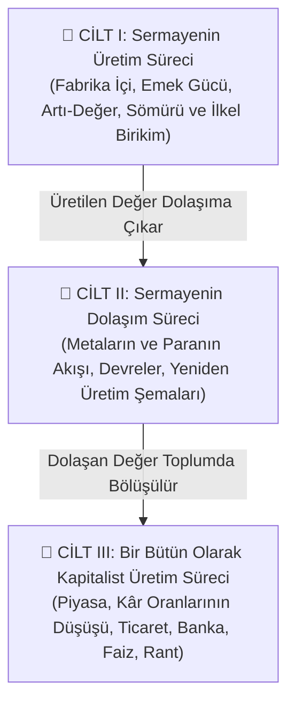

# 📕 Das Kapital: Kapsamlı Okuma ve Çözümleme Rehberi

Karl Marx'ın başyapıtı olan *Das Kapital: Kritik der politischen Ökonomie* (Kapital: Ekonomi Politiğin Eleştirisi), klasik burjuva iktisadının (Smith, Ricardo) varsayımlarını kökünden sarsan ve sermayenin içsel işleyiş ve kriz dinamiklerini deşifre eden üç ciltlik bir külliyattır.

---

## 📌 Ciltlerin Genel Mimarisi

---

## 📗 Cilt I: Sermayenin Üretim Süreci (1867)

Cilt 1; kapitalist toplumun en temel hücresi olan **meta** ile başlar ve üretimin gizli mabedine (*hidden abode of production*) inerek artı-değerin nasıl üretildiğini gösterir.

### 1. Kısım: Meta ve Para
* **Metanın İkili Niteliği:** Her meta hem bir *Kullanım Değeri*ne (insan ihtiyacını karşılama kabiliyeti) hem de bir *Değişim Değeri*ne (piyasada mübadele edilme oranı) sahiptir.
* **Emeğin İkili Niteliği:** Somut emek kullanım değeri yaratır; Soyut insan emeği ise toplumsal değeri (*Value*) oluşturur.
* **Toplumsal Olarak Gerekli Emek Zamanı (SNLT):** Bir metanın değeri, ortalama teknoloji ve beceri düzeyinde üretilmesi için harcanan ortalama çalışma süresidir.
* **Meta Fetişizmi:** Üreticilerin toplumsal ilişkilerinin, şeyler (metalar ve para) arasındaki nesnel ilişkiler gibi görünmesi yanılsaması.

### 2. Kısım: Paranın Sermayeye Dönüşmesi
* **Basit Meta Dolaşımı ($M - P - M$):** Amaç bir metayı satıp ihtiyaç duyulan başka bir metayı almaktır (Kullanım değeri odaklı).
* **Sermaye Devresi ($P - M - P'$):** Amaç parayı metaya yatırıp daha fazla para ($P' = P + \Delta P$) elde etmektir (Değer artırma odaklı).
* **Emek Gücü Metası:** Kapitalist, piyasada tüketildiğinde kendi değerinden daha fazlasını üreten tek metayı; yani işçinin *Emek Gücünü* satın alır.

### 3-5. Kısımlar: Artı-Değer Üretimi
* **Gerekli Emek vs. Artı-Emek:**
  * İşçi günün ilk yarısında kendi maaşının karşılığını üretir (*Gerekli Emek*).
  * Günün geri kalanında ise kapitalist için bedelsiz çalışır (*Artı-Emek*).
* **Mutlak Artı-Değer:** Çalışma gününün uzatılmasıyla elde edilir (Mevzuat mücadeleleri).
* **Göreli Artı-Değer:** Teknolojik yeniliklerle temel tüketim mallarının ucuzlatılması ve böylece gerekli çalışma süresinin kısaltılarak artı-çalışma süresinin genişletilmesi.

### 7-8. Kısımlar: Sermaye Birikimi ve İlkel Birikim
* **Yedek Sanayi Ordusu (İşsizler Ordusu):** Sermaye birikimi, ücretleri baskı altında tutmak için sürekli bir işsiz nüfus havuzu yaratır.
* **Sözde İlkel Birikim (*Ursprüngliche Akkumulation*):**
  * İngiltere'de müşterek arazilerin çitlenmesi (*Enclosures*).
  * Amerika'da yerli katliamları ve köle ticareti.
  * Üreticilerin üretim araçlarından zora dayalı olarak koparılması.

---

## 📘 Cilt II: Sermayenin Dolaşım Süreci (1885)

Marx'ın ölümünden sonra Friedrich Engels tarafından notlarından derlenen Cilt 2; fabrikada üretilen değerin pazarda nasıl gerçekleştiğini ($Realization$) ve sermayenin metamorfozlarını inceler.

### 1. Sermayenin Üç Biçimi ve Devresi
1. **Para Sermaye Devresi ($P ... P'$):** Sermayenin finansal başlangıcı ve kârla geri dönüşü.
2. **Üretken Sermaye Devresi ($\ddot{U} ... \ddot{U}'$):** Üretim araçları ve emeğin birleştiği fiziksel süreç.
3. **Meta Sermaye Devresi ($M' ... M'$):** Üretilen metaların tüketiciye satılması ve piyasada gerçekleşmesi.

### 2. Dolaşım ve Dönüş Süreleri
* **Sabit Sermaye (*Fixed Capital*):** Makineler, binalar (değeri aşama aşama aktarılır).
* **Döner Sermaye (*Circulating Capital*):** Hammadde ve işçi ücretleri (değeri tek bir üretim döngüsünde aktarılır).

### 3. Yeniden Üretim Şemaları
Toplum iki büyük departmana ayrılır:
* **Departman I:** Üretim araçları üreten sektör (Makineler, hammadde).
* **Departman II:** Tüketim maddeleri üreten sektör (Gıda, giyim, barınma).
* **Kriz Dinamiği:** İki departman arasındaki arz-talep oranlarının piyasa anarşisi içinde dengede kalması neredeyse imkânsızdır; bu durum periyodik aşırı üretim krizlerine yol açar.

---

## 📙 Cilt III: Bir Bütün Olarak Kapitalist Üretim Süreci (1894)

Cilt 3; artı-değerin toplumdaki farklı sermaye fraksiyonları (sanayici, tüccar, bankacı, toprak sahibi) arasında nasıl paylaşıldığını ve genel kriz yasalarını inceler.

### 1. Artı-Değerin Kâra ve Fiyata Dönüşümü
* **Maliyet Fiyatı ($k = c + v$):** Kapitalistin harcadığı sermaye.
* **Üretim Fiyatı:** Değer kuramının farklı sermaye bileşimlerine sahip sektörlerde kâr oranlarının eşitlenmesi (*General Rate of Profit*) sonucu piyasa fiyatlarına dönüşümü.

### 2. Kâr Oranlarının Eğilimsel Düşüş Yasası (*TRPF*)
* Kapitalistler rekabette öne geçmek için teknolojiye yatırım yapar $\rightarrow$ Sermayenin Organik Bileşimi ($c/v$) yükselir.
* Artı-değer yalnızca canlı emek ($v$) tarafından üretildiği için, toplam sermayeye oranla kâr oranı ($p' = \frac{s}{c+v}$) uzun vadede düşüş eğilimine girer.
* **Karşı Eğilimler:** Sömürü oranının artırılması, ücretlerin emek gücü değerinin altına düşürülmesi, dış ticaret, finansal spekülasyon.

### 3. Sermayenin Bölüşümü: Ticari Sermaye, Faiz ve Rant
* **Ticari Sermaye:** Metaları tüketiciye ulaştırarak sanayiciden kâr payı alır.
* **Faiz Getiren Sermaye ve Hayali Sermaye (*Fictitious Capital*):** Bankalar, hisse senetleri, tahviller ve borç senetleri aracılığıyla gelecekteki artı-değere ipotek koyulması.
* **Toprak Rantı:**
  * *Diferansiyel Rant I & II:* Toprağın doğal verimliliği ve yapılan ek sermaye yatırımlarından doğan artı-kâr.
  * *Mutlak Rant:* Özel toprak mülkiyetinin tarım sektörüne sermaye girişini engellemesinden doğan tekel payı.
* **Üçlü Formül Eleştirisi:** Burjuva iktisadının "Sermaye $\rightarrow$ Kâr, Toprak $\rightarrow$ Rant, Emek $\rightarrow$ Ücret" şeklindeki yanılsamasının deşifresi. Bütün bu gelirlerin tek gerçek kaynağı toplumsal artı-emektir.
