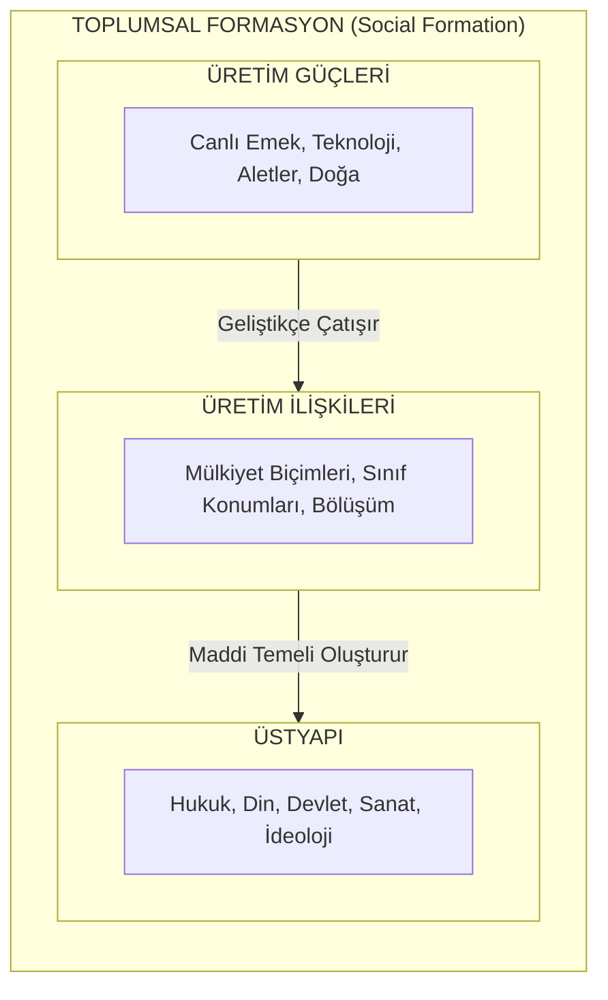

# ⚙️ Diyalektik ve Tarihsel Materyalizm: Metodoloji ve Felsefe Rehberi

Marksizm, soyut bir inanç veya dogmatik bir öğreti değil; doğanın, toplumun ve insan düşüncesinin hareket ve dönüşüm yasalarını inceleyen felsefi ve bilimsel bir yöntemdir.

---

## 📌 İçindekiler
- [1. İdealist Diyalektikten Materyalist Diyalektiğe (Hegel'den Marx'a)](#1-idealist-diyalektikten-materyalist-diyalektiğe-hegeldan-marxa)
- [2. Materyalist Diyalektiğin Üç Temel Yasası](#2-materyalist-diyalektiğin-üç-temel-yasası)
- [3. Praksis Felsefesi ve Yabancılaşmanın Aşılması](#3-praksis-felsefesi-ve-yabancılaşmanın-aşılması)
- [4. Tarihsel Materyalizmin Temel Kategorileri](#4-tarihsel-materyalizmin-temel-kategorileri)
- [5. Tarih Boyunca Üretim Tarzları ve Dönüşümler](#5-tarih-boyunca-üretim-tarzları-ve-dönüşümler)

---

## 1. İdealist Diyalektikten Materyalist Diyalektiğe (Hegel'den Marx'a)

G. W. F. Hegel, diyalektiği modern felsefenin merkezine oturtmuş ancak tarihi "Mutlak Fikir"in (*Geist*) kendini dünyada açması olarak görmüştür (İdealizm).

* **Marx'ın Müdahalesi:**
  > *"Benim diyalektik yöntemim, Hegelci yöntemden yalnızca farklı değil, onun doğrudan tam karşıtıdır... Hegel'de diyalektik baş aşağı durmaktadır. Mistik kabuk içindeki rasyonel çekirdeği bulmak için onu ayakları üzerine dikmek gerekir."*  
  > — Karl Marx, *Kapital*, 1. Cilt, 2. Baskıya Sonsöz (1873)
* **Materyalist Temel:** Fikirler, bilincin gökten inen ürünleri değil; maddi dünyanın insan beyninde yansıması ve insan pratiğiyle (praksis) dönüştürülmesidir.

---

## 2. Materyalist Diyalektiğin Üç Temel Yasası

Friedrich Engels'in *Anti-Dühring* ve *Doğanın Diyalektiği*nde sistematize ettiği yasalar:

### A. Zıtların Birliği ve Mücadelesi
* **İlke:** Bütün nesneler ve olgular kendi içlerinde karşıt eğilimler, çelişkiler taşırlar. Hareketin ve değişimin içsel kaynağı bu çelişkidir.
* **Örnekler:**
  * *Doğada:* Atomdaki artı ve eksi yükler; ekosistemdeki madde alışverişi.
  * *Toplumda:* Burjuvazi ile Proletarya arasındaki uzlaşmaz çıkar karşıtlığı.

### B. Niceliksel Değişikliklerin Niteliksel Sıçramalara Dönüşmesi
* **İlke:** Küçük, tedrici ve görünüşte fark edilmeyen niceliksel birikimler belirli bir kritik eşiğe (düğüm noktasına) ulaştığında ani niteliksel dönüşümler (sıçramalar/devrimler) meydana gelir.
* **Örnekler:**
  * *Fizikte:* Suyun $99^\circ\text{C}$'de hâlâ sıvı iken, $100^\circ\text{C}$'ye ulaştığında aniden gaza (buhara) dönüşmesi.
  * *Siyasette:* İşçi sınıfının günlük hak taleplerinin birikerek devrimci bir kalkışmaya evrilmesi.

### C. İnkârın İnkârı (*Negation of the Negation*)
* **İlke:** Gelişme düz bir çizgi değil; spiral şeklinde bir yükseliştir. Yeni olan eskiyi yıkar (inkâr eder), ancak eski olanın olumlu unsurlarını daha yüksek bir aşamada koruyarak aşar (*Aufhebung*).
* **Örnek:**
  * Bir tohum toprağa düşer ve çürüyerek inkâr edilir $\rightarrow$ Bitki doğar $\rightarrow$ Bitki büyür, çiçek açar ve tohum vererek ölür $\rightarrow$ Başlangıçtaki tek tohum, onlarca yeni tohum şeklinde daha yüksek bir nicelikte geri döner.
  * *Toplumda:* İlkel komünal mülkiyet $\rightarrow$ Özel mülkiyet tarafından inkâr edilir $\rightarrow$ Komünist mülkiyet özel mülkiyeti inkâr ederek komünaliteyi yüksek teknolojik temelde yeniden kurar.

---

## 3. Praksis Felsefesi ve Yabancılaşmanın Aşılması

* **Praksis (*Devrimci Eylem*):** Teori ile pratik arasındaki yapay ayrımı kaldıran dönüştürücü insan etkinliğidir. Dünyayı anlamanın yolu, onu değiştirme pratiğinden geçer.
* **Yabancılaşmanın Dört Boyutu:**
  1. *Nesneye Yabancılaşma:* İşçinin ürettiği ürün kendisine düşman bir yabancı güç olarak geri döner.
  2. *Üretim Eylemine Yabancılaşma:* Çalışma eylemi bir kendini gerçekleştirme değil, salt hayatta kalma angaryasına dönüşür.
  3. *Türsel Öze (*Gattungswesen*) Yabancılaşma:* İnsanın yaratıcı, bilinçli ve özgür doğasını kaybetmesi.
  4. *İnsanın İnsana Yabancılaşması:* Toplumun rekabetçi atomlara bölünmesi.

---

## 4. Tarihsel Materyalizmin Temel Kategorileri

* **Üretim Güçleri:** İnsanların doğayı dönüştürürken kullandığı tüm maddi araçlar (aletler, makineler, fabrikalar, yapay zekâ) ve insanın bilgi, beceri ve deneyim birikimi.
* **Üretim İlişkileri:** İnsanların üretim sürecinde birbirleriyle ve üretim araçlarıyla kurdukları toplumsal, hukuksal ve sınıfsal bağlar (özel mülkiyet, kölelik, ücretli emek).
* **Üretim Tarzı (*Mode of Production*):** Üretim güçleri ile üretim ilişkilerinin belirli bir tarihsel andaki bütünleşmiş yapısı ($Üretim\ Güçleri + Üretim\ İlişkileri = Üretim\ Tarzı$).
* **Tarihsel Çatışma Yasası:** Üretim güçleri belirli bir aşamada mevcut üretim ilişkilerine sığmaz hale gelir; mevcut mülkiyet ilişkileri birer gelişim biçimi olmaktan çıkıp birer prangaya dönüşür. Bu noktada devrimler çağı başlar.

---

## 5. Tarih Boyunca Üretim Tarzları ve Dönüşümler

1. **İlkel Komünal Toplum:** Sınıfsız, devletsiz, özel mülkiyetsiz, ortaklaşa avcı-toplayıcı üretim tarzı.
2. **Asya Tipi Üretim Tarzı (ATÜT):** Özel toprak mülkiyetinin bulunmadığı, sulama ve altyapı işlerini merkezi despotik devletin organize ettiği kolektif köy komünleri yapısı (Eski Mısır, Mezopotamya, Çin, Osmanlı tartışmaları).
3. **Antik / Köleci Üretim Tarzı:** Efendiler ve mülk haline getirilmiş köleler arasındaki açık sömürü (Antik Yunan, Roma).
4. **Feodal Üretim Tarzı:** Toprak sahibi senyörler ile toprağa bağlı serfler arasındaki ayni rant ve angarya sömürüsü.
5. **Kapitalist Üretim Tarzı:** Üretim araçlarına sahip burjuvazi ile yalnızca emek gücünü satabilen özgür proleterler arasındaki piyasa ve artı-değer sömürüsü.
6. **Komünizm (Sosyalist Geçiş Aşaması ile):** Üretim araçlarının toplumsallaştırıldığı, sınıfların, sömürünün ve devlet aygıtının sönümlendiği özgür üreticiler birliği.
