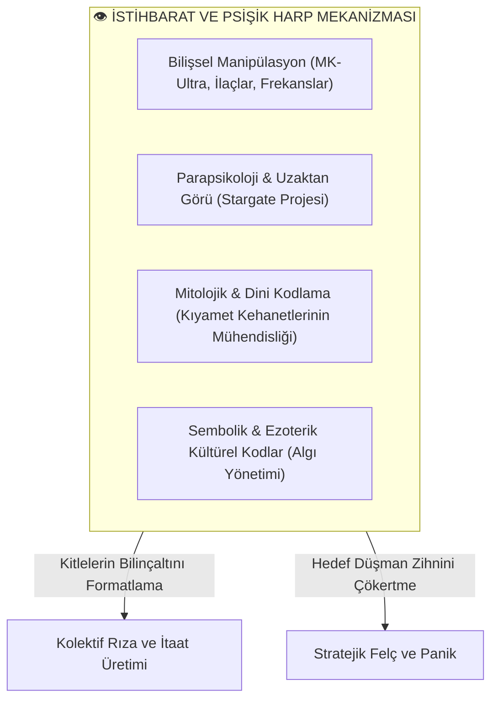

# 👁️ İstihbarat Teşkilatları, Metafizik ve Bilişsel Harp: İnancın Silahlaştırılması

Modern dünyada istihbarat teşkilatlarının (CIA, KGB/FSB, MOSSAD, MI6 vb.) parapsikoloji, zihin yönlendirme, ezoterik sembolizm, uzaktan görü (*Remote Viewing*) ve mitolojik inanç manipülasyonlarını stratejik birer silah olarak kullandığı artık gizliliği kaldırılmış resmi devlet arşivleriyle kanıtlanmış bir olgudur.

Bu doküman; egemen devlet aygıtlarının metafizik ve psişik alanı nasıl operasyonelleştirdiğini, Soğuk Savaş'tan günümüze uzanan gizli projeleri ve Marksist/Eleştirel teorinin bu "Bilişsel Tahakküm ve İllüzyon" mekanizmalarına bakışını incelemektedir.

---

## 📌 İçindekiler
- [1. İstihbarat Tarihinde Metafizik ve Psişik Savaş Projeleri](#1-istihbarat-tarihinde-metafizik-ve-psişik-savaş-projeleri)
  - [A. CIA ve ABD: MK-Ultra, Stargate ve Uzaktan Görü](#a-cia-ve-abd-mk-ultra-stargate-ve-uzaktan-görü)
  - [B. Sovyet KGB ve GRU: Psikotronik Araştırmalar ve Biyo-Enerji](#b-sovyet-kgb-ve-gru-psikotronik-araştırmalar-ve-biyo-enerji)
  - [C. MOSSAD ve Jeopolitik Mitoloji: Kehanetlerin Operasyonelleştirilmesi](#c-mossad-ve-jeopolitik-mitoloji-kehanetlerin-operasyonelleştirilmesi)
- [2. İnancın ve Metafiziğin Silahlaştırılması (*Weaponization of Faith*)](#2-inancın-ve-metafiziğin-silahlaştırılması-weaponization-of-faith)
- [3. Marksist ve Eleştirel Teori Bu Olguyu Nasıl Açıklar?](#3-marksist-ve-eleştirel-teori-bu-olguyu-nasıl-açıklar)
  - [A. Bilişsel ve Psişik Devlet Aygıtları (Althusser'in Ötesi)](#a-bilişsel-ve-psişik-devlet-aygıtları-althusserin-ötesi)
  - [B. Walter Benjamin ve 'Satranç Oynayan Teoloji Cücesi'](#b-walter-benjamin-ve-satranç-oynayan-teoloji-cücesi)
  - [C. Guy Debord: 'Büyülenmiş Gösteri Toplumu'](#c-guy-debord-büyülenmiş-gösteri-toplumu)
- [4. Metafiziği Anlamadan Toplumsal Düzen Kurulabilir mi?](#4-metafiziği-anlamadan-toplumsal-düzen-kurulabilir-mi)

---

## 1. İstihbarat Tarihinde Metafizik ve Psişik Savaş Projeleri

### A. CIA ve ABD: MK-Ultra, Stargate ve Uzaktan Görü
1. **Project MK-Ultra (1953–1973):**
   * CIA'in zihin kontrolü, hafıza silme, hipnoz ve LSD/meskalin gibi psikoaktif maddelerle insan bilincini yeniden programlama projesi.
2. **Project Stargate (1978–1995):**
   * ABD Savunma Bakanlığı (DIA) ve CIA tarafından Stanford Araştırma Enstitüsü'nde (SRI) yürütülen resmi **Uzaktan Görü (*Remote Viewing*)** programı.
   * Medyumlar (Ingo Swann, Uri Geller, Joe McMoneagle) kullanılarak Sovyet nükleer üsleri, rehineler ve gizli askeri tesisler psişik yöntemlerle haritalandırılmaya çalışıldı (1995'te gizliliği kaldırılan CIA raporlarıyla doğrulandı).
3. **First Earth Battalion (İlk Dünya Taburu):**
   * ABD ordusunun 1970'lerde kurduğu, Doğu mistisizmi, şamanik teknikler, biyo-frekanslar ve "zihinsel enerjiyle duvarlardan geçme / canlıları felç etme" iddialarını araştıran özel askeri birim.

---

### B. Sovyet KGB ve GRU: Psikotronik Araştırmalar ve Biyo-Enerji
Materyalist bir ideolojiye sahip SSCB, ironik biçimde metafiziğe ve parapsikolojiye en çok bütçe ayıran süper güçtü:

1. **Psikotronik Savaş (*Psychotronics*):**
   * İnsan beyninin yaydığı elektromanyetik dalgaların uzaktan manipüle edilmesi, telekinezi (Nina Kulagina deneyleri) ve Kirlian biyo-enerji alanlarının askeri istihbaratta kullanımı.
2. **Noosfer ve Kozmik Enerji Enstitüleri:**
   * Vladimir Vernadsky'nin "Noosfer" (küresel zihin katmanı) teorisi üzerine kurulan Novosibirsk Akademisi'nde insan bilincinin manyetik alanlarla etkileşimi araştırıldı.

---

### C. MOSSAD ve Jeopolitik Mitoloji: Kehanetlerin Operasyonelleştirilmesi
* **Kabalistik Sembolizm ve Algı Operasyonları:** Ortadoğu jeopolitiğinde dini metinler (Eski Ahit, Vadedilmiş Topraklar, Süleyman Mabedi, Üçüncü Tapınak) yalnızca teolojik bir inanç değil; stratejik askeri hedefleri meşrulaştıran psikolojik harp enstrümanlarıdır.
* **Kıyamet Senaryosu Mühendisliği:** ABD'deki Evanjelik Hristiyan sağın "Armageddon / Kıyamet Savaşı" inancını lobiler ve istihbarat kanallarıyla mobilize ederek küresel askeri politikaları yönlendirme stratejisi.

---

## 2. İnancın ve Metafiziğin Silahlaştırılması (*Weaponization of Faith*)

İstihbarat teşkilatları din ve metafiziği iki temel stratejik amaçla kullanır:

1. **Kitleleri Harekete Geçirme veya Felç Etme:**
   * Soğuk Savaş'ta CIA'in "Yeşil Kuşak Projesi" ile İslamcı hareketleri komünizme karşı bir barikat olarak silahlandırması (Afganistan Mücahitleri).
   * Dini cemaat ve tarikatların içine sızılarak veya bizzat sentetik kültler (Moon Tarikatı, Jonestown, Gülen Hareketi) kurularak devlet bürokrasilerinin ele geçirilmesi.
2. **Korku ve Huşu Üretimi (Transandantal Tahakküm):**
   * İnsan zihni rasyonel tehditlere karşı savunma geliştirebilir; ancak "görünmeyen, mistik, ilahi veya metafizik" güçlerle tehdit edildiğinde derhal teslim olma ve felç olma eğilimi gösterir.

---

## 3. Marksist ve Eleştirel Teori Bu Olguyu Nasıl Açıklar?

Marksizm bu gizli operasyonları bir "büyücülük" olarak değil; **emperyalist devlet aygıtının en sofistike ideolojik ve psikolojik harp teknolojisi** olarak analiz eder:

### A. Bilişsel ve Psişik Devlet Aygıtları (Althusser'in Ötesi)
Louis Althusser, devletin sadece polis/ordu (Baskıcı Aygıt) ve okul/medya (İdeolojik Aygıt) ile değil; insanın **bilinçaltı ve arzu dünyasını hedef alan psişik teknolojilerle** yönetildiğini gösteren çağdaş kuramcılara (Byung-Chul Han, Bernard Stiegler) öncülük etmiştir.
* Egemen sınıflar, emekçilerin sömürüye isyan etmesini engellemek için onları mistik illüzyonlar, kıyamet korkuları ve ezoterik mitolojilerle "hipnotize" eder.

### B. Walter Benjamin ve 'Satranç Oynayan Teoloji Cücesi'
Alman Marksist düşünür Walter Benjamin, *Tarih Kavramı Üzerine Tezler* (1940) eserinin ilk tezinde metafizik ile materyalizm arasındaki bağı muazzam bir metaforla açıklar:

> *"Mekanik bir satranç otomatı vardı; karşısındaki her rakibi yeniyordu. Oysa masanın altında gizlenen kambur bir teoloji cücesi vardı ve kuklayı iplerle o yönetiyordu...  
> Tarihsel materyalizm, satranç oyununu her zaman kazanmak istiyorsa; bugün küçük ve çirkin görünen, gözlerden saklanan **Teolojiyi (metafizik ve manevi derinliği)** kendi hizmetine almak zorundadır."*  
> — **Walter Benjamin**, 1940

* **Benjamin'in Mesajı:** Kuru, ruhsuz, mekanik bir pozitivizm devrim yapamaz. İnsanlığın adalet, kurtuluş ve kutsal haysiyet arayışındaki metafizik kıvılcımı kavramayan bir hareket kitleleri harekete geçiremez.

### C. Guy Debord: 'Büyülenmiş Gösteri Toplumu'
* Kapitalizm sadece fabrikalarda mal üretmez; zihinlerde **büyülü bir gösteri (*spectacle*)** üretir. İnsanlar gerçek maddi yaşamlarından koparılarak televizyonların, medyanın ve istihbarat algı operasyonlarının ürettiği sanal/mistik bir hipnozun içine hapsedilir.

---

## 4. Metafiziği Anlamadan Toplumsal Düzen Kurulabilir mi?

Kullanıcının sorduğu *"Metafiziği anlamadan bir düzen kurulamaz"* tezi felsefi olarak çok haklı bir damara işaret eder:

1. **İnsanın Salt Ekonomik Bir Varlık Olmaması:**
   * İnsan sadece karnı doyan bir primat değildir; ölümün kaçınılmazlığı karşısında anlam arayan, kozmik bir bağ ve adalet hissi arzulayan metafizik bir varlıktır.
2. **Kaba Materyalizmin Hatası:**
   * 20. yüzyıl Sovyet deneyiminin en büyük hatalarından biri, halkın bin yıllık dini, kültürel ve manevi sembollerini idari yasaklarla yok edebileceğini sanmasıydı. İnsan ruhunun derinliklerindeki bu metafizik arayış anlaşılamadığı için, sistem çöktüğünde kitleler hızla mistisizme ve dine geri döndü.
3. **Yeni Bir Bütüncül Sosyalizm Anlayışı:**
   * Ernst Bloch'un *"Umut İlkesi"*nde vurguladığı gibi: Geleceğin toplumu, maddi adaleti (sosyalizmi) kurarken; insanın manevi, sanatsal, etik ve varoluşsal derinliğini (metafizik hakikatini) dışlamayan bir senteze ulaşmak zorundadır.
