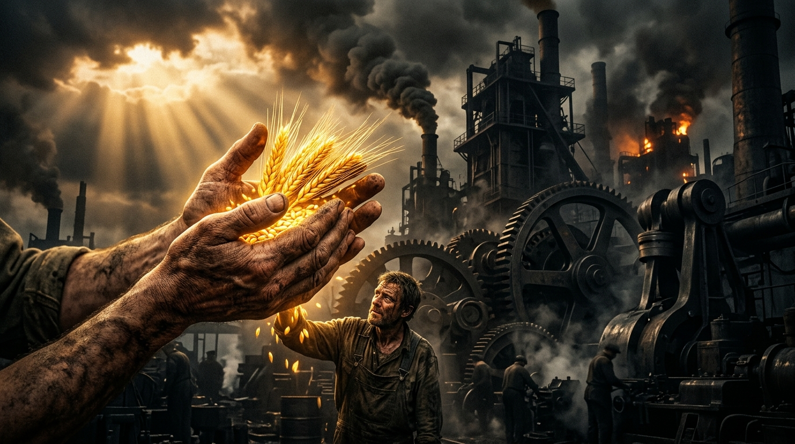
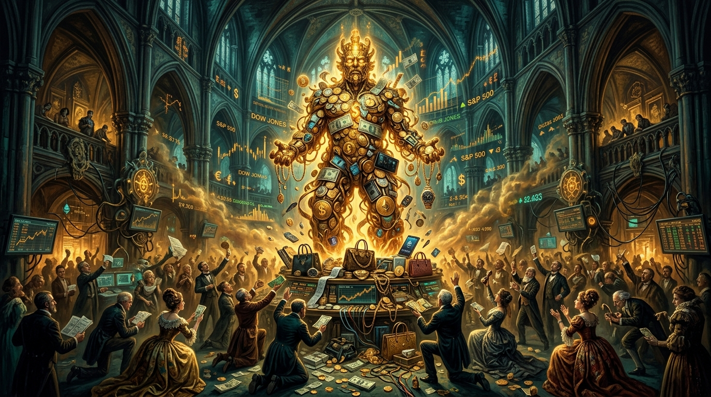

# 💎 Marksizmdeki Mantıklı Hakikatler, İsabetli Teşhisler ve Alıntılar Külliyatı
## *Hikmet Müminin Yitiğidir: Kapitalizmin Deşifresinde Marksist Düşüncenin İsabetli Analizleri*

---

> *"Hikmet müminin yitik malıdır; onu nerede bulursa almaya en çok o hak sahibidir."*  
> — **Hadis-i Şerif (Tirmizî, İlim, 19; İbn Mâce, Zühd, 15)**

---

## 📌 Giriş ve Metodolojik Çerçeve

Bir Müslüman düşünür ve araştırmacı için batıl bir sistemin (örneğin felsefi materyalizmin veya ateizmin) ontolojisini toptan reddetmek, o sistemin **mevcut zulüm düzenine (kapitalizme, faiz tekelciliğine, emperyalist yağmaya) getirdiği isabetli teşhisleri ve hakikat kırıntılarını** görmezden gelmeyi gerektirmez. 

Karl Marx ve Marksist gelenek, 19. yüzyıldan bugüne dek sermayenin doğasını, insan emeğinin nasıl çalındığını, serbest piyasa masallarının arkasındaki vahşi sömürü mekanizmalarını ve modern insanın manevi boşluğunu besleyen tüketim putçuluğunu tarihte görülmemiş bir mantıksal derinlikle deşifre etmiştir.

Bu çalışmanın gayesi; Marksizmin ateist-materyalist metafizik çıkmazlarına düşmeden, **kapitalist sömürü çarklarını matematiksel ve sosyolojik olarak ifşa eden en parlak hakikatlerini, isabetli teşhislerini ve orijinal alıntılarını** derleyip İslami adalet tasavvuruyla mukayese etmektir.

---

## 📑 İçindekiler
1. [1. Emek-Değer ve Artı-Değer Sömürüsü (Alınterinin Gasp Edilmesi)](#1-emek-değer-ve-artı-değer-sömürüsü-alınterinin-gasp-edilmesi)
2. [2. Yabancılaşma (*Entfremdung*): İnsanın Şeyleşmesi ve Ruhsuzlaşması](#2-yabancılaşma-entfremdung-insanın-şeyleşmesi-ve-ruhsuzlaşması)
3. [3. Meta Fetişizmi (*Warenfetischismus*): Modern Putperestlik](#3-meta-fetişizmi-warenfetischismus-modern-putperestlik)
4. [4. Kapitalizmin Yapısal Krizleri ve Sınırsız Sermaye Hırsı](#4-kapitalizmin-yapısal-krizleri-ve-sınırsız-sermaye-hırsı)
5. [5. Emperyalizm ve Küresel Mazlumların Yağmalanması](#5-emperyalizm-ve-küresel-mazlumların-yağmalanması)
6. [6. Ekolojik Yıkım ve "Metabolik Yarılma" (*Metabolic Rift*)](#6-ekolojik-yıkım-ve-metabolik-yarılma-metabolic-rift)
7. [7. Burjuva Hukuku ve Sahte Özgürlük İllüzyonu](#7-burjuva-hukuku-ve-sahte-özgürlük-illüzyonu)
8. [8. Rantiyer/Tefeci Sermayenin Parazitliği](#8-rantiyertefeci-sermayenin-parazitliği)
9. [9. Büyük Karşılaştırma Matrisi: Marksist Teşhis & İslami İlke](#9-büyük-karşılaştırma-matrisi-marksist-teşhis--i̇slami-i̇lke)

---

## 1. Emek-Değer ve Artı-Değer Sömürüsü (Alınterinin Gasp Edilmesi)

### 🎯 Teşhisin Mantığı
Kapitalizm, işçiye "çalıştığının tam karşılığını ücret olarak ödediği" yalanını söyler. Oysa Marx'ın ispatladığı üzere, işçinin ürettiği değer ile ona ödenen ücret (emek gücünün yeniden üretim maliyeti) arasında daima bir fark vardır. Bu fark **Artı-Değerdir ($s$)** ve sermayedar tarafından gasp edilir.

İslamiyet'teki *"İşçinin ücretini alnının teri kurumadan veriniz"* (İbn Mâce) ve *"İnsan için ancak emeğinin karşılığı vardır"* (Necm, 39) ilkeleriyle Marksizmin artı-değer hırsızlığı tespiti tam bir ahlaki/iktisadi örtüşme gösterir.

### 📜 Temel Alıntılar

> *"Sermaye ölü emektir; vampir gibi ancak canlı emeği emerek yaşar ve ne kadar çok emek emerse o kadar çok yaşar."*  
> — **Karl Marx, *Das Kapital*, Cilt 1, Bölüm 10 (Çalışma Günü)**

> *"Artı-değer üretimi ya da kâr elde etme, bu üretim tarzının mutlak yasasıdır."*  
> — **Karl Marx, *Das Kapital*, Cilt 1, Bölüm 25**

> *"İşçinin kendi emeğinin ürününden aldığı pay, sermayedarın ve toprak sahibinin aldığı payla karşılaştırıldığında giderek küçülür... İşçi ne kadar çok zenginlik üretirse, üretimi güç ve hacim olarak ne kadar artarsa, kendisi o kadar yoksullaşır."*  
> — **Karl Marx, *1844 İktisadi ve Felsefi Elyazmaları***

> *"Ücret, emeğin fiyatı değil, emek gücünün fiyatıdır. Sermayedar işçinin harcadığı emeği değil, işçiyi yarın tekrar çalışabilecek durumda tutacak asgari gıdayı satın alır. Aradaki devasa artık zenginlik ise gasptır."*  
> — **Karl Marx, *Ücret, Fiyat ve Kâr* (1865)**

---

## 2. Yabancılaşma (*Entfremdung*): İnsanın Şeyleşmesi ve Ruhsuzlaşması

### 🎯 Teşhisin Mantığı
Kapitalizm insanı sadece fiziki olarak sömürmez; onu manevi olarak parçalar. İşçi, ürettiği nesneye, çalıştığı üretim sürecine, kendi insan doğasına (*Gattungswesen*) ve diğer insanlara yabancılaşır. İnsan artık Allah'ın yarattığı onurlu bir halife değil; üretim bandındaki bir dişli, alınıp satılan bir girdi haline gelir.

### 📜 Temel Alıntılar

> *"Emeğin yabancılaşması şu sonuçları doğurur:  
> 1. İnsan kendi ürettiği nesneye yabancı bir nesne olarak bakar.  
> 2. Kendi üretici etkinliğine kendine ait olmayan, ona eziyet veren bir faaliyet olarak yabancılaşır.  
> 3. İnsan kendi türsel özüne (insanlığına) yabancılaşır; bedeni, ruhu ve manevi varlığı elinden alınır.  
> 4. İnsan diğer insanlara yabancılaşır; herkes birbirini sadece bir rakip, araç veya meta olarak görmeye başlar."*  
> — **Karl Marx, *1844 İktisadi ve Felsefi Elyazmaları***

> *"İşçi ne kadar çok çalışırsa, karşısında dikilen yabancı nesneler dünyası o kadar güçlenir; kendi iç dünyası ise o kadar fakirleşir, kendine ait olan şey o kadar azalır."*  
> — **Karl Marx, *Yabancılaşmış Emek Üzerine***

> *"Makinelerin gelişmesiyle birlikte işçi, makinenin basit bir uzantısı haline gelir. Ondan beklenen yalnızca en mekanik, en tekdüze ve en kolay öğrenilen hareketleri yapmasıdır."*  
> — **Karl Marx & Friedrich Engels, *Komünist Manifesto* (1848)**

  
  
<em>Sanayi çarklarında şeyleşen insan emeği ve alınterinin bereketi.</em>

---

## 3. Meta Fetişizmi (*Warenfetischismus*): Modern Putperestlik

### 🎯 Teşhisin Mantığı
Marx'ın *Das Kapital*'in ilk cildinde ortaya koyduğu **Meta Fetişizmi**, insanların elleriyle ürettikleri eşyalara, markalara ve paraya tapınmaya başlamasını açıklar. Tıpkı eski kavimlerin taştan ve helvadan put yapıp sonra onların önünde eğilmesi gibi, kapitalist toplumda da insanlar kendi ürettikleri metaların (doların, borsanın, tüketim ürünlerinin) kölesi olurlar. 

İslam'ın **Şirk ve Heva/Heves Putlaştırması** (Câsiye, 23: *"Kendi heva ve hevesini ilah edineni gördün mü?"*) eleştirisinin iktisadi sahadaki en kusursuz felsefi karşılığı Meta Fetişizmidir.

### 📜 Temel Alıntılar

> *"İlk bakışta bir meta çok sıradan ve anlaşılması kolay bir şey gibi görünür. Oysa analizi, onun metafizik incelikler ve teolojik kaprislerle dolu, son derece karmaşık ve tuhaf bir şey olduğunu göstermektedir."*  
> — **Karl Marx, *Das Kapital*, Cilt 1, Bölüm 1, Kısım 4 (Metanın Fetiş Karakteri)**

  
  
<em>Meta Fetişizmi: Paranın ve metaların ilahlaştırıldığı modern tüketim tapınağı.</em>

> *"Tıpkı dinin sisli dünyasında insan beyninin ürünlerinin kendi başlarına yaşayan, birbirleriyle ve insanlarla ilişki içinde olan bağımsız varlıklar gibi görünmesi gibi; metalar dünyasında da insan elinin ürünleri aynı duruma düşer. Ben buna 'Meta Fetişizmi' diyorum."*  
> — **Karl Marx, *Das Kapital*, Cilt 1**

> *"Para, bütün şeylerin değerini bozan evrensel bir fahişedir; insanların bütün tanrılarını sıradan metalara dönüştürür ve sonra da kendine taptırır."*  
> — **Karl Marx, *1844 Elyazmaları***

---

## 4. Kapitalizmin Yapısal Krizleri ve Sınırsız Sermaye Hırsı

### 🎯 Teşhisin Mantığı
Kapitalizm ahlaki bir sınır tanımaz; tek gayesi sermayenin sınırsız büyümesidir ($M - C - M'$). Bu durum piyasada doymak bilmez bir kâr hırsına, aşırı üretime, finansal spekülasyonlara ve periyodik krizlere yol açar. Bir yanda çöpe dökülen tonlarca buğday/süt, diğer yanda açlıktan ölen milyonlar vardır.

Kur'an-ı Kerim'in **Tekâsür Suresi**'ndeki uyarısı (*"Çoklukla övünmek, yığma hırsı sizi kabirlere varıncaya kadar oyaladı"*) kapitalist sermaye birikiminin tam bir özetidir.

### 📜 Temel Alıntılar

> *"Sermaye, kârın olmadığı veya çok az olduğu yerden ürker; tıpkı doğanın boşluktan ürktüğü gibi. Uygun bir kâr sağlandığında sermaye cesurlaşır. Yüzde 10 kâr garantisi onu her yere çeker; yüzde 20 kâr hevesini canlandırır; yüzde 50 kâr onu gözü pek yapar; yüzde 100 kâr bütün insani kanunları ayaklar altına aldırır; yüzde 300 kâr karşısında ise işleyemeyeceği hiçbir cinayet, göze alamayacağı hiçbir cürüm yoktur; darağacı tehdidi altında olsa bile."*  
> — **T.J. Dunning'den aktaran Karl Marx, *Das Kapital*, Cilt 1, Dipnot 250**

> *"Burjuva üretim ilişkileri, büyücünün artık kontrol edemediği yeraltı güçlerini çağırmasına benzer. Krizler sırasında, geçmiş çağlarda bir saçmalık gibi görünecek olan bir salgın patlak verir: Aşırı üretim salgını... İnsanlar açtır çünkü çok fazla üretilmiştir!"*  
> — **Karl Marx & Friedrich Engels, *Komünist Manifesto***

> *"Sermayenin gerçek engeli, sermayenin bizzat kendisidir."*  
> — **Karl Marx, *Das Kapital*, Cilt 3**

---

## 5. Emperyalizm ve Küresel Mazlumların Yağmalanması

### 🎯 Teşhisin Mantığı
Kapitalizm ulusal sınırları aşarak küresel bir ahtapota dönüşür. Batılı tekelci tröstler ve finans oligarşisi, Afrika'yı, Asya'yı, Ortadoğu'yu ve Latin Amerika'yı hammadde deposu, ucuz emek pazarı ve rant sahası olarak yağmalar. Bu teşhis, İslam dünyasının neden yüzyıllardır sömürge ve kargaşa altında tutulduğunu anlamak için vazgeçilmez bir kılavuzdur.

### 📜 Temel Alıntılar

> *"Emperyalizm, kapitalizmin en yüksek aşamasıdır... Mali sermaye çağı, tekellerin ve mali oligarşinin hâkim olduğu, sermaye ihracının ön plana çıktığı, dünyanın uluslararası tröstler arasında paylaşıldığı ve yeryüzünün en büyük kapitalist güçler tarafından paylaşılmasının tamamlandığı çağdır."*  
> — **V.I. Lenin, *Emperyalizm: Kapitalizmin En Yüksek Aşaması* (1916)**

> *"Kapitalist üretim tarzı kendi içine kapalı bir sistem değildir; varlığını sürdürebilmek için kapitalist olmayan coğrafyaları, geleneksel tarım toplumlarını ve Doğulu halkları zorla, kanla ve işgalle kendi pazarına katmak zorundadır."*  
> — **Rosa Luxemburg, *Sermaye Birikimi* (1913)**

> *"Sömürgecilik sadece bir halkı boyunduruk altına almakla kalmaz; o halkın geçmişini tahrip eder, hafızasını siler ve onları kendi efendilerine hayran bırakacak şekilde aşağılık duygusuna boğar."*  
> — **Frantz Fanon, *Yeryüzünün Lanetlileri* (1961)**

---

## 6. Ekolojik Yıkım ve "Metabolik Yarılma" (*Metabolic Rift*)

### 🎯 Teşhisin Mantığı
Marx, kapitalizmin sadece insanı değil, toprağı ve doğayı da acımasızca sömürdüğünü ilk gören düşünürlerdendir. İnsan ile doğa arasındaki döngüsel etkileşimin (metabolizmanın) kapitalist sanayi tarafından koparılmasına **Metabolik Yarılma** denir.

Kur'an-ı Kerim'in *"İnsanların elleriyle kazandıkları yüzünden karada ve denizde fesat çıktı"* (Rûm, 41) ayetiyle bu tespit birebir örtüşür.

### 📜 Temel Alıntılar

> *"Kapitalist tarımdaki her ilerleme, yalnızca işçiyi soyma sanatında değil, aynı zamanda toprağı soyma sanatında da bir ilerlemedir; toprağın verimliliğini artırmadaki her ilerleme, bu verimliliğin uzun vadeli kaynaklarını yok etmede bir ilerlemedir."*  
> — **Karl Marx, *Das Kapital*, Cilt 1, Bölüm 15**

> *"Kapitalist üretim, insan ile toprak arasındaki metabolik etkileşimi bozar; toprağın tükenen unsurlarının toprağa geri dönmesini engeller... Böylece bütün zenginliğin asıl kaynağını tüketir: Toprağı ve İşçiyi."*  
> — **Karl Marx, *Das Kapital*, Cilt 1**

> *"Doğa üzerinde kazandığımız zaferlerle kendimizi fazla övmeyelim. Çünkü her zafer için doğa bizden intikamını alır."*  
> — **Friedrich Engels, *Doğanın Diyalektiği* (1883)**

---

## 7. Burjuva Hukuku ve Sahte Özgürlük İllüzyonu

### 🎯 Teşhisin Mantığı
Kapitalist sistemde "hukuk önünde herkes eşittir" sözü büyük bir maskedir. Bir holding patronu ile asgari ücretli bir işçi aynı mahkemede yargılansa dahi, patronun avukat ordusu, lobicilik gücü ve sermaye ağırlığı adaleti ezer. Hukuk, egemen sınıfın çıkarlarını koruyan bir aygıta dönüşür.

### 📜 Temel Alıntılar

> *"Sizin hukukunuz, sınıfınızın kanun mertebesine yükseltilmiş iradesinden başka bir şey değildir; içeriği sizin sınıfınızın maddi yaşam koşulları tarafından belirlenen bir iradedir bu."*  
> — **Karl Marx & Friedrich Engels, *Komünist Manifesto***

> *"Görünüşte işçi ve kapitalist piyasada 'özgürce' sözleşme imzalarlar. Ancak bu özgürlük bir yanılsamadır; çünkü işçi karnını doyurmak ve hayatta kalmak için emek gücünü satmaya MECBURDUR. Kapitalistin özgürlüğü sömürme özgürlüğü, işçinin özgürlüğü ise açlıktan ölme özgürlüğüdür."*  
> — **Karl Marx, *Das Kapital*, Cilt 1**

> *"Devlet, egemen sınıfın ortak işlerini yöneten bir komiteden başka bir şey değildir."*  
> — **Karl Marx & Friedrich Engels, *Komünist Manifesto***

---

## 8. Rantiyer/Tefeci Sermayenin Parazitliği

### 🎯 Teşhisin Mantığı
Marx, *Das Kapital*'in 3. Cildinde hiçbir üretim yapmadan yalnızca para satarak kâr elde eden faizci-tefeci sermayeyi (*Zinstragendes Kapital*) ağır bir dille eleştirir. Finans sermayesinin reel üretimi boğarak halkı borç köleliğine mahkûm etmesi, İslam iktisadındaki **Riba (Faiz)** yasağının sosyolojik boyutunu aydınlatır.

### 📜 Temel Alıntılar

> *"Faiz getiren sermaye ($M - M'$), sermayenin en fetişleşmiş, en yabancılaşmış ve en paraziter biçimidir. Burada üretim süreci ($C$) tamamen ortadan kalkmış, para doğrudan doğruya daha fazla para doğuran sihirli bir nesneye dönüşmüştür. Para paradan ürer; bu ise en saf haliyle asalaklıktır."*  
> — **Karl Marx, *Das Kapital*, Cilt 3, Bölüm 24**

> *"Tefecilik, üretim tarzını dönüştürmez; aksine üreticiyi iliklerine kadar emer, onu sefalete mahkûm eder ve üretici güçleri felce uğratır."*  
> — **Karl Marx, *Das Kapital*, Cilt 3, Bölüm 36**

---

## 9. Büyük Karşılaştırma Matrisi: Marksist Teşhis & İslami İlke

| Konu | 🔴 Marksizmin İsabetli Teşhisi | 🟢 İslamın Hakikati ve İlahi İlkesi | Ortak Zemin / Çıkarılacak Ders |
| :--- | :--- | :--- | :--- |
| **Emek Sömürüsü** | Artı-değer işçiden çalınır, sermaye birikimi hırsızlıktır. | *"İşçinin hakkını teri kurumadan verin."* (Hadis) / Hak gasbı haramdır. | Emek kutsaldır, patron işçiyi sömüremez. |
| **Para & Tüketim** | Meta Fetişizmi: İnsan paraya ve eşyaya tapınır. | *"Hevasını ilah edinenler"* (Câsiye, 23) / Şirk ve maddecilik uyarısı. | Eşya efendi olamaz; insan eşyaya hükmeder. |
| **Servet Yığılması** | Sermaye tekelleşir, zenginlik birkaç elde toplanır. | *"Servet içinizden sadece zenginler arasında dönüp duran bir güç olmasın."* (Haşr, 7) | Tekelleşme ve kenz (yığmacılık) yasaktır. |
| **Faiz ve Rant** | Faizli sermaye parazittir, üretimi felç eder. | *"Allah faizi mahveder, zekatı ve sadakayı bereketlendirir."* (Bakara, 276) | Tefecilik ve faiz düzeni zulümdür. |
| **Ekolojik Kriz** | Metabolik yarılma: Toprak ve doğa kâr uğruna katledilir. | *"Yeryüzünde fesat çıkarmayın, ıslah edildikten sonra onu bozmayın."* (A'râf, 56) | Tabiat emanettir; sermaye aracı değildir. |
| **Küresel Düzen** | Emperyalist tekelcilik Üçüncü Dünyayı köleleştirir. | Mazlumların kıyamı / Firavun ve Karun düzenine karşı cihat ve adalet. | Küresel sömürgeciliğe karşı direnç esastır. |

---

## 💡 Sonuç ve Müslümanca Duruş

Marksizm, teşhislerinde (kapitalizmin çelişkileri, vahşeti, faizcilik, artı-değer gaspı, yabancılaşma) son derece **kuvvetli, mantıklı ve isabetlidir**. Ancak çözümünde (materyalist tarih okuması, ateizm, maneviyatı inkar) **yetersiz ve eksiktir**.

Müslüman aydın; Marksizmin kapitalizme vurduğu öldürücü darbelerden ve analiz yöntemlerinden istifade etmeli, ancak çözümü ve kurtuluşu **Tevhid, Adalet, Zekat, İnfak ve Faizsiz İslam İktisadında** aramalıdır.

---
*Bu metin `marksizm-okumalari` külliyatının temel mukayese ve hakikat antolojisidir.*
