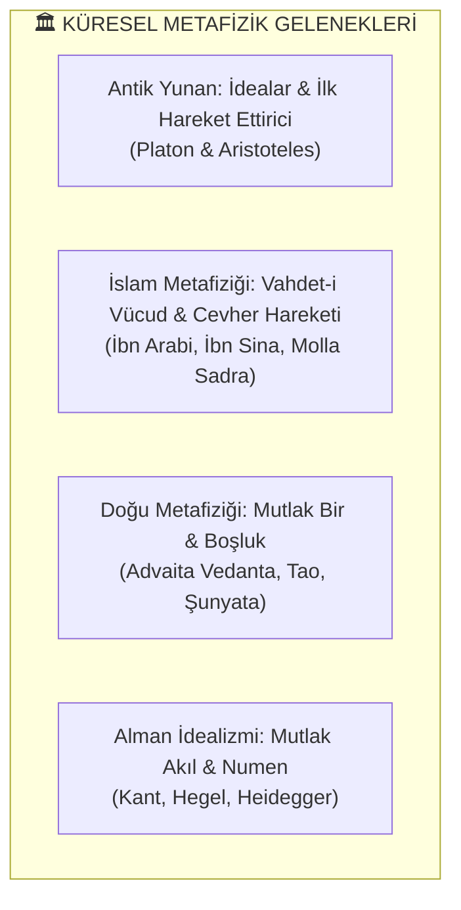
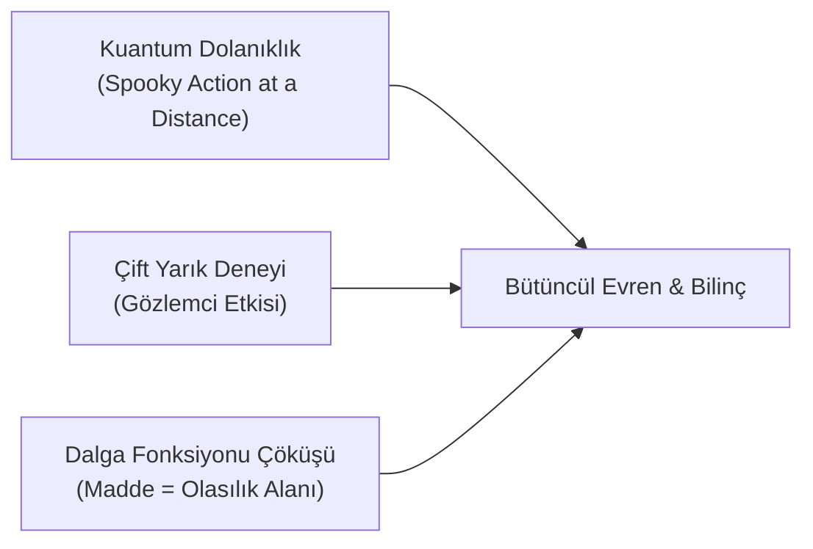

# 🌌 Metafizik Felsefesi, Ontoloji ve Varlık Kuramı: Fizikselin Ötesindeki Hakikat

Metafizik (*Yunanca: Metà tà physiká - Fiziğin Ötesi / İlk Felsefe*); varlığın doğasını, evrenin nihai yapısını, bilincin kökenini, zaman ve mekânın sınırlarını ve maddeden aşkın olan hakikat katmanlarını araştıran insan düşüncesinin en köklü ve temel felsefi disiplinidir.

Bu doküman; Antik Yunan'dan İslam tasavvufuna, Alman İdealizminden kuantum fiziği ve çağdaş bilinç araştırmalarına kadar metafiziğin hakikatini, ontolojik temellerini ve materyalizmle diyalektik ilişkisini derinlemesine incelemektedir.

---

## 📌 İçindekiler
- [1. Metafizik Nedir? İlk Felsefenin Doğuşu](#1-metafizik-nedir-i̇lk-felsefenin-doğuşu)
- [2. Metafiziğin Temel Alanları ve Ezeli Soruları](#2-metafiziğin-temel-alanları-ve-ezeli-soruları)
- [3. Büyük Metafizik Gelenekleri](#3-büyük-metafizik-gelenekleri)
  - [A. Antik Yunan Metafiziği (Platon ve Aristoteles)](#a-antik-yunan-metafiziği-platon-ve-aristoteles)
  - [B. İslam Metafiziği ve Vahdet-i Vücud (İbn Sina, İbn Arabi, Molla Sadra)](#b-i̇slam-metafiziği-ve-vahdet-i-vücud-i̇bn-sina-i̇bn-arabi-molla-sadra)
  - [C. Doğu Metafiziği (Advaita Vedanta, Taoizm ve Şunyata)](#c-doğu-metafiziği-advaita-vedanta-taoizm-ve-şunyata)
  - [D. Batı Felsefesinde Metafizik Kırılmalar (Kant, Hegel, Heidegger)](#d-batı-felsefesinde-metafizik-kırılmalar-kant-hegel-heidegger)
- [4. Modern Bilim, Kuantum Fiziği ve Metafizik Eşiği](#4-modern-bilim-kuantum-fiziği-ve-metafizik-eşiği)
- [5. Materyalizm ve Metafizik Diyalektiği: Ernst Bloch ve Walter Benjamin](#5-materyalizm-ve-metafizik-diyalektiği-ernst-bloch-ve-walter-benjamin)
- [6. Metafiziği Dışlayan Bir Toplumun Kaçınılmaz Sonu: Nihilizm ve Anlam Krizi](#6-metafiziği-dışlayan-bir-toplumun-kaçınılmaz-sonu-nihilizm-ve-anlam-krizi)

---

## 1. Metafizik Nedir? İlk Felsefenin Doğuşu

Aristoteles, doğa bilimlerini (fiziği) yazdıktan sonra varlığın en temel yasalarını ele aldığı metinlerine *"İlk Felsefe"* (*Prote Philosophia*) adını vermiştir. Rodoslu Andronikos bu eserleri tasnif ederken fizikten sonra geldikleri için onlara **"Meta ta physika" (Fiziğin ötesindekiler)** başlığını koymuştur.

```
                           VARLIK DÜZEYLERİ
  ┌─────────────────────────────────────────────────────────────┐
  │  🌌 AŞKIN (TRANSCENDENT) BOYUT: İlk Neden, Bilinç, Mutlak   │
  ├─────────────────────────────────────────────────────────────┤
  │  🧠 ZİHİNSEL (NOETİK) BOYUT: İdealar, Kavramlar, Mantık     │
  ├─────────────────────────────────────────────────────────────┤
  │  ⚙️ FİZİKSEL (MADDİ) BOYUT: Atomlar, Biyoloji, Gezegenler   │
  └─────────────────────────────────────────────────────────────┘
```

* **Metafizik Bir Dogma Değildir:** Metafizik bir hurafe veya saf inanç değil; *"Varlık olmak bakımından varlığı"* (*ens qua ens*) ve şeylerin ardında yatan görünmeyen yasaları sorgulayan rasyonel ve sezgisel bir hakikat arayışıdır.

---

## 2. Metafiziğin Temel Alanları ve Ezeli Soruları

1. **Ontoloji (Varlık Felsefesi):**
   * Varlık nedir? Neden hiçbir şey yerine bir şey vardır? (*Heidegger'in temel sorusu*).
   * Gerçeklik zihinden bağımsız mıdır yoksa bilinçle mi inşa edilir?
2. **Kozmoloji ve Teleoloji (Düzen ve Gaye):**
   * Evrenin bir başlangıcı ve nihai bir gayesi (*telos*) var mıdır yoksa her şey kör bir rastlantı mıdır?
3. **Zihin-Beden Problemi ve Bilinç (*Qualia*):**
   * Beyindeki kimyasal ve elektriksel sinyaller, nasıl olup da "aşk, acı, kırmızı rengin algısı, anlam ve benlik bilinci" gibi öznel ve maddesel olmayan deneyimlere dönüşür? (*Bilinç Problemi*).
4. **Zaman, Mekân ve Sonsuzluk:**
   * Zaman akıp giden fiziksel bir nehir midir yoksa insan zihninin bir algı kalıbı mıdır?

---

## 3. Büyük Metafizik Gelenekleri



### A. Antik Yunan Metafiziği (Platon ve Aristoteles)
* **Platon'un İdealar Kuramı:** Gözümüzle gördüğümüz maddi dünya (mağara gölgeleri), sonsuz ve değişmez olan asıl gerçekliğin —İdealar Alemi'nin— kusurlu bir yansımasıdır.
* **Aristoteles'in Dört Neden Kuramı:** Her varlık dört nedenden oluşur: Maddi Neden, Formel Neden, Fail Neden ve Ereksel (Gaye) Neden. Evrendeki her hareket, kendisi hareketsiz olan bir "İlk Hareket Ettirici"ye (*Unmoved Mover*) bağlanır.

---

### B. İslam Metafiziği ve Vahdet-i Vücud (İbn Sina, İbn Arabi, Molla Sadra)
İslam medeniyeti, metafiziği insanlık tarihinin en yüksek entelektüel ve mistik zirvesine taşımıştır:

1. **İbn Sina (Zorunlu Varlık - *Vacibü'l Vücud*):**
   * Evrendeki bütün varlıklar kendi başlarına var olamazlar (*Mümkinü'l Vücud*). Varoluş zincirinin sonsuza kadar geriye gitmemesi için, varlığı kendi özünden kaynaklanan Zorunlu bir Varlık (*Vacibü'l Vücud*) şarttır.
2. **Muhyiddin İbn Arabi (Vahdet-i Vücud / Varlığın Birliği):**
   * Gerçekte var olan tek bir Mutlak Hakikat (Vücud) vardır; evrendeki sayısız nesne ve insan ise o Tek Hakikat'in tecellileri ve aynalarıdır. Madde ve ruh ayrı iki töz değil, aynı Mutlak Varlık'ın farklı yoğunluktaki yansımalarıdır.
3. **Sadruddin Şirazi / Molla Sadra (*Hikmet-i Mütealiye*):**
   * **Cevheri Hareket (*el-Hareketü'l-Cevheriyye*):** Maddenin yalnızca dışsal özellikleri değil; bizzat kendi cevheri ve özü durmaksızın daha yüksek bir bilinç ve varlık mertebesine doğru tekamül eder.

---

### C. Doğu Metafiziği (Advaita Vedanta, Taoizm ve Şunyata)
* **Advaita Vedanta (Hint):** Nihai gerçeklik *Brahman*dır (Kozmik Bilinç). Bireysel benlik (*Atman*) ile Evrensel Bilinç birdir; maddi ayrılık yanılsaması ise *Maya* (kurgusal örtü) olarak adlandırılır.
* **Taoizm (Çin):** İsimlendirilemeyen, görülemeyen ama her şeyi yöneten ezeli ritim: *Tao*. Zıtların dengesi (*Yin-Yang*).
* **Budizm (*Şunyata* - Boşluk):** Hiçbir nesnenin bağımsız ve kalıcı bir özü yoktur; her şey karşılıklı bağımlılık (*Pratītyasamutpāda*) içinde var olur.

---

### D. Batı Felsefesinde Metafizik Kırılmalar (Kant, Hegel, Heidegger)
* **Immanuel Kant (Numen vs. Fenomen):** İnsan aklı yalnızca duyularıyla algıladığı dünyayı (*Fenomen*) bilebilir; eşyanın kendi içindeki saf hakikati (*Numen / Kendinde Şey*) saf akılla bilinemez, ancak ahlaki ve pratik akılla sezilebilir.
* **G. W. F. Hegel (Mutlak Tin - *Geist*):** Bütün tarih ve evren, Mutlak Bilincin (*Geist*) kendini doğada ve tarihte yabancılaştırıp ardından insan aklı yoluyla kendi bilincine varması sürecidir.
* **Martin Heidegger (Varlık Unutuluşu - *Seinsvergessenheit*):** Modern teknolojinin varlığı unutarak onu tüketilecek bir nesneye (*Gestell*) indirgediğini; insanın *"Varlığın Çobanı"* olduğunu hatırlaması gerektiğini öne sürmüştür.

---

## 4. Modern Bilim, Kuantum Fiziği ve Metafizik Eşiği

20. yüzyıl kuantum mekaniği, 19. yüzyılın katı ve mekanik "saat gibi işleyen maddeci evren" modelini yerle bir ederek bilimi yeniden metafizik soruların eşiğine getirmiştir:



1. **Gözlemci Etkisi ve Dalga Fonksiyonu:**
   * Atom altı parçacıklar, gözlemlenmedikleri sürece somut bir parçacık değil; sonsuz olasılıklar içeren bir dalga alanıdır. Maddeyi katılaştıran ve somutlaştıran şey **bilinçli bir gözlem eylemidir.**
2. **Kuantum Dolanıklık (*Entanglement*):**
   * Birbirinden ışık yılları kadar uzakta olan iki parçacığın anında (zaman ve mekânı aşarak) haberleşmesi, Einstein'ın deyişiyle "uzaktan hayaletsi etki", evrenin bölünemez tek bir bütünsel bilinç alanı olduğunu düşündürmektedir (David Bohm'un *Saklı Düzen / Implicate Order* teorisi).
3. **Orch-OR Teorisi (Roger Penrose & Stuart Hameroff):**
   * Bilincin beyindeki nöronların basit hesaplamalarından doğmadığı; nöron mikrotübüllerindeki kuantum düzeyindeki dalga çöküşlerinden kaynaklanan evrensel bir olgu olduğu tezi.

---

## 5. Materyalizm ve Metafizik Diyalektiği: Ernst Bloch ve Walter Benjamin

Marksizmin en derin düşünürleri, metafiziğin insani ve devrimci gücünü görmezden gelmemiştir:

* **Ernst Bloch (*Umut İlkesi*):**
  * İnsan yalnızca geçmişi ve maddesiyle var olan bir varlık değildir; onda henüz gerçekleşmemiş olanı arzulayan derin bir **metafizik aşma arzusu (*Transzendieren*)** vardır. Sosyalizm bu manevi umudun yeryüzündeki inşasıdır.
* **Walter Benjamin (*Mesiyanik Zaman*):**
  * Tarih düz ve boş bir kronolojik zaman çizgisi değildir. Her an geçmişteki tüm ezilenlerin acısını dindirebilecek metafizik ve devrimci bir "Şimdi-Zamanı" (*Jetztzeit*) kapısıdır.

---

## 6. Metafiziği Dışlayan Bir Toplumun Kaçınılmaz Sonu: Nihilizm ve Anlam Krizi

Metafiziği "boş laf" sayan, her şeyi sadece tüketim, para, biyolojik haz ve mekanik verimliliğe indirgeyen modern pozitivist toplum derin bir **varoluşsal felaket** üretmiştir:

1. **Kozmik Anlam Kaybı:** İnsanı yalnızca tüketen bir primata indirgemek; modern dünyada devasa bir anlamsızlık, intihar oranları, klinik depresyon ve ruhsal çölleşme yaratmıştır.
2. **Kutsallığın Yok Oluşu:** Hiçbir şeyi kutsal görmeyen bir akıl; doğayı sınırsızca talan eder, insanı fabrikada bir vida, savaşta bir istatistik olarak harcar.
3. **Bütüncül Gelecek Vizyonu:**
   * İnsanlığın kurtuluşu; ne kaba hurafelere ve din tüccarlığına geri dönmekte, ne de insan ruhunu yok sayan mekanik bir materyalizme hapsolmaktadır.
   * Gerçek kurtuluş; **maddi adaleti kurarken, varlığın metafizik derinliğini, bilincin gizemini ve insanın evrensel haysiyetini baş tacı eden bütüncül bir felsefede yatmaktadır.**
