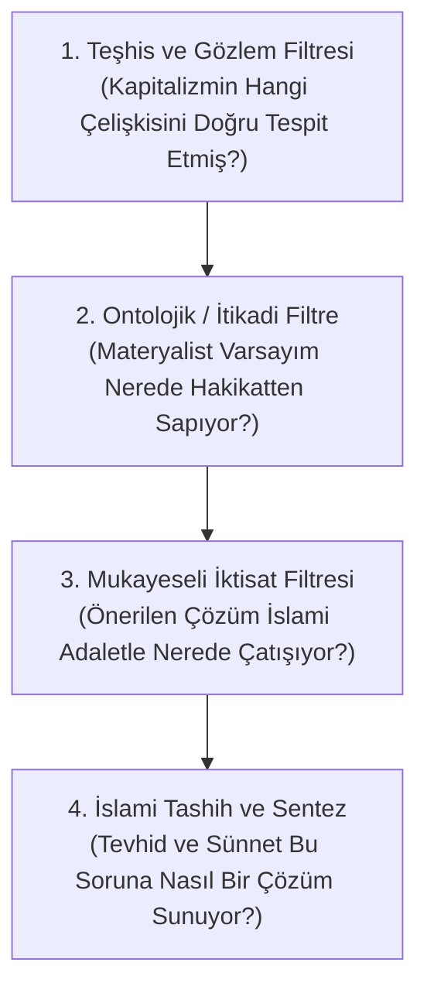

# 📚 Müslüman Araştırmacılar İçin Marksizm Okuma ve Tahlil Kılavuzu

Bu kılavuz; İslami ilimler, sosyoloji, felsefe ve iktisat alanında çalışan Müslüman araştırmacılar, ilim talebeleri ve okurlar için Marksist külliyatı **eleştirel bir Tevhidî filtreyle** okuma, anlama ve tahlil etme metodolojisi sunmaktadır.

---

## 📌 Metodolojik İlkeler: 4 Aşamalı Eleştirel Filtre

---

## 🧭 4 Aşamalı Okuma Müfredatı

### 🟢 1. Aşama: Giriş ve Kavramsal Temeller
* **Karl Marx & Friedrich Engels** – *Komünist Manifesto* (1848)
  * *Tahlil Odağı:* Sınıf çatışması tespiti ve kapitalizmin küreselleşme dinamikleri.
* **Karl Marx** – *Ücretli Emek ve Sermaye* & *Ücret, Fiyat ve Kâr*
  * *Tahlil Odağı:* Artı-değerin ve emek sömürüsünün matematiksel mekanizması.
* **Seyyid Kutub** – *İslam'da Sosyal Adalet* (1949)
  * *Tahlil Odağı:* İslam'ın mülkiyet, infak ve adalet anlayışının beşeri sistemlerle mukayesesi.

---

### 🟡 2. Aşama: Felsefi Metodoloji ve Yabancılaşma
* **Karl Marx** – *1844 İktisadi ve Felsefi El Yazmaları*
  * *Tahlil Odağı:* Yabancılaşma (*Entfremdung*) teorisi ile Kur'an'ın "heva putçuluğu ve fıtrattan kopuş" kavramlarının karşılaştırılması.
* **Karl Marx & Friedrich Engels** – *Alman İdeolojisi*
  * *Tahlil Odağı:* Tarihsel materyalizmin epistemolojik sınırları ve ideoloji tahlili.
* **Dr. Ali Şeriati** – *Dine Karşı Din* & *Marksizm ve Diğer Batı Düşünceleri*
  * *Tahlil Odağı:* Karunların Şirk Dinine karşı peygamberlerin Tevhid Dini ve sosyalist materyalizmin çıkmazları.

---

### 🔴 3. Aşama: Başyapıtlar ve Külliyat Analizi
* **Karl Marx** – *Das Kapital (Cilt I, II, III)*
  * *Tahlil Odağı:* Meta fetişizmi, sermayenin organik bileşimi, faiz/hayali sermaye tahlili ve kriz yasaları.
* **İmam Gazali** – *İhyâu Ulûmi'd-Dîn* (İktisat ve Helal Kazanç Bölümleri)
  * *Tahlil Odağı:* Paranın tabiatı, faizin (riba) toplumsal yıkımı ve pazar ahlakı.
* **İbn Haldun** – *Mukaddime*
  * *Tahlil Odağı:* Üretim, asabiyet, emek ve medeniyetlerin yükseliş-çöküş dinamikleri.

---

### 🟣 4. Aşama: Çağdaş Eleştiri, İhtida ve Diriliş
* **Roger Garaudy** – *Geleceğimizde İslam Var* & *İslam'ın Vadettikleri*
  * *Tahlil Odağı:* Fransız Komünist Partisi ideologluğundan İslami hakikate geçişteki felsefi dönüşüm.
* **Nurettin Topçu** – *İslam ve Sosyalizm* & *Ahlak Nizamı*
  * *Tahlil Odağı:* Maddeci sınıf kinciliğine karşı Anadolu İslami ruhçuluğu ve alın teri ahlakı.
* **Sezai Karakoç** – *Diriliş Neslinin Âmentüsü* & *İslam Toplumunun Ekonomik Strüktürü*
  * *Tahlil Odağı:* Madde ve mana dengesi, İslam medeniyetinin iktisadi omurgası.
* **İsmet Özel** – *Üç Mesele: Gayret, Tebliğ, Problem*
  * *Tahlil Odağı:* Sosyalist kökenden Müslümanca şahsiyete geçiş ve küresel kapitalizme direnç.

---

## 📌 Tahlil Soruları ve Değerlendirme Kriterleri
1. Marx'ın meta fetişizmi tespiti, modern çağda insanın eşyayı putlaştırması bağlamında Tevhid inancıyla nasıl örtüşür?
2. Artı-değer teorisi ile İslam'daki "emeğin kutsallığı ve kul hakkı" prensipleri arasındaki benzerlik ve ayrışma noktaları nelerdir?
3. Materyalist diyalektiğin dini "altyapının bir yansıması" sayan iddiası, peygamberlerin saraylara ve Karunlara karşı başlattığı Tevhid devrimleri karşısında neden geçersizdir?
4. İslam'ın faiz (riba) yasağı ve infak/zekât farziyeti, kapitalizmin aşırı sermaye birikimi krizine nasıl köklü ve fıtri bir çözüm getirir?
