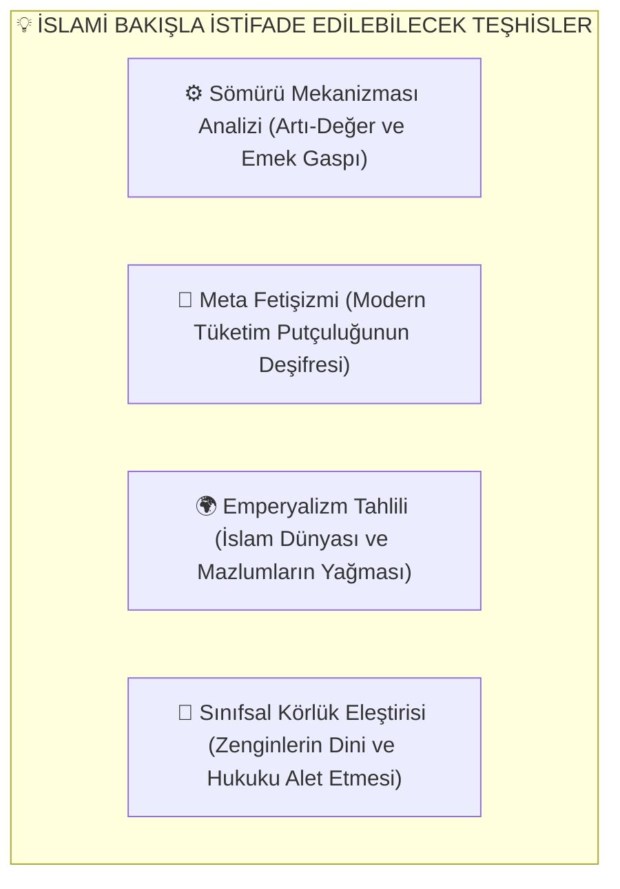

# 🌙 Müslüman Bakış Açısıyla Marksizm: Tevhid, Adalet ve İktisadi Mukayese Rehberi

Bu doküman; Müslüman bir araştırmacı, düşünür ve mümin gözüyle Marksist felsefeyi, ekonomi politik eleştirisini ve sosyalist tarihi incelemektedir: **Marksizm'in kapitalizme dair hangi teşhislerinden yararlanabiliriz, nerede temelden ayrışıyoruz ve İslam'ın Tevhid temelli adalet nizamı bu meseleye nasıl bir ufuk sunmaktadır?**

---

## 📌 İçindekiler
- [1. Temel Yaklaşım: 'Hikmet Müminin Yitiğidir'](#1-temel-yaklaşım-hikmet-müminin-yitiğidir)
- [2. Marksizm'den Neler Öğrenebiliriz? (Doğru Teşhisler)](#2-marksizmden-neler-öğrenebiliriz-doğru-teşhisler)
  - [A. Kapitalizmin Sömürü Çarkları ve Artı-Değer](#a-kapitalizmin-sömürü-çarkları-ve-artı-değer)
  - [B. Meta Fetişizmi ve Modern Çağın Putçuluğu](#b-meta-fetişizmi-ve-modern-çağın-putçuluğu)
  - [C. Emperyalizm ve Küresel Güney'in Yağmalanması](#c-emperyalizm-ve-küresel-güneyin-yağmalanması)
  - [D. Emeğin Hakkı ve Alın Teri Duyarlılığı](#d-emeğin-hakkı-ve-alın-teri-duyarlılığı)
- [3. Nerede Temelden Ayrışıyoruz? (İtikadi ve Felsefi Çıkmazlar)](#3-nerede-temelden-ayrışıyoruz-i̇tikadi-ve-felsefi-çıkmazlar)
  - [A. Materyalizm vs. Tevhid ve Metafizik Hakikat](#a-materyalizm-vs-tevhid-ve-metafizik-hakikat)
  - [B. 'Din Afyondur' Yanılgısı vs. Peygamberlerin Devrimci Tevhidi](#b-din-afyondur-yanılgısı-vs-peygamberlerin-devrimci-tevhidi)
  - [C. Sınıf Kini ve Çatışma vs. Uhuvvet (Kardeşlik) ve Merhamet](#c-sınıf-kini-ve-çatışma-vs-uhuvvet-kardeşlik-ve-merhamet)
  - [D. Tarihsel Determinizm vs. İnsan İradesi ve İmtihan](#d-tarihsel-determinizm-vs-i̇nsan-i̇radesi-ve-i̇mtihan)
  - [E. Aile, Mahremiyet ve Ahlak Anlayışı](#e-aile-mahremiyet-ve-ahlak-anlayışı)
- [4. İslami İktisat ile Marksist İktisadın Karşılaştırmalı Matrisi](#4-i̇slami-i̇ktisat-ile-marksist-i̇ktisadın-karşılaştırmalı-matrisi)
- [5. Müslüman Düşünürlerin Marksizm Okumaları](#5-müslüman-düşünürlerin-marksizm-okumaları)

---

## 1. Temel Yaklaşım: 'Hikmet Müminin Yitiğidir'

Peygamber Efendimiz'in (s.a.v.) *"Hikmet müminin yitiğidir; nerede bulursa onu almaya en layık olan odur"* hadis-i şerifi gereğince Müslüman; yeryüzündeki hiçbir fikre körü körüne düşmanlık etmez, ancak hiçbir beşeri ideolojiyi de din edinmez.

* **Metodoloji:** Marksizm'in kapitalist sömürüye, faize, tekelleşmeye ve adaletsizliğe dair **isabetli teşhislerini** alır; fakat onun ateist, ruhsuz, kaba materyalist ve determinist **yanlış ontolojisini ve reçetelerini** reddeder.

---

## 2. Marksizm'den Neler Öğrenebiliriz? (Doğru Teşhisler)



### A. Kapitalizmin Sömürü Çarkları ve Artı-Değer
Marx'ın *Kapital*'de ortaya koyduğu gibi; sermayedarlar işçiye ürettiği gerçek değerin sadece küçük bir kısmını (ücret) öder, geri kalan büyük artı-değere karşılıksız el koyar.
* **İslami Karşılık:** Bu durum Hz. Peygamber'in *"İşçinin ücretini teri kurumadan veriniz"* ve *"Kıyamet günü emeğin hakkını vermeyen işverenin hasmı bizzat ben olacağım"* buyruğunun çiğnenmesidir.

### B. Meta Fetişizmi ve Modern Çağın Putçuluğu
Marx, kapitalizmde nesnelerin (markalar, lüks arabalar, paralar) insanlar arasında birer puta dönüştüğünü söyler.
* **İslami Karşılık:** Bu, Kur'an'ın **"Şirk ve Heva Putları"** dediği durumun 21. yüzyıldaki tam karşılığıdır. İnsanlar Allah'a değil; tüketim metalarına ve konfora tapınır hale gelmiştir.

### C. Emperyalizm ve Küresel Güney'in Yağmalanması
Lenin ve çağdaş Marksistlerin emperyalizm analizleri; Ortadoğu, Afrika ve Asya'daki Müslüman halkların kaynaklarının (petrol, madenler, tarım) nasıl küresel bankalar ve askeri müdahalelerle sömürüldüğünü anlamada çok güçlü bir araçtır.

---

## 3. Nerede Temelden Ayrışıyoruz? (İtikadi ve Felsefi Çıkmazlar)

```
                            MUKAYESE MATRİSİ
  ┌──────────────────────────────┬──────────────────────────────┐
  │     MARKSİST MATERYALİZM     │       İSLAMİ TEVHİD          │
  ├──────────────────────────────┼──────────────────────────────┤
  │ 🚫 Madde tek hakikattir      │ ☝️ Varlık madde + manadır    │
  │ 🚫 Din afyondur ve ilkeldir │ 📖 Din hakikattir ve kıyamdır│
  │ 🚫 Sınıf kini ve çatışma     │ 🤝 Uhuvvet, merhamet, adalet │
  │ 🚫 Determinist tarih yasası  │ ⚖️ İrade, ahlak ve imtihan   │
  │ 🚫 Devletçi mutlak mülkiyet  │ 🤲 Mülk Allah'ın (Emanet)    │
  └──────────────────────────────┴──────────────────────────────┘
```

### A. Materyalizm vs. Tevhid ve Metafizik Hakikat
* **Marksizm:** İnsanı yalnızca biyolojik, üreten ve tüketen bir primata indirger. Ruh, ahiret, melekler ve Allah inancını "maddi altyapının ürettiği bir yanılsama" sayar.
* **İslam:** Madde gerçektir ama tek gerçeklik değildir. İnsan ruh üflenmiş (*nefh-i ruh*) şerefli bir varlıktır (*ahsen-i takvim*). Ahiret ve hesap bilinci olmadan yeryüzünde kalıcı bir ahlak kurulamaz.

### B. 'Din Afyondur' Yanılgısı vs. Peygamberlerin Devrimci Tevhidi
* **Marksizm:** Dinin her zaman egemen sınıfların halkı uyutmak için kullandığı bir uyuşturucu olduğunu iddia eder.
* **İslam:** Bütün peygamberler (Hz. İbrahim, Hz. Musa, Hz. İsa, Hz. Muhammed) çağlarının firavunlarına, Karunlarına ve nemrutlarına karşı mazlumları ayağa kaldıran en büyük adalet devrimcileridir. Din afyon değil; şirk saraylarını yıkan tevhid fırtınasıdır.

### C. Sınıf Kini ve Çatışma vs. Uhuvvet (Kardeşlik) ve Merhamet
* **Marksizm:** Toplumsal dönüşümü kanlı sınıf intikamı ve nefret üzerinden kurgular.
* **İslam:** Hedef zenginleri fiziken yok etmek değil; zenginliği paylaşma ahlakıyla (infak, zekât) terbiye etmek, sömürüyü (faiz, karaborsa, gasp) yasaklayarak kardeşlik ve adalet toplumunu inşa etmektir.

---

## 4. İslami İktisat ile Marksist İktisadın Karşılaştırmalı Matrisi

| Konu / Alan | Marksist Sosyalizm | Vahşi Kapitalizm | İslami İktisat Nizamı |
| :--- | :--- | :--- | :--- |
| **Mülkiyet Anlayışı** | Bütün üretim araçları devletindir; özel mülkiyet yasaktır. | Mülkiyet kutsaldır; sermayedar dilediği gibi sömürür. | **Mülk Allah'ındır.** İnsan emanetçidir; helal mülkiyet haktır, tekelleşme haramdır. |
| **Faiz (Riba)** | Bankacılığı devlet tekeline alır ama faiz mantığı sürer. | Faizi ve finansal borçlandırmayı sistemin motoru yapar. | **Faiz kesinlikle haramdır.** Emeksiz para kazanma yasaklanmıştır. |
| **Piyasa ve Fiyat** | Merkezi bürokrasi (GOSPLAN) belirler (Kıtlık doğar). | Serbest piyasa anarşisi ve tekel fiyatları hakimdir. | **Serbest ve ahlaklı pazar.** Karaborsa, tekelcilik (*ihtikâr*) ve aldatma yasaktır. |
| **Servet Bölüşümü** | Devlet dağıtır (Bürokratik eşitsizlik ve Nomenklatura türedi). | Zengin daha zengin, yoksul daha yoksul olur. | **Zekât ve İnfak farz kılınmıştır.** Servetin tabana yayılması zorunludur (Haşr:7). |

---

## 5. Müslüman Düşünürlerin Marksizm Okumaları

### A. Roger Garaudy (Fransız Marksizminin Zirvesinden İslama)
> *"Marksizm insanın midesini doyurmaya çalışırken, onu varoluşsal bir anlamsızlığın içine fırlattı. İslam ise adaleti göklerden koparmayan, bireyin vicdanı ile toplumun ekmeğini aynı ilahi terazide tartan yegâne yaşayan vahiy hakikatidir."*

### B. Dr. Ali Şeriati (Sosyoloji ve Tevhid)
> *"Tarih boyunca iki din savaşmıştır: Biri sarayların ve Karunların 'Şirk Dini'; diğeri ise ezilenlerin ve peygamberlerin 'Tevhid Dini'dir. Ebu Zer el-Gıfari, Muaviye'nin yeşil sarayına karşı 'Altın ve gümüşü yığıp infak etmeyenleri yakıcı bir azapla müjdele!' ayetini haykırırken hakiki İslam'ın ta kendisiydi."*

### C. Nurettin Topçu (Anadolu İslami Sosyalizmi)
> *"Bizim sosyalizmimiz, Batı'nın sınıf kini üzerine kurulu materyalist kavgası değil; İslam'ın merhamet, infak ve alın teri ahlakına dayanan ruhçu bir nizamdır. Ruhu çökmüş bir toplumda sadece fabrikaları kamulaştırmak felaket getirir."*
