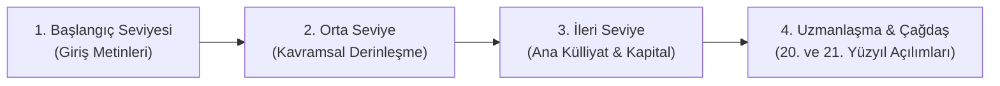

# 📚 Yapılandırılmış Marksizm Okuma Rehberi

Bu rehber, Marksist düşünceyi sıfırdan öğrenmek veya belirli bir disiplinde derinleşmek isteyen araştırmacılar, öğrenciler ve okurlar için pedagojik olarak yapılandırılmış rotalar sunar.

---

## 🎯 Seviye Bazlı Okuma Rotası

---

### 🟢 1. Aşama: Başlangıç Seviyesi (Giriş Metinleri)
Temel mantığı, terminolojiyi ve tarihsel bağlamı kavramak için:

1. **Karl Marx & Friedrich Engels** – *Komünist Parti Manifestosu* (1848)
   * *Neden Okunmalı:* Sınıf savaşı, kapitalizmin dinamizmi ve nihai hedefler hakkında en etkili kurucu bildirge.
2. **Karl Marx** – *Ücretli Emek ve Sermaye* (1847) & *Ücret, Fiyat ve Kâr* (1865)
   * *Neden Okunmalı:* Kapital'in karmaşık matematiğine girmeden önce artı-değer, kâr ve ücret mekanizmasını anlamak için mükemmel giriş.
3. **Friedrich Engels** – *Sosyalizmin Ütopyadan Bilime Gelişimi* (1880)
   * *Neden Okunmalı:* Ütopik sosyalizm ile bilimsel materyalizm arasındaki metodolojik farkı gösterir.
4. **V. I. Lenin** – *Marksizmin Üç Kaynağı ve Üç Öğesi* (1913)
   * *Neden Okunmalı:* Alman felsefesi, İngiliz ekonomi politiği ve Fransız sosyalizminin sentezini kısa ve net özetler.

---

### 🟡 2. Aşama: Orta Seviye (Kavramsal Derinleşme)

1. **Karl Marx & Friedrich Engels** – *Alman İdeolojisi* (Feuerbach bölümü)
   * *Konu:* Tarihsel materyalizmin felsefi temelleri, ideoloji ve yabancılaşma.
2. **Karl Marx** – *1844 İktisadi ve Felsefi El Yazmaları*
   * *Konu:* Emeğin yabancılaşması ve hümanist Marx dönemi.
3. **Karl Marx** – *Louis Bonaparte'ın 18 Brumaire'i*
   * *Konu:* Sınıf mücadelelerinin somut siyasal analizi ve devletin özerkliği.
4. **Friedrich Engels** – *Ailenin, Özel Mülkiyetin ve Devletin Kökeni*
   * *Konu:* Antropolojik kökenler, ataerkillik ve devletin tarihsel kuruluşu.
5. **V. I. Lenin** – *Devlet ve Devrim* (1917)
   * *Konu:* Burjuva devlet aygıtı, işçi demokrasisi ve devletin sönümlenmesi.
6. **V. I. Lenin** – *Emperyalizm: Kapitalizmin En Yüksek Aşaması* (1916)
   * *Konu:* Tekelci kapitalizm, finans kapital ve dünya pazarı paylaşımı.

---

### 🔴 3. Aşama: İleri Seviye (Külliyat ve Başyapıtlar)

1. **Karl Marx** – *Kapital: Ekonomi Politiğin Eleştirisi*
   * **Cilt I:** Sermayenin Üretim Süreci (Değer, meta, artı-değer, ilkel birikim).
   * **Cilt II:** Sermayenin Dolaşım Süreci (Devreler, yeniden üretim şemaları).
   * **Cilt III:** Bir Bütün Olarak Kapitalist Üretim Süreci (Kâr oranının düşüşü, ticari sermaye, faiz ve rant).
2. **Karl Marx** – *Grundrisse (Ekonomi Politiğin Eleştirisinin Temelleri)*
   * *Konu:* Makineleşme, otomasyon, genel zekâ (*general intellect*) ve soyut emek.
3. **Rosa Luxemburg** – *Sermaye Birikimi* (1913)
   * *Konu:* Kapitalizmin dış pazarlara ve emperyalist genişlemeye zorunlu bağımlılığı.
4. **Antonio Gramsci** – *Hapishane Defterleri* (Seçmeler)
   * *Konu:* Kültürel hegemonya, organik aydınlar, pasif devrim, sivil toplum.
5. **Georg Lukács** – *Tarih ve Sınıf Bilinci* (1923)
   * *Konu:* Şeyleşme (*reification*), özne-nesne diyalektiği ve proletarya bilinci.

---

### 🟣 4. Aşama: Tematik ve Çağdaş Okuma Rotaları

#### A. Ekonomi Politik ve Kriz Kuramları
* David Harvey – *Sermayenin Sınırları* & *Kapitalizmin Onyedi Çelişkisi*
* Paul Sweezy – *Kapitalist Gelişme Teorisi*
* Costas Lapavitsas – *Finansallaşma ve Sermayenin Krizleri*

#### B. Eleştirel Teori ve Kültür Analizi
* Max Horkheimer & Theodor W. Adorno – *Aydınlanmanın Diyalektiği*
* Walter Benjamin – *Tarih Kavramı Üzerine Tezler* & *Tekniğin Olanaklarıyla Yeniden Üretilebildiği Çağda da Sanat Yapıtı*
* Herbert Marcuse – *Tek Boyutlu İnsan*
* Terry Eagleton – *Marksizm ve Edebiyat Eleştirisi* & *İdeoloji*

#### C. Marksist Feminizm ve Toplumsal Yeniden Üretim
* Silvia Federici – *Caliban ve Cadı: Kadınlar, Beden ve İlkel Birikim*
* Lise Vogel – *Marksizm ve Kadınların Ezilmişliği*
* Angela Davis – *Kadınlar, Irk ve Sınıf*
* Cinzia Arruzza, Tithi Bhattacharya, Nancy Fraser – *Yüzde 99 İçin Feminizm*

#### D. Eko-Marksizm ve Ekoloji
* John Bellamy Foster – *Marx'ın Ekolojisi: Materyalizm ve Doğa*
* Kohei Saito – *Doğa Karşı Sermaye* & *Yavaşlamak: Küçülmeci Komünizm Çağrısı*
* Jason W. Moore – *Hayat Ağındaki Kapitalizm*

#### E. Anti-Emperyalizm ve Sömürge Sonrası Çalışmalar
* Frantz Fanon – *Yeryüzünün Lanetlileri*
* Immanuel Wallerstein – *Modern Dünya Sistemi*
* Samir Amin – *Eşitsiz Gelişme* & *Avrupamerkezcilik*
* Eduardo Galeano – *Latin Amerika'nın Kesik Damarları*
