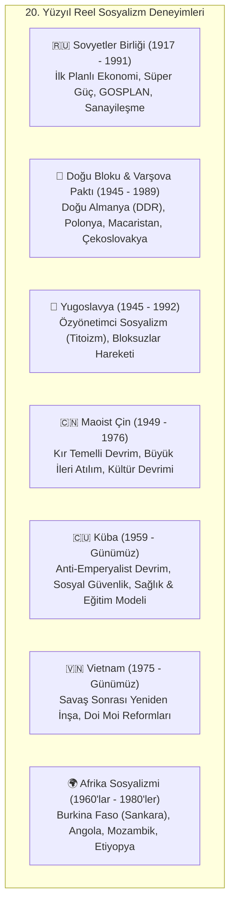

# 🌍 Marksizm Uygulandı mı, Uygulanıyor mu? Reel Sosyalizmin Tarihsel Bilançosu

Bu doküman; Marksist kuramın 20. ve 21. yüzyıllardaki somut tarihsel uygulamalarını (*Reel Sosyalizm*), geçmiş ve günümüz deneyimlerini (SSCB, Çin, Küba, Vietnam, Doğu Bloku, yerel modeller), sistemin **olumlu kazanımlarını**, **yapısal tıkanıklıklarını/başarısızlıklarını** ve "Marksizm çalışan bir sistem mi?" sorusunu nesnel bir bilanço ile incelemektedir.

---

## 📌 İçindekiler
- [1. Marksizm Tarihte Nerelerde ve Nasıl Uygulandı?](#1-marksizm-tarihte-nerelerde-ve-nasıl-uygulandı)
- [2. Günümüzde Hâlâ Uygulanıyor mu? (21. Yüzyıl Deneyimleri)](#2-günümüzde-hâlâ-uygulanıyor-mu-21-yüzyıl-deneyimleri)
- [3. Olumlu Sonuçlar ve Tarihsel Kazanımlar (Ne Başarıldı?)](#3-olumlu-sonuçlar-ve-tarihsel-kazanımlar-ne-başarıldı)
- [4. Olumsuz Sonuçlar, Tıkanıklıklar ve Çöküş Nedenleri (Nerede Yanlış Gitti?)](#4-olumsuz-sonuçlar-tıkanıklıklar-ve-çöküş-nedenleri-nerede-yanlış-gitti)
- [5. "Gerçek Sosyalizm Bu Değildi" Tartışması ve Kuram-Pratik Makası](#5-gerçek-sosyalizm-bu-değildi-tartışması-ve-kuram-pratik-makası)
- [6. Sonuç: Marksizm Çalışan Bir Sistem mi?](#6-sonuç-marksizm-çalışan-bir-sistem-mi)

---

## 1. Marksizm Tarihte Nerelerde ve Nasıl Uygulandı?

Marksizm 19. yüzyılda Batı Avrupa'daki ileri sanayi toplumları için öngörülmüş olsa da; 20. yüzyılda şaşırtıcı biçimde tarım ağırlıklı, geri kalmış ve otoriter geçmişe sahip çevre ülkelerde iktidara gelmiştir.

### 🏛️ Başlıca Tarihsel Uygulamalar:


1. **Sovyetler Birliği (SSCB / 1917-1991):**
   * Çarlık Rusyası'nın yarı-feodal köylü toplumundan 30 yılda nükleer ve uzay teknolojisine sahip ikinci süper güce dönüşüm.
   * *Uygulama Modeli:* Üretim araçlarının tamamen devletleştirilmesi, 5 Yıllık Merkezi Planlar (GOSPLAN) ve tek parti diktatörlüğü.
2. **Yugoslavya Özyönetim Modeli (1948-1990):**
   * Sovyet merkeziyetçiliğine alternatif olarak fabrikaların işçi konseyleri tarafından doğrudan yönetildiği "Sosyalist Piyasa ve Özyönetim" (*Samoupravljanje*) deneyi.
3. **Maoist Çin (1949-1976):**
   * İşçi sınıfı yerine köylü kitlelerine dayanan kır gerillası stratejisi. Kollektifleştirme ve "Halk Komünleri".

---

## 2. Günümüzde Hâlâ Uygulanıyor mu? (21. Yüzyıl Deneyimleri)

Bugün dünyada Marksist kökenli partiler tarafından yönetilen veya Marksist ilkeleri uygulayan farklı modeller varlığını sürdürmektedir:

| Ülke / Deneyim | Uygulanan Model | Mevcut Durum ve Nitelik |
| :--- | :--- | :--- |
| **🇨🇳 Çin Halk Cumhuriyeti** | *Çin'e Özgü Sosyalizm / Sosyalist Piyasa Ekonomisi* | Komünist Parti iktidarını korurken; serbest piyasa, yabancı sermaye ve özel teşebbüsü devlet kontrolünde (stratejik sektörler, bankalar) bir kaldıraç olarak kullanmaktadır. Dünyanın 2. büyük ekonomisidir. |
| **🇨🇺 Küba** | *Planlı ve Dayanışmacı Sosyalizm* | 60 yılı aşkın ABD ambargosuna rağmen sağlık ve eğitimde kamu mülkiyetini sürdürmekte, turizm ve küçük işletmelerde kontrollü açılımlar yapmaktadır. |
| **🇻🇳 Vietnam** | *Doi Moi (Yenilenme) Modeli* | Çin modeline benzer şekilde piyasa mekanizmalarını sosyalist devlet denetimi altında entegre eden dinamik sanayi ekonomisi. |
| **🇮🇳 Kerala Eyaleti (Hindistan)** | *Demokratik Parlamenter Sosyalizm* | Hindistan Komünist Partisi'nin (CPI-M) demokratik seçimlerle yönettiği eyalette %96 okuryazarlık, yüksek yaşam süresi ve kamu sağlık ağı. |
| **🇲🇽 Zapatistalar (EZLN - Chiapas)** | *Otonom ve Yatay Liberter Sosyalizm* | Devlete bağlı olmayan, yerli halkın müşterek toprak ve doğrudan komün konseyleriyle yönettiği özerk köyler ağı. |

---

## 3. Olumlu Sonuçlar ve Tarihsel Kazanımlar (Ne Başarıldı?)

Marksizmin devlet düzeyindeki pratikleri ve küresel işçi hareketine etkileri dünyada köklü dönüşümler yaratmıştır:

```
                            KAZANIMLAR
  ┌─────────────────────────────────────────────────────────────┐
  │  📚 Evrensel Okuryazarlık ve Parasız Eğitim                 │
  │  🏥 Herkes İçin Ücretsiz Kamusal Sağlık Hizmeti             │
  │  🏡 Anayasal Barınma Güvencesi ve Sıfır Evsizlik            │
  │  👩 Kadın Haklarında Tarihsel Öncülük (Eşit Ücret, Kürtaj)  │
  │  ⚙️ Geri Kalmışlıktan Süper Güce Hızlı Sanayileşme         │
  │  🌍 Sömürgeciliğin Yıkılışı ve Anti-Emperyalist Destek      │
  │  🛡️ Batı'da 'Refah Devleti'nin Doğmasına Neden Olması       │
  └─────────────────────────────────────────────────────────────┘
```

1. **Geri Kalmış Toplumların Mucizevi Sanayileşmesi:**
   * 1920'lerde nüfusunun %80'i okuma-yazma bilmeyen, tahta sabanla tarım yapan Çarlık Rusyası; planlı ekonomi sayesinde 1957'de uzaya ilk uyduyu (Sputnik) ve 1961'de ilk insanı (Yuri Gagarin) gönderen süper güce dönüştü.
2. **Sağlık, Eğitim ve Sosyal Güvence:**
   * **SSCB:** Tarihte ilk kez ücretsiz eğitim, ücretsiz kreş, ücretsiz sağlık ve garantili iş/barınma anayasal hak haline getirildi.
   * **Küba:** Latin Amerika'nın genelevi ve kumarhanesi durumundaki bir ada ülkesinden; bebek ölüm oranlarının ABD'den daha düşük olduğu, kişi başına en çok doktor düşen ve aşı üreten tıp merkezine evrildi.
3. **Kadın Kurtuluşu ve Toplumsal Cinsiyet:**
   * Sovyetler Birliği 1920'de dünyada **kürtajı yasallaştıran ilk ülke** oldu. Eşit işe eşit ücret, doğum izni, kamusal çamaşırhane ve yemekhanelerle kadın ev köleliğinden çıkarıldı.
4. **Nazizmin ve Faşizmin Yenilmesi:**
   * II. Dünya Savaşı'nda Hitler Almanyası'nın askeri gücünün %75'i Sovyet Kızıl Ordusu tarafından (27 milyon Sovyet insanının fedakarlığıyla) Doğu Cephesi'nde imha edildi.
5. **Küresel Refah Devletinin Doğuşu:**
   * Batı Avrupa'daki kapitalist ülkeler (İskandinavya, İngiltere, Fransa), işçilerin komünizme sempati duymasını engellemek için **8 saatlik iş günü, emeklilik, işsizlik maaşı ve sosyal devlet** politikalarını hayata geçirmek zorunda kaldı.

---

## 4. Olumsuz Sonuçlar, Tıkanıklıklar ve Çöküş Nedenleri (Nerede Yanlış Gitti?)

Reel sosyalist rejimler, vaat ettikleri "sınıfsız, özgür üreticiler birliği" yerine bürokratik, baskıcı ve ekonomik olarak tıkanan yapılar üretmiştir.

### ⚠️ Başlıca Yapısal Başarısızlıklar:

```
                            AÇMAZLAR VE ÇÖKÜŞ
  ┌─────────────────────────────────────────────────────────────┐
  │  🔒 Tek Parti Diktatörlüğü ve Siyasi Çoğulculuk Yokluğu     │
  │  🩸 Gulag Kampları, Zorunlu Tehcirler ve Tasfiyeler (Terör) │
  │  📊 Tüketim Mallarında Kıtlık ve İnovasyon Tıkanıklığı     │
  │  👔 'Nomenklatura' (Bürokratik Yönetici Kastın Türemesi)    │
  │  🌾 Zorla Kolektifleştirme ve Kıtlıklar (Holodomor)         │
  │  💣 Ağır Silahlanma Yarışı ve Tüketim Ekonomisinin Çöküşü   │
  └─────────────────────────────────────────────────────────────┘
```

1. **Otoriterlik ve Siyasi Özgürlüklerin Yok Edilmesi:**
   * Sovyetlerde "işçi demokrasisi" kısa sürede parti diktatörlüğüne, ardından Stalin döneminde tek adam terörüne (Büyük Temizlik - 1937) dönüştü. Muhalifler, aydınlar ve devrimin kurucu kadroları dahi Gulag kamplarında imha edildi.
2. **Bürokratik Tıkanıklık ve Kıtlık Ekonomisi:**
   * Moskova'daki GOSPLAN'ın milyonlarca ayakkabı, gömlek, buzdolabı ve ekmek fiyatını ve miktarını belirlemeye çalışması felaketle sonuçlandı. Ağır sanayi ve silahlanmada başarılı olan sistem; ayakkabı, deterjan, et ve tüketici elektroniğinde sürekli kuyruklar ve kıtlıklar üretti.
3. **İnovasyon ve Teşvik Eksikliği:**
   * Rekabetin ve kâr teşvikinin olmaması, fabrikalarda kalitesiz üretime ve teknolojik tembelliğe yol açtı (Askeri/uzay sektörü hariç sivil teknoloji Batı'nın fersah fersah gerisinde kaldı).
4. **Yeni Sınıf (Nomenklatura):**
   * Üretim araçları devlete devredilince sömürü bitmedi; özel dükkanlara, lüks daçalara ve ayrıcalıklara sahip bürokratik parti elitleri türedi.

---

## 5. "Gerçek Sosyalizm Bu Değildi" Tartışması ve Kuram-Pratik Makası

Marksistler ile Marksizm eleştirmenleri arasında en hararetli tartışma bu noktada düğümlenir:

| Görüş / Yaklaşım | Temel Argüman |
| :--- | :--- |
| **"Gerçek Sosyalizm Uygulanmadı" (Eleştirel Marksist Savunma)** | Marx devrimin gelişmiş, zengin, demokratik geleneğe sahip Batı'da olacağını öngörmüştü. Oysa devrim Çarlık Rusyası gibi geri kalmış, kuşatılmış ve iç savaş yaşayan bir ülkede patlak verdi. Bu koşullar zorunlu olarak otarşik, militarist ve bürokratik bir "yozlaşmış işçi devleti" doğurdu. Dolayısıyla SSCB komünizmin değil, bürokratik devlet kapitalizminin örneğidir. |
| **"Teori Kaçınılmaz Olarak Tiranlık Doğurur" (Liberal/Muhafazakâr İtiraz)** | Sorun koşullar değil, teorinin bizzat kendisidir. Özel mülkiyeti, piyasayı ve bağımsız hukuku ortadan kaldırıp tüm ekonomik gücü devlete verdiğinizde; o devleti yönetenlerin tiranlaşması kaçınılmaz bir sosyolojik yasadır. 40 farklı ülkede (Rusya, Çin, Kamboçya, Küba, Arnavutluk) denenip hepsinin otoriter tek partiye evrilmesi tesadüf olamaz. |

---

## 6. Sonuç: Marksizm Çalışan Bir Sistem mi?

### 🎯 Çok Boyutlu Değerlendirme Özeti:

1. **Bir Eleştiri ve Analiz Aracı Olarak:** **%100 ÇALIŞIYOR.**
   * Kapitalizmin kriz dinamiklerini, finansallaşmayı, kâr hırsının doğayı talan edişini, eşitsizliği ve yabancılaşmayı açıklamada Marksizm hâlâ insanlığın geliştirdiği en yetkin ve aşılamamış felsefi/ekonomik metodolojidir.
2. **20. Yüzyıl Katı Merkezi Devlet Planlaması Olarak:** **ÇÖKTÜ VE ÇALIŞMADI.**
   * Bütün ekonomik kararları merkezi bürokrasinin aldığı, siyasi özgürlüklerin ve sivil toplumun bastırıldığı katı komuta ekonomileri sürdürülemez olduğunu tarihsel olarak kanıtlamıştır.
3. **Sosyal Haklar ve Dönüştürücü Güç Olarak:** **DÜNYAYI KÖKTEN DEĞİŞTİRDİ.**
   * Bugün modern dünyada sahip olduğumuz hafta sonu tatili, 8 saatlik iş günü, kıdem tazminatı, parasız eğitim/sağlık talebi ve kadın hakları; Marksist hareketlerin ve sosyalist blokun yarattığı basınç sayesinde kazanılmıştır.
4. **21. Yüzyılda Gelecek Arayışları:**
   * Günümüzde demokratik, katılımcı, ekolojik (küçülmeci), bilişimsel planlamaya dayalı ve insan haklarıyla bütünleşmiş "Yeni Bir Sosyalizm" arayışları (Eko-Sosyalizm, Katılımcı Ekonomi - Parecon, Dijital Müşterekler) canlılığını korumaktadır.
