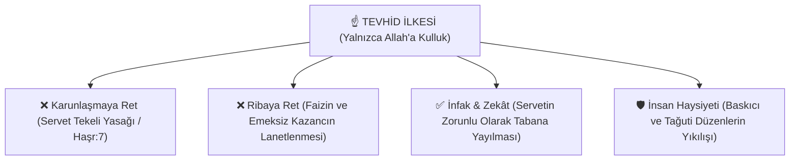

# ⚖️ Tevhid, Adalet ve Küresel Sermaye Eleştirisi: Maneviyat, İktisat ve Sosyalizm Tartışmaları

Bu doküman; dinler tarihinde ezoterik ve mistik gelenekleri, küresel finansal tahakküm mekanizmalarını, 20. yüzyıl sosyalist devrimlerinin tıkandığı manevi/insani kör noktaları ve İslam düşüncesinin **Tevhid, Riba (Faiz) Karşıtlığı, İnfak ve Sosyal Adalet** ilkeleriyle geliştirdiği küresel sömürü eleştirisini kapsamlı alıntılarla incelemektedir.

---

## 📌 İçindekiler
- [1. Dinler Tarihinde Mistisizm, Ezoterizm ve Hakikat Arayışı](#1-dinler-tarihinde-mistisizm-ezoterizm-ve-hakikat-arayışı)
- [2. Küresel Sermayenin Dünyevi Büyüsü: Faiz, Borçlandırma ve Gösteri](#2-küresel-sermayenin-dünyevi-büyüsü-faiz-borçlandırma-ve-gösteri)
- [3. Sosyalist Devrim Neden Tıkandı? Ruhsuz Materyalizmin İflası](#3-sosyalist-devrim-neden-tıkandı-ruhsuz-materyalizmin-i̇flası)
- [4. Tevhid ve Sosyal Adalet: Şirkin, Tağutun ve Sermaye Tekelinin Reddi](#4-tevhid-ve-sosyal-adalet-şirkin-tağutun-ve-sermaye-tekelinin-reddi)
- [5. Büyük Mütefekkirlerden Kapsamlı Alıntılar Kataloğu](#5-büyük-mütefekkirlerden-kapsamlı-alıntılar-kataloğu)
  - [A. İmam Gazali ve İbn Haldun](#a-i̇mam-gazali-ve-i̇bn-haldun)
  - [B. Ali Şeriati ve Seyyid Kutub](#b-ali-şeriati-ve-seyyid-kutub)
  - [C. Muhammed İkbal ve Malik bin Nebi](#c-muhammed-i̇kbal-ve-malik-bin-nebi)
  - [D. Roger Garaudy (Marksizmden İslama Geçiş)](#d-roger-garaudy-marksizmden-i̇slama-geçiş)
  - [E. Sezai Karakoç ve İsmet Özel](#e-sezai-karakoç-ve-i̇smet-özel)

---

## 1. Dinler Tarihinde Mistisizm, Ezoterizm ve Hakikat Arayışı

Tarih boyunca insanlık, görünen fiziksel alemin ötesindeki görünmeyen hakikat katmanlarını anlamak için mistik ve bâtıni bilgi sistemleri geliştirmiştir:
* **Kabala (Yahudi Mistisizmi):** Evrenin ilahi nur tecellilerini ve harflerin metafizik dengesini araştıran teolojik bir tefekkür geleneğidir. Ortaçağ'da ortaya atılan "büyücülük" suçlamaları, dönemin feodal kilisesinin ekonomik çekememezlik üzerinden ürettiği düşmanlaştırma mitleridir.
* **İslam Tasavvufu ve İrfan Geleneği:** İbn Arabi, İmam Rabbani ve Mevlana gibi bilgeler; maddenin ardındaki ilahi birliği (*Vahdet-i Vücud*) vurgulamış, nefsin terbiyesini ve dünyevi hırslardan arınmayı temel gaye saymıştır. İslam, büyü ve sihri kesinlikle haram sayarak insanı yalnızca **Alemlerin Rabbi olan Allah'a (Tevhid)** sığınmaya çağırmıştır.

---

## 2. Küresel Sermayenin Dünyevi Büyüsü: Faiz, Borçlandırma ve Gösteri

Modern dünyadaki küresel sömürü mekanizması doğaüstü büyülerle değil; insan zihnini ve emeğini ipotek altına alan **kurumsal finansal aygıtlarla** yürütülür:

1. **Riba (Faiz) Mekanizması:** Paranın hiçbir üretim ve risk almadan kendi kendini çoğaltması; zenginliği bir avuç tekelde toplarken milyarlarca insanı borç kölesi haline getirir.
2. **Kurgusal Değer ve Borsa İllüzyonu:** Fiziksel hiçbir reel karşılığı olmayan türev piyasalar ve hayali finansal varlıklar üzerinden halkların alın teri buharlaştırılır.
3. **Kültürel Hipnoz ve Gösteri Toplumu:** Medya, tüketim çılgınlığı ve popüler kültür ile kitlelerin vicdanı, maneviyatı ve direnme iradesi uyuşturulur.

---

## 3. Sosyalist Devrim Neden Tıkandı? Ruhsuz Materyalizmin İflası

20. yüzyıl sosyalist blokunun (SSCB) çözülüşü, yalnızca ekonomik değil, derin bir **varoluşsal ve felsefi iflastır**:

* **İnsanın Kalbinin ve Ruhunun Yok Sayılması:** İnsanı yalnızca midesi olan, tüketen ve üreten biyolojik bir canlıya indirgeyen katı materyalizm; insanın aşkınlık, kutsallık, ebediyet ve ahlak arayışına cevap verememiştir.
* **Yeni Firavunlar (Bürokrasi):** Mülkiyet devlete devredilince adalet gelmemiş; devleti yöneten parti elitleri yeni bir tahakküm sınıfı oluşturmuştur.

---

## 4. Tevhid ve Sosyal Adalet: Şirkin, Tağutun ve Sermaye Tekelinin Reddi

İslam, hem kapitalizmin vahşi bireyciliğini hem de bürokratik sosyalizmin ruhsuz devletçiliğini aşan ilahi bir denge sunar:

> *"Allah'ın helal kıldığı mallar, içinizden yalnızca zenginler arasında elden ele dolaşan bir servet olmasın!"*  
> — **Kur'an-ı Kerim**, Haşr Suresi, 7. Ayet

---

## 5. Büyük Mütefekkirlerden Kapsamlı Alıntılar Kataloğu

### A. İmam Gazali ve İbn Haldun

> *"Para, Allah'ın kulları arasında adaleti sağlasın diye yarattığı bir ölçü birimidir; onun bizzat kendisinde bir lezzet ve gaye yoktur. Parayı faizle, stokçulukla veya tefecilikle çoğaltmaya çalışanlar, Allah'ın yarattığı fıtratı tersyüz eden zalimlerdir."*  
> — **İmam Gazali**, *İhyâu Ulûmi'd-Dîn*

> *"Zulüm ve haksız vergilendirme, medeniyetin ve üretimin kökünü kurutur. İnsanlar emeklerinin karşılığını alamayacaklarını anladıkları anda üretimi bırakırlar; böylece devletler çöker, şehirler harabeye döner."*  
> — **İbn Haldun**, *Mukaddime* (1377)

---

### B. Ali Şeriati ve Seyyid Kutub

> *"Tarih boyunca iki din savaşmıştır: Biri sarayların, Karunların (sermayedarların) ve Firavunların dini olan 'Şirk ve İktidar Dini'; diğeri ise ezilenlerin, peygamberlerin ve kölelerin dini olan 'Tevhid Dini'dir. Ebu Zer el-Gıfari, sarayın altın yığmasına karşı sokaklara fırlayıp 'Altın ve gümüşü biriktirip yoksullara infak etmeyenleri yakıcı bir azapla müjdele!' ayetini haykırırken hakiki İslam'ın ta kendisiydi."*  
> — **Dr. Ali Şeriati**, *Dine Karşı Din* ve *İslam-Sosyolojisi*

> *"İslam; insanın insana kulluğunu kökünden kazıyıp, insanı yalnızca Allah'a kul kılan evrensel bir özgürlük fermanıdır. İster kapitalist tekelciler olsun ister sosyalist parti diktatörleri; insanların rızkını ve vicdanını elinde tutan her beşeri sistem bir tağuttur."*  
> — **Seyyid Kutub**, *İslam'da Sosyal Adalet* (1949)

---

### C. Muhammed İkbal ve Malik bin Nebi

> *"Karl Marx'ın ekonomi politiği doğru teşhisler koydu; ama kalbi göğe kapalıydı. O, insanın karnını doyurmak istedi ama ruhunu doyurmayı unuttu. Oysa Doğu'nun aradığı nizam; ne Batı'nın vahşi para tanrısı ne de Doğu Bloku'nun ruhsuz kışlasıdır; adaleti aşkla harmanlayan Tevhid nizamıdır."*  
> — **Muhammed İkbal**, *Cavidnâme*

> *"Müslüman toplumların asıl trajedisi askeri veya ekonomik yenilgiler değildir; zihinsel ve ahlaki olarak 'sömürgeleştirilmeye elverişli' (*kâbiliyyetü'l-isti'mâr*) hale gelmeleridir. Putlar yıkılmadan ve nefisler Tevhid ahlakıyla dirilmeden hiçbir siyasi devrim kalıcı olamaz."*  
> — **Malik bin Nebi**, *İslam Dünyasında Fikirler ve Putlar*

---

### D. Roger Garaudy (Marksizmden İslama Geçiş)

> *"Fransız Komünist Partisi'nin baş ideoloğu olarak on yıllarca diyalektik materyalizmi savundum. Fakat gördüm ki; Marksizm insanın maddi yabancılaşmasını çözmeye çalışırken, onu varoluşsal bir anlamsızlığın içine fırlatıyor. İslam ise adaleti göklerden koparmayan, bireyin vicdanı ile toplumun ekmeğini aynı ilahi terazide tartan yegâne yaşayan vahiy hakikatidir."*  
> — **Roger Garaudy**, *Geleceğimizde İslam Var* ve *İslam'ın Vadettikleri* (1981)

---

### E. Sezai Karakoç ve İsmet Özel

> *"Batı medeniyeti maddeyi putlaştırdı; Doğu medeniyeti maddeyi küçümsedi. İslam ise maddeyi ruhun emrine vererek medeniyetin hakiki dengesini kurdu. Diriliş; paranın ve tağutların boyunduruğundan kurtulup, kalbi ve cemiyeti yeniden Allah'ın adaletiyle inşa etmektir."*  
> — **Sezai Karakoç**, *Diriliş Neslinin Âmentüsü*

> *"Sosyalizm kapitalizmin gayrimeşru çocuğudur; çünkü aynı materyalist gövdeden doğmuştur. İnsanı yalnızca sınıflar üzerinden tanımlayan bir sistem, insanın fıtratındaki günah ve fazilet savaşını anlayamaz. Gerçek direniş; küresel küfrün ve sömürünün çarklarına çomak sokan Müslümanca bir şahsiyetle başlar."*  
> — **İsmet Özel**, *Üç Mesele: Gayret, Tebliğ, Problem*
