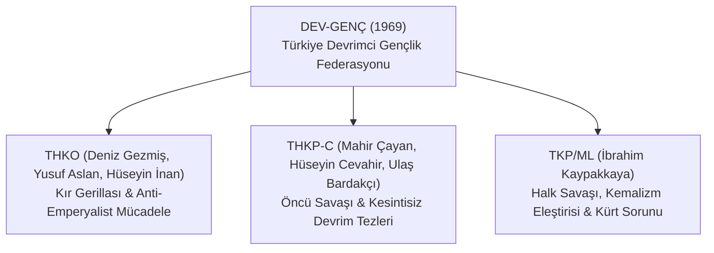

# 🇹🇷 Türkiye'de Marksist Düşünce ve Sosyalist Hareket Tarihi

Bu doküman; Osmanlı İmparatorluğu'nun son döneminden günümüze kadar Türkiye coğrafyasında gelişen Marksist felsefe, ekonomi politik analizler, sosyalist yayınlar, kuramsal tartışmalar ve kitle mücadelelerini kapsamlı bir şekilde incelemektedir.

---

## 📌 İçindekiler
- [1. Osmanlı Dönemi ve İlk Sosyalist Nüveler (1870 - 1920)](#1-osmanlı-dönemi-ve-ilk-sosyalist-nüveler-1870---1920)
- [2. Erken Cumhuriyet, TKP ve Mustafa Suphi (1920 - 1938)](#2-erken-cumhuriyet-tkp-ve-mustafa-suphi-1920---1938)
- [3. Dr. Hikmet Kıvılcımlı ve Özgün Tarih Tezi](#3-dr-hikmet-kıvılcımlı-ve-özgün-tarih-tezi)
- [4. Nazım Hikmet ve Sosyalist Edebiyat / Sanat](#4-nazım-hikmet-ve-sosyalist-edebiyat--sanat)
- [5. 1960'lar: TİP Deneyimi, YÖN ve MDD-SD Tartışmaları](#5-1960lar-tip-deneyimi-yön-ve-mdd-sd-tartışmaları)
- [6. 1968-1971 Devrimci Kuşağı ve Kopuşlar](#6-1968-1971-devrimci-kuşağı-ve-kopuşlar)
- [7. 1970'ler Kitle Hareketleri, DİSK ve Yerel Deneyimler](#7-1970ler-kitle-hareketleri-disk-ve-yerel-deneyimler)
- [8. 12 Eylül 1980 Askeri Darbesi ve Sonrası Dönüşüm](#8-12-eylül-1980-askeri-darbesi-ve-sonrası-dönüşüm)
- [9. Günümüz Türkiye Solu ve Çağdaş Tartışmalar](#9-günümüz-türkiye-solu-ve-çağdaş-tartışmalar)

---

## 1. Osmanlı Dönemi ve İlk Sosyalist Nüveler (1870 - 1920)

Osmanlı İmparatorluğu'nda sosyalist fikirler ilk olarak gayrimüslim tebaa (Ermeni, Rum, Bulgar ve Yahudi aydınlar ve işçiler) arasında ve Selanik, İstanbul, İzmir gibi liman/sanayi kentlerinde filizlendi.

* **İlk Metinler ve Çeviriler:** 1870'lerde *Hakayık-ul Vakayi* ve *İbret* gibi gazetelerde sosyalizm ve komünizm kavramları tartışılmaya başlandı.
* **Selanik Sosyalist İşçi Federasyonu (1909):** Avram Benaroya öncülüğünde kurulan çok dilli ve çok uluslu ilk kitlesel sosyalist örgütlenme.
* **Osmanlı Sosyalist Fırkası (1910):** Hüseyin Hilmi (İştirakçi Hilmi) öncülüğünde kuruldu; *İştirak* ve *İnsaniyet* gazetelerini yayımladı.
* **1908 İşçi Grevleri:** II. Meşrutiyet'in ilanının ardından demiryolu, liman ve tütün işçilerinin grev dalgası Osmanlı'da modern sınıf bilincinin ilk büyük patlaması oldu.

---

## 2. Erken Cumhuriyet, TKP ve Mustafa Suphi (1920 - 1938)

* **Türkiye Komünist Partisi'nin (TKP) Kuruluşu (10 Eylül 1920):** 
  * Mustafa Suphi, Ethem Nejat ve yoldaşları tarafından Bakü'de Doğu Halkları Kurultayı sırasında kuruldu.
  * Anadolu'daki Kurtuluş Savaşı'na destek vermek amacıyla Türkiye'ye hareket eden Mustafa Suphi ve 14 yoldaşı, 28-29 Ocak 1921 gecesi Trabzon açıklarında Karadeniz'de katledildi (*Onbeşler Olayı*).
* **Türkiye İşçi ve Çiftçi Sosyalist Fırkası (TİÇSF):** Şefik Hüsnü (Deymer) liderliğinde İstanbul'da faaliyet yürüttü; *Aydınlık* dergisi etrafında bir araya gelen kadrolar Türkiye'de tarihsel materyalist analizin ilk teorik temellerini attı.
* **1925 Takrir-i Sükûn Kanunu:** Sol yayınlar ve örgütler yasaklandı; komünist hareket uzun yıllar yeraltı faaliyeti ve cezaevi koşullarında varlığını sürdürdü.

---

## 3. Dr. Hikmet Kıvılcımlı ve Özgün Tarih Tezi

Dr. Hikmet Kıvılcımlı (1902–1971), Türkiye Marksizminin en üretken, özgün ve bağımsız kuramcılarından biridir.

* **Tarih Tezi:** Marx ve Engels'in Batı merkezli tarih anlayışını, İbn Haldun'un *Mukaddime*si ve antropolojik bulgularla sentezleyerek geliştirdiği kuramdır.
  * **Tarihsel Maddecilik ve Antika Tarih:** Batı'daki gibi kölelikten feodalizme doğrudan bir sınıf savaşı geçişi yerine; barbar kabilelerin (göçebelerin) çökmekte olan medeniyetleri fethederek taze kan taşıdığı "Tarihsel Devrimler" mekanizmasını açıklamıştır.
  * **Osmanlı'nın Kuruluşu:** Osmanlı'nın bir feodalite değil, göçebe Türkmenlerin gaza dinamizmiyle kurduğu bir kamu mülkiyeti ve imece devleti olduğunu savunmuştur.
* **Vatan Partisi Deneyimi (1954):** İşçi sınıfı, esnaf ve köylü ittifakına dayalı yasal bir sosyalist parti kurma girişimi.
* **Din ve Sınıf Analizi:** *Allah-Peygamber-Kitap* adlı eserinde İslamiyet'in doğuşunu bir "ilkel komünal devrim" olarak incelemiş; halkın dini inançlarıyla bağ kurabilen materyalist bir sosyoloji önermiştir.

---

## 4. Nazım Hikmet ve Sosyalist Edebiyat / Sanat

Nazım Hikmet Ran (1902–1963), Marksist diyalektiği Türkçe şiire ve tiyatroya aktaran küresel çapta bir devrimci şairdir.

* **Kuvâyi Milliye Destanı:** Türk Kurtuluş Savaşı'nı "köylü ve zanaatkâr halkın anti-emperyalist destanı" olarak maddeci tarih anlayışıyla işledi.
* **Memleketimden İnsan Manzaraları:** 20. yüzyıl Türkiyesi'nin sınıfsal tabakalaşmasını, tren vagonları üzerinden altyapı-üstyapı ilişkileriyle anlatan benzersiz bir epik toplumcu-gerçekçi başyapıttır.
* **Biçim ve İçerik Devrimi:** Mayakovski ve fütürizmden esinlenerek serbest nazmı ve makine ritmini Türk şiirine kazandırdı ("Trrrrum, trrrrum, trrrrum! / Trak tiki tak! / Makinalaşmak İstiyorum!").

---

## 5. 1960'lar: TİP Deneyimi, YÖN ve MDD-SD Tartışmaları

1960 Anayasası'nın getirdiği görece özgürlük ortamında Marksizm Türkiye'de kitleselleşti ve ana akım siyasetin merkezine oturdu.

### A. Türkiye İşçi Partisi (TİP) ve Meclis Deneyimi (1965)
* 1961'de sendikacılar tarafından kurulan, Mehmet Ali Aybar, Behice Boran ve Sadun Aren'in katılımıyla güçlenen TİP, 1965 genel seçimlerinde **15 milletvekili** çıkararak TBMM'ye girdi.
* TBMM kürsüsünü sömürüyü teşhir, toprak reformu, NATO karşıtlığı ve bağımsızlık talepleri için kullanarak tüm ülkeye sosyalizmi tanıttı.

### B. MDD (Milli Demokratik Devrim) vs. SD (Sosyalist Devrim) Tartışması
1960'ların sonuna damga vuran büyük teorik ayrışma:
* **Sosyalist Devrim (SD) Tezi (TİP - Boran, Aren, Aybar):**
  * Türkiye'de kapitalizmin gelişimini tamamladığını, temel çelişkinin sermaye ile emek arasında olduğunu ve doğrudan işçi sınıfı öncülüğünde sosyalist devrime gidilmesi gerektiğini savundu.
* **Milli Demokratik Devrim (MDD) Tezi (YÖN, Mihri Belli, Dev-Genç):**
  * Türkiye'nin yarı-feodal ve yarı-sömürge bir ülke olduğunu; önce işçi, köylü, aydın ve "milli burjuvazi" ittifakıyla anti-emperyalist ve anti-feodal bir demokratik devrimin (aşamalı devrim) zorunlu olduğunu savundu.

---

## 6. 1968-1971 Devrimci Kuşağı ve Kopuşlar

1968 gençlik hareketleri ve işçi eylemleri, MDD ve TİP'in pasif/parlamenter yöntemlerine tepki gösteren yeni öncü devrimci örgütlerin doğmasına yol açtı:

* **THKO (Türkiye Halk Kurtuluş Ordusu):** Deniz Gezmiş ve arkadaşları; kır gerillası odaklı, doğrudan emperyalizme karşı tam bağımsızlık savaşı verdi.
* **THKP-C (Türkiye Halk Kurtuluş Partisi-Cephesi):** Mahir Çayan'ın *Kesintisiz Devrim II-III* broşürlerinde formüle ettiği "Oligarşi, Suni Denge ve Öncü Savaşı" teorisi; Türkiye tekelci kapitalizminin emperyalizmle içselleştiğini ve bu dengenin ancak silahlı propaganda ile kırılabileceğini öne sürdü.
* **İbrahim Kaypakkaya:** Kemalizmin "faşist bir burjuva diktatörlüğü" olduğunu ilk kez açıkça teorileştirdi; Kürt ulusunun kendi kaderini tayin hakkını tavizsiz biçimde savundu ve Maoist "Halk Savaşı" stratejisini benimsedi.

---

## 7. 1970'ler Kitle Hareketleri, DİSK ve Yerel Deneyimler

* **15-16 Haziran 1970 Büyük İşçi Direnişi:** Sendikal hakların kısıtlanmasına karşı İstanbul ve Kocaeli'de yüz binlerce işçinin sokaklara dökülerek üretimi durdurduğu tarihi eylem.
* **DİSK'in (Devrimci İşçi Sendikaları Konfederasyonu) Yükselişi:** Sınıf ve kitle sendikacılığı anlayışıyla yüzbinlerce metal, maden, tekstil ve belediye işçisinin örgütlenmesi.
* **1 Mayıs 1977 Katliamı:** Taksim Meydanı'nda 500 bini aşkın emekçinin katıldığı mitingde kontrgerilla ateşiyle 34 kişinin katledilmesi.
* **Fatsa Devrimci Yol Deneyimi (1979-1980):** Fikri Sönmez ("Terzi Fikri") önderliğinde halk komiteleri aracılığıyla kurulan doğrudan katılımcı ve demokratik yerel yönetim modeli ("Çamura Son Kampanyası", halk mahkemeleri ve karaborsa ile mücadele).

---

## 8. 12 Eylül 1980 Askeri Darbesi ve Sonrası Dönüşüm

* **24 Ocak 1980 Kararları ve Neoliberalizm:** Turgut Özal öncülüğünde hazırlanan piyasacı yapısal uyum programı, işçi sınıfının örgütlü direnişi kırılarak 12 Eylül darbesi süngüsüyle uygulandı.
* **Kitlesel Tutuklamalar ve İşkenceler:** Sendikalar kapatıldı, yüzbinlerce sosyalist hapsedildi, idamlar ve sürgünlerle sol hareket ağır bir tasfiyeye uğradı.
* **1980 Sonrası Cezaevi ve Sürgün Tartışmaları:** Stalinizm eleştirisi, sivil toplum, insan hakları, ekoloji ve kadın hareketiyle temasların artması (*11. Tez*, *Zemin*, *Sosyalizm ve Toplumsal Mücadeleler Ansiklopedisi*).

---

## 9. Günümüz Türkiye Solu ve Çağdaş Tartışmalar

* **ÖDP (Özgürlük ve Dayanışma Partisi - 1996):** Farklı geleneklerin "çoğulcu ve özgürlükçü sosyalizm" ekseninde bir araya gelme girişimi.
* **Güncel Partiler ve Hatlar:**
  * **TKP & EMEP:** Geleneksel Leninist parti ve işçi sınıfı merkezli fabrika/mahalle örgütlenmesi hattı.
  * **TİP (Türkiye İşçi Partisi - Günümüz):** Kitle iletişimini, meclis muhalefetini ve gençlik dinamizmini harmanlayan sol kitle odağı.
  * **SOL Parti & Devrimci Hareketler:** Kamusallık, laiklik ve anti-emperyalizm odaklı mücadele hattı.
* **Güncel Teorik Tartışmalar:**
  * Kürt Sorunu ve Ulusların Kendi Kaderini Tayin Hakkı diyalektiği.
  * Neoliberal İslamcı rejimde emek rejimi, güvencesizlik ve prekaryalaşma.
  * Feminist hareket ve LGBTİ+ mücadelesi ile sosyalist sınıf siyasetinin kesişimselliği.
  * Ekolojik talan (Madencilik, HES'ler, Kanal projeleri) karşısında köylü ve çevre direnişleri.
